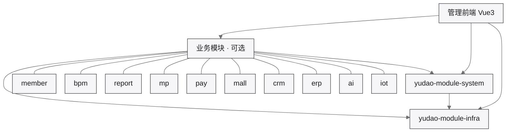

基于 Spring Boot 的芋道项目（ruoyi-vue-pro）相关文档。

运行环境与部署关系：[芋道 · 运行环境](/environment/yudao/)

## 模块架构

`system` / `infra` 为必选，其余按业务启用。明细见 [模块说明](/dev/framework/yudao/modules/)。

## 文档导航

- [入门与项目介绍](/dev/framework/yudao/guide/)
- [快速开始](/dev/framework/yudao/quick/)
- [模块说明](/dev/framework/yudao/modules/)
- [部署](/dev/framework/yudao/deploy/) / [应用部署](/dev/framework/yudao/deploy-app/)
- [常见问题](/dev/framework/yudao/problems/)
