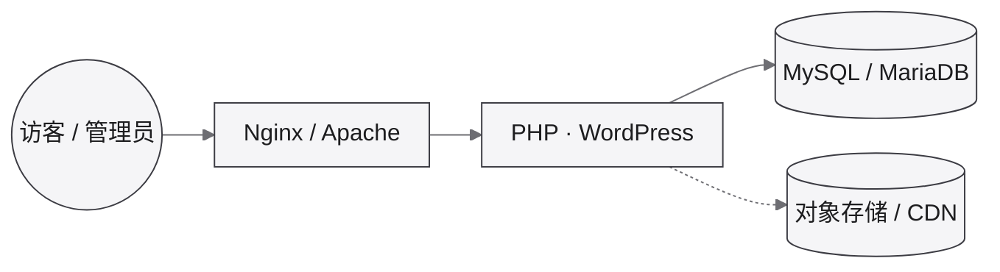

对应开发文档：[WordPress](/dev/php/wordpress/)

## 部署架构

典型站点栈（地址确定后补到下表）。插件与主题见开发文档。

## 环境地址

| 环境 | 站点 | 后台 (`/wp-admin`) | 备注 |
|------|------|---------------------|------|
| 开发 | _待补充_ | _待补充_ | |
| 测试 | _待补充_ | _待补充_ | |
| 生产 | _待补充_ | _待补充_ | |

## 账号与说明

| 项 | 内容 |
|----|------|
| 管理员 | _待补充_ |
| 主题 / 插件 | 见 [WordPress 插件](/dev/php/wordpress/plugin/) |
| 其它 | 含 B2 Pro 时见 [B2 Pro](/dev/php/b2-pro/) |

顶栏「应用访问 → WordPress」的外链将在地址确定后补上。
