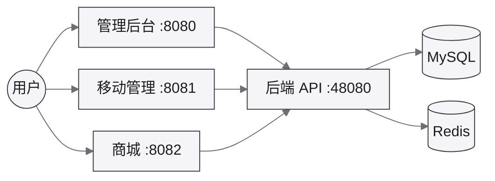

对应开发文档：[芋道 (ruoyi-vue-pro)](/dev/framework/yudao/)

代码仓库：后端官方 `YunaiV/ruoyi-vue-pro`（本地对齐）；前端自有 [bongxin/yudao-ui-admin-vben](https://github.com/bongxin/yudao-ui-admin-vben)。

开发、测试、生产的主机与中间件访问信息见下列子页；应用入口另见顶栏「应用访问」。

## 环境说明

- [开发环境](/environment/yudao/dev/) — LXC `dev-yudao` · `192.168.31.103`（已部署）
- [测试环境](/environment/yudao/test/) — LXC `test-yudao` · `192.168.31.104`（待部署）
- [生产环境](/environment/yudao/prod/) — 规划为独立 KVM（待建）

LXC IP 约定：末段 = VMID（模板 `102` / 开发 `103` / 测试 `104`）。

## 部署架构

运行时依赖（开发 LXC 内 Docker Compose 单体形态）。模块拆分见 [芋道介绍](/dev/framework/yudao/)。

## 基建

- 宿主机：[Proxmox VE](/ops/proxmox/)（SER6 · `192.168.31.2:8006`）
- 开发 CT 创建：[创建 dev-yudao](/ops/proxmox/dev-yudao/)（模板 `tpl-yudao` 链接克隆 · Nesting + Docker）
- 部署文档：[后端部署](/dev/framework/yudao/deploy/) · [前端部署](/dev/framework/yudao/deploy-app/)
