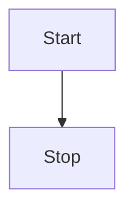
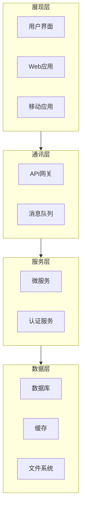

---
# https://vitepress.dev/reference/default-theme-home-page
layout: home

hero:
  name: "BongXin"
  text: "Different Me"
  tagline: My great project tagline
  image:
    src: /logo.svg
    alt: VitePress
  actions:
    - theme: brand
      text: Markdown Examples
      link: /markdown-examples
    - theme: alt
      text: API Examples
      link: /api-examples
features:
  - title: Feature A
    details: Lorem ipsum dolor sit amet, consectetur adipiscing elit
  - title: Feature B
    details: Lorem ipsum dolor sit amet, consectetur adipiscing elit
  - title: Feature C
    details: Lorem ipsum dolor sit amet, consectetur adipiscing elit
---

### Title <Badge type="info" text="default" />
### Title <Badge type="tip" text="^1.9.0" />
### Title <Badge type="warning" text="beta" />
### Title <Badge type="danger" text="caution" />

