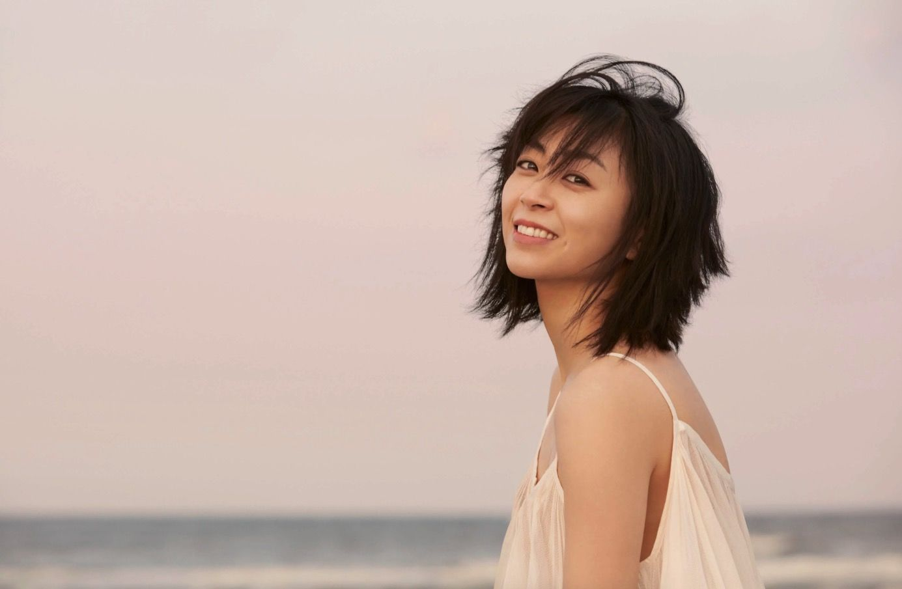

日裔美籍创作型歌手，J-Pop 标杆人物。《First Love》几乎是一代人的共同记忆，亦以《Kingdom Hearts》主题曲等跨圈作品闻名。词曲、编曲与声线辨识度都极高。

{ width=640 }

## First Love（Live）(2010)

@[bilibili](BV1M54y1y7LD)

## Stay Gold（Live）(2010)

@[bilibili](BV1hZ4y1K7Q9)
