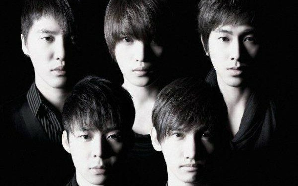

# 东方神起

{ width=640 }

## 2006（Live）

### Heart,mind and soul

<BilibiliPlayer
  base-src="//player.bilibili.com/player.html?isOutside=true&aid=1955464273&bvid=BV1Ry411b76S&cid=1570251679&p=1"
/>

### Holding back the tears

<BilibiliPlayer
  base-src="//player.bilibili.com/player.html?isOutside=true&aid=70969141&bvid=BV1VE411Z7Ez&cid=122968320&p=1"
/>

## 2007（Live）

### Proud

<BilibiliPlayer
  base-src="//player.bilibili.com/player.html?isOutside=true&aid=629065636&bvid=BV1yt4y1B7mU&cid=338475356&p=1"
/>

## 2008（Live）

### Kiss したまま、さよなら

<BilibiliPlayer
  base-src="//player.bilibili.com/player.html?isOutside=true&aid=1255147504&bvid=BV1WJ4m137Ax&cid=1563259844&p=1"
/>

## 2009（Live）

### Bolero

<BilibiliPlayer
  base-src="//player.bilibili.com/player.html?isOutside=true&aid=709226785&bvid=BV1nQ4y1c7oG&cid=1418489774&p=1"
/>

### Love in the ice

<BilibiliPlayer
  base-src="//player.bilibili.com/player.html?isOutside=true&aid=629065636&bvid=BV1yt4y1B7mU&cid=308980238&p=4"
/>

### Taxi

<BilibiliPlayer
  base-src="//player.bilibili.com/player.html?isOutside=true&aid=629065636&bvid=BV1yt4y1B7mU&cid=296558504&p=7"
/>

### 不要忘记

<BilibiliPlayer
  base-src="//player.bilibili.com/player.html?isOutside=true&aid=629065636&bvid=BV1yt4y1B7mU&cid=295430117&p=8"
/>

### Begin

<BilibiliPlayer
  base-src="//player.bilibili.com/player.html?isOutside=true&aid=629065636&bvid=BV1yt4y1B7mU&cid=305160570&p=5"
/>

### Rainy Blue+Stand By U

<BilibiliPlayer
  base-src="//player.bilibili.com/player.html?isOutside=true&aid=862304337&bvid=BV1fG4y117Bq&cid=951253253&p=1"
/>

## 其他

### Bolero 和声分析

【东方神起】无人敢翻唱神曲之《bolero》和声分析 | 出道定位：男子和声舞蹈团

<BilibiliPlayer
  base-src="//player.bilibili.com/player.html?isOutside=true&aid=26276909&bvid=BV1Zs411H7N1&cid=45119541&p=1"
/>