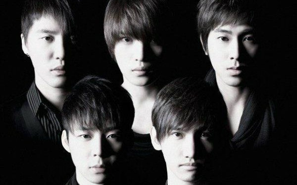

韩国男子组合 TVXQ（东方神起），长期在韩日两地活动。以和声、舞蹈与舞台完成度见长，《Bolero》《Stand By U》等日语曲目尤其受听。

{ width=640 }

## 2006（Live）

### Heart,mind and soul

@[bilibili](BV1Ry411b76S)

### Holding back the tears

@[bilibili](BV1VE411Z7Ez)

## 2007（Live）

### Proud

@[bilibili](BV1yt4y1B7mU)

## 2008（Live）

### Kiss したまま、さよなら

@[bilibili](BV1WJ4m137Ax)

## 2009（Live）

### Bolero

@[bilibili](BV1nQ4y1c7oG)

### Love in the ice

@[bilibili p4](BV1yt4y1B7mU 629065636 308980238)

### Taxi

@[bilibili p7](BV1yt4y1B7mU 629065636 296558504)

### 不要忘记

@[bilibili p8](BV1yt4y1B7mU 629065636 295430117)

### Begin

@[bilibili p5](BV1yt4y1B7mU 629065636 305160570)

### Rainy Blue+Stand By U

@[bilibili](BV1fG4y117Bq)

## 其他

### Bolero 和声分析

【东方神起】无人敢翻唱神曲之《bolero》和声分析 | 出道定位：男子和声舞蹈团

@[bilibili](BV1Zs411H7N1)
