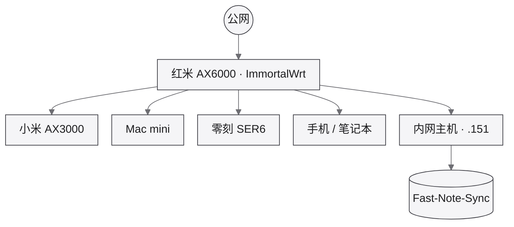

工作室与主机关系总览。设备规格见 [设备资产](/assets/)；管理入口见 [快捷入口](/shortcuts/)。

## 拓扑总览

网段 `192.168.31.0/24`。

## 关键节点

| 节点 | 角色 | 管理 / 备注 |
|------|------|-------------|
| 红米 AX6000 | 家庭主路由（待确认） | [ImmortalWrt](http://192.168.31.1/) · [刷固件](/ops/openwrt/红米AX6000刷固件/) |
| 小米 AX3000 | 待确认（AP / 旁路等） | 见 [设备资产](/assets/#mi-ax3000) |
| Mac mini / 零刻 SER6 | 主机 | 见 [设备资产](/assets/) |
| `192.168.31.151` | 内网服务主机 | [Fast-Note-Sync](http://192.168.31.151:9000/) |
| `192.168.31.2` | Proxmox VE（SER6） | [管理后台](https://192.168.31.2:8006/) · [创建总览](/ops/proxmox/) |
| `192.168.31.101` | WireGuard（TurnKey CT） | [创建文档](/ops/proxmox/wireguard/) · UDP `51820` |
| `192.168.31.186` | 飞牛 fnOS（VM `100`） | [管理后台](http://192.168.31.186:5666/) · [PVE 创建](/ops/proxmox/fnos/) |
| `192.168.31.129` | Ubuntu Server 26.04（VM `101`） | [运行环境](/environment/ubuntu-server/) · [PVE 创建](/ops/proxmox/ubuntu-server/) |
| `192.168.31.102` | tpl-yudao（LXC 模板） | [芋道 LXC](/ops/proxmox/dev-yudao/) |
| `192.168.31.103` | dev-yudao（LXC） | [环境页](/environment/yudao/) · [创建文档](/ops/proxmox/dev-yudao/) |
| `192.168.31.104` | test-yudao（LXC） | 芋道测试 · 待部署 |

## 相关文档

| 文档 | 说明 |
|------|------|
| [Proxmox VE](/ops/proxmox/) | 虚拟机 / LXC 创建实操 |
| [WireGuard](/ops/proxmox/wireguard/) | TurnKey CT · 外网回家 |
| [设备资产](/assets/) | 硬件台账与规格明细 |
| [OpenWrt](/ops/openwrt/) | 路由固件与使用 |
| [Clash](/ops/clash/) | 代理客户端 |
| [VPN](/ops/vpn/) | 远程接入 |
| [内网穿透 · Natapp](/ops/natapp/) | 本地服务暴露 |
| [群晖 NAS / DSM](/ops/dsm/) | 存储（待录入资产表） |

拓扑随实装调整；NAS、交换机、AP 等补录后同步更新本页与资产表。
