在 Proxmox VE 上用 TurnKey WireGuard 模板创建家庭 VPN 入口，外网通过隧道访问内网 `192.168.31.0/24`。宿主机：[PVE](https://192.168.31.2:8006/) · 拓扑：[家庭网络](/ops/network/)。

## 角色与地址

| 角色 | 地址 / 说明 |
|------|-------------|
| 服务端 CT | 主机名 `wireguard` · 内网 **`192.168.31.101`** |
| 隧道网段 | **`10.99.0.0/24`**（服务端 `10.99.0.1`，客户端从 `.2` 起） |
| 公网 Endpoint | DDNS 域名，如 `studio.bongxin.com.cn:51820`（**只解析 IPv4**） |
| 路由器转发 | **UDP 51820 → 192.168.31.101:51820**（建议地址族仅 IPv4） |

家宽运营商常封锁外网入站 **80/443/8080**。自己在外访问内网服务：走 WireGuard，只映射 **UDP 51820**。给外人用的公网站点另走 VPS 反代，不要为下载客户端配置去映射 80/443。

## 创建 CT

右上角 **创建 CT**（社区脚本是在宿主机 Shell 自动建 CT，不是往 PVE 宿主装软件）。

| 项 | 建议 |
|----|------|
| 主机名 | `wireguard` |
| 模板 | **`turnkey-wireguard`**（先到 `local` → CT Templates 下载） |
| 规格 | 约 **1 核 / 512MB / 8GB** |
| 磁盘存储 | **local-zfs** |
| 网络 | 桥接 **vmbr0**；静态 **`192.168.31.101/24`**，网关 `.1` |
| 特性 | 无特权；TurnKey WG **不需要** Docker |

模板文件在 **local**；`local-zfs` 出现在 **磁盘** 页。不要搜到 `turnkey-nodejs` 就当反代用——那是 Node 运行时，不是 Nginx Proxy Manager。

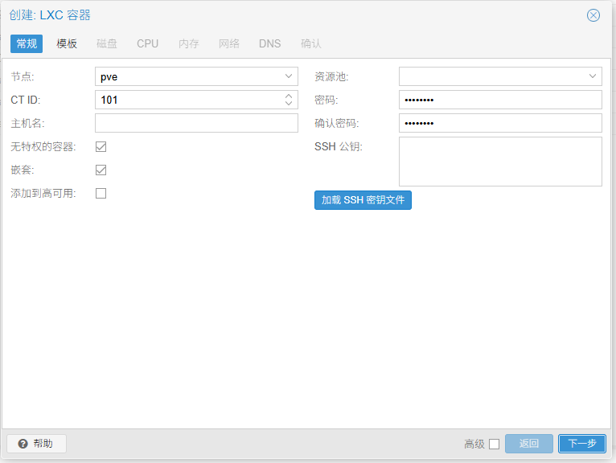

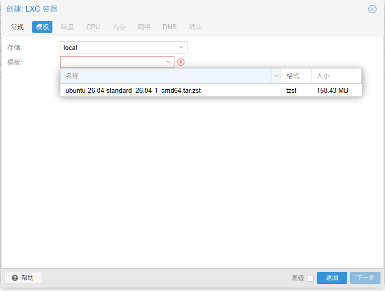

无默认账号：用户名 **`root`**，密码为创建时自设（勿写入公开仓）。

## TurnKey 安装向导

### 角色：Server

本机是家里入口，接受手机 / 笔记本连入。选 **Server**，不要选 Client。

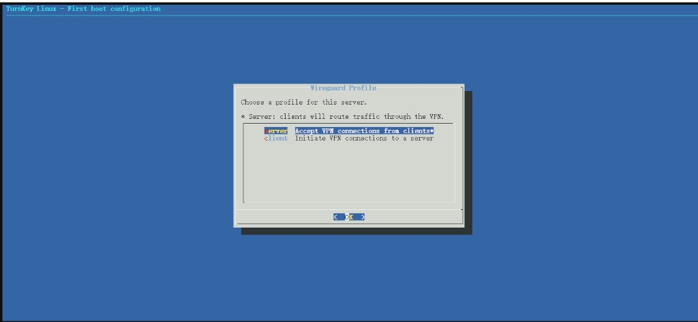

### 虚拟网段：`10.99.0.0/24`

不要用默认 `10.0.0.0/8`。避开家庭 LAN `192.168.31.0/24`，也避开以后 Headscale 常用的 `100.64.0.0/10`。

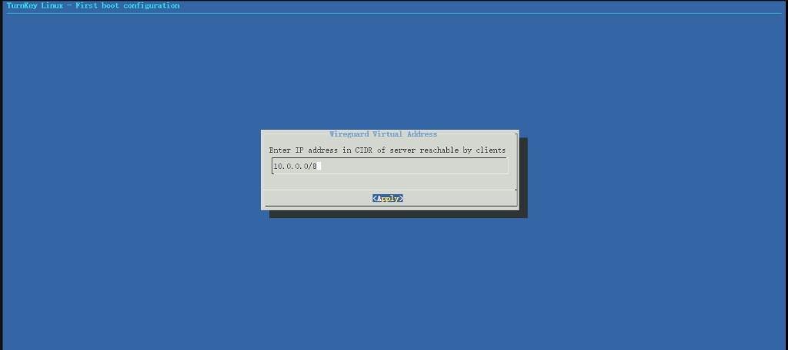

### 公网地址：DDNS 域名

填外网能解析到家的域名（如 `studio.bongxin.com.cn`）。不要填占位域名，也不要填内网 `192.168.31.101`。

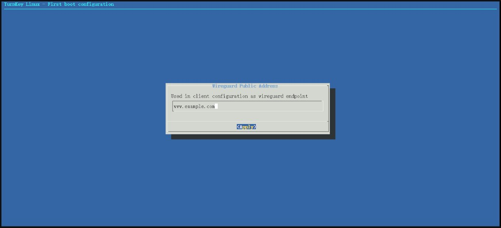

### Hub / 邮件：Skip

TurnKey 云备份、其动态域名、安全邮件订阅可跳过；家里用自有 DDNS 与备份策略即可。

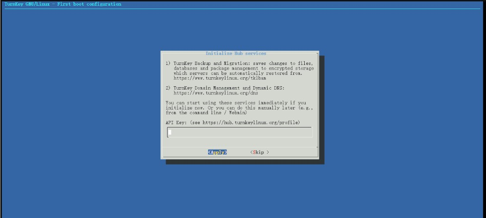

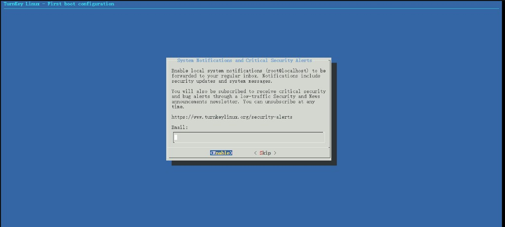

### 安全更新：Install；内核重启：Skip

CT 与 PVE 共用内核，容器内装 kernel 包并重启也不会换宿主内核。

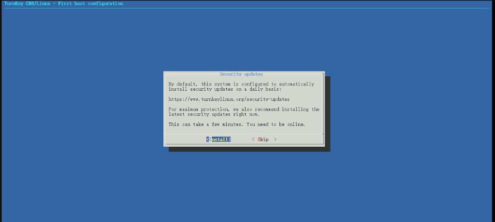

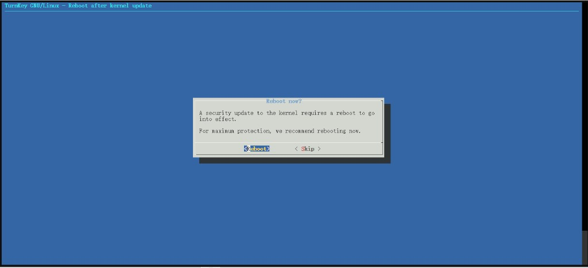

完成后 Web / Webmin / SSH 均在 `192.168.31.101`（Webmin 常见端口 `12321`）。


## 添加客户端

控制台 Advanced Menu → **Add client**（不要动 Let's Encrypt / 无故 Reboot）。

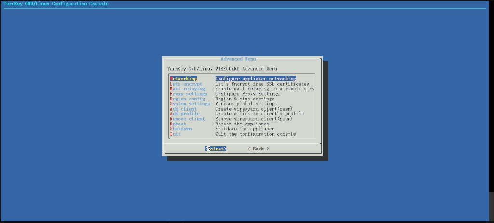

客户端流量 CIDR 填：

```text
192.168.31.0/24
```

表示只有访问家里 `192.168.31.x` 才走隧道；不要填 `0.0.0.0/0`（否则会把全部上网流量塞进隧道）。

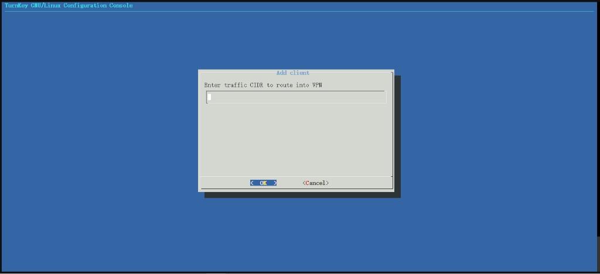

profile 名称可自定义（如 `home` / `phone`）。**每个设备单独 Add client**，手机与笔记本不要共用同一份配置。

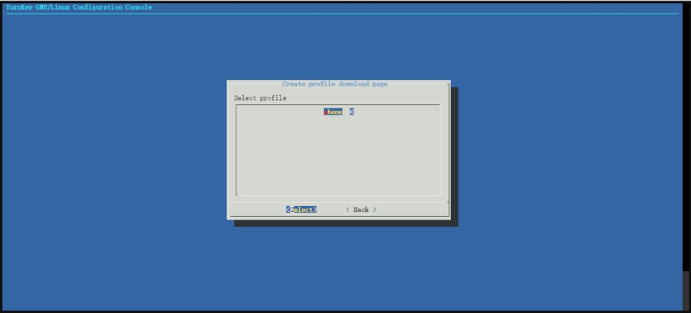

### 下载配置：走内网

公网 `https://你的域名/profiles/...` 往往会失败——家宽 **80/443 入站被封**，不是漏映射。在家里局域网用：

```text
http://192.168.31.101/profiles/<一次性路径>/
```

证书警告选继续。官方客户端见 [WireGuard 安装页](https://www.wireguard.com/install/)。

一次性下载链接含密钥，**勿发到公开仓库或聊天群**；用最新一条在内网打开即可，不要反复生成。

### 控制台点 OK 掉到命令行

PVE noVNC + TurnKey 菜单有时会退出到 shell（可见 `dtach terminating`）。配置多半已生成，不要反复点 OK。

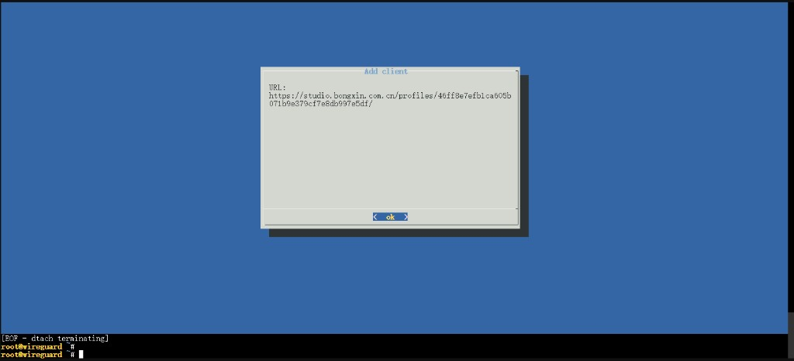

可执行：

```bash
confconsole
ls /etc/wireguard/clients/
```

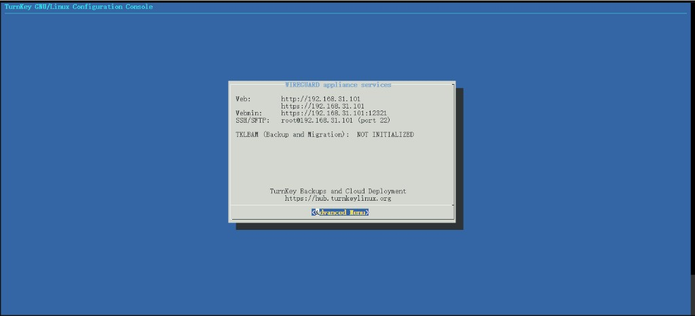

需要二维码时（在 CT 内）：

```bash
apt-get install -y qrencode
qrencode -t ansiutf8 < /etc/wireguard/clients/<客户端名>.conf
```

## 地址与配置核对（必查）

服务端与客户端地址不要抢同一个 `.1`：

| 位置 | 正确示例 |
|------|----------|
| 服务端 `wg0` | `Address = 10.99.0.1/24`（不要写成 `10.99.0.0/24`） |
| 服务端 Peer | `AllowedIPs = 10.99.0.2/32`（对应该客户端） |
| 客户端 | `Address = 10.99.0.2/24` |
| 客户端 Peer | `Endpoint = studio.bongxin.com.cn:51820` |
| 客户端 AllowedIPs | `10.99.0.0/24, 192.168.31.0/24` |
| 保活 | `PersistentKeepalive = 25`（手机 / NAT 后建议开） |

服务端常见路径：`/etc/wireguard/wg0.conf`、`/etc/wireguard/clients/<名>.conf`。手改后建议 `SaveConfig = false`，避免 `wg-quick down` 把错误状态写回。改完后：

```bash
wg-quick down wg0
wg-quick up wg0
wg show
ip -br a show wg0
```

`wg show` 出现 **`latest handshake`** 且客户端能 `ping 10.99.0.1`，隧道才算通。

服务端应已开启转发与 NAT（TurnKey 安装时常见 `PostUp` 含 `MASQUERADE`）：

```bash
sysctl net.ipv4.ip_forward   # 应为 1
```

## 路由器与 DDNS

### ImmortalWrt 端口转发

| 项 | 值 |
|----|-----|
| 协议 | **UDP** |
| 外部端口 | **51820** |
| 内部 IP | **192.168.31.101** |
| 内部端口 | **51820** |
| 地址族 | 建议 **仅 IPv4** |
| 源 / 目标区域 | wan → lan |

光猫若仍是路由模式，需同样转发或改桥接。

### DDNS 与 IPv6

域名若同时有 **A** 与 **AAAA**，双栈客户端常优先走 IPv6；家宽往往只做了 IPv4 的 51820 转发，结果是 **能 ping 域名（IPv6）但 WireGuard 无握手**。

做法：

- DDNS（如 DDNS-GO）对 WireGuard 用的主机名 **只更新 IPv4**，或 DNS 控制台 **删除该主机的 AAAA**
- 客户端 `Endpoint` 使用域名（公网 IP 会变，不要长期写死 IP）
- ImmortalWrt 转发保持 **仅 IPv4** 即可与上述策略一致

验证：

```bash
nslookup studio.bongxin.com.cn
# 应只有 IPv4；不应再出现 240e: 等 AAAA
```

## 客户端使用

- **笔记本 / 手机在外**：打开隧道，再访问 `https://192.168.31.2:8006` 等内网地址
- **已在家里 Wi-Fi**：关掉隧道，避免绕路
- PVE 里那台 Ubuntu Server 已在 `192.168.31.0/24`，**通常不需要**再当 WG 客户端

Linux（NetworkManager）可从 `.conf` 导入；验收：

```bash
ping -c2 10.99.0.1
ping -c2 192.168.31.1
```

## 排障速查

| 现象 | 优先检查 |
|------|----------|
| 无 `latest handshake`，接口 RX=0 | UDP 51820 未到 `.101`；或 Endpoint 走了 IPv6（删 AAAA / 仅 IPv4 DDNS） |
| 通 `10.99.0.1`，不通 `192.168.31.x` | 服务端 `ip_forward`、MASQUERADE、客户端 AllowedIPs 是否含 `192.168.31.0/24` |
| 客户端与服务器都是 `10.99.0.1` | 改客户端为 `.2/24`，Peer AllowedIPs 为 `.2/32` |
| 公网打不开 `/profiles/` 下载页 | 正常（80/443 被封）；改用内网 `http://192.168.31.101/...` |

家里局域网临时把 Endpoint 改成 `192.168.31.101:51820` 能握手、公网域名不能：问题在公网路径 / DDNS / IPv6，不在密钥本身。

## 相关

- [Proxmox VE 总览](/ops/proxmox/)
- [家庭网络](/ops/network/)
- [VPN 目录](/ops/vpn/)
