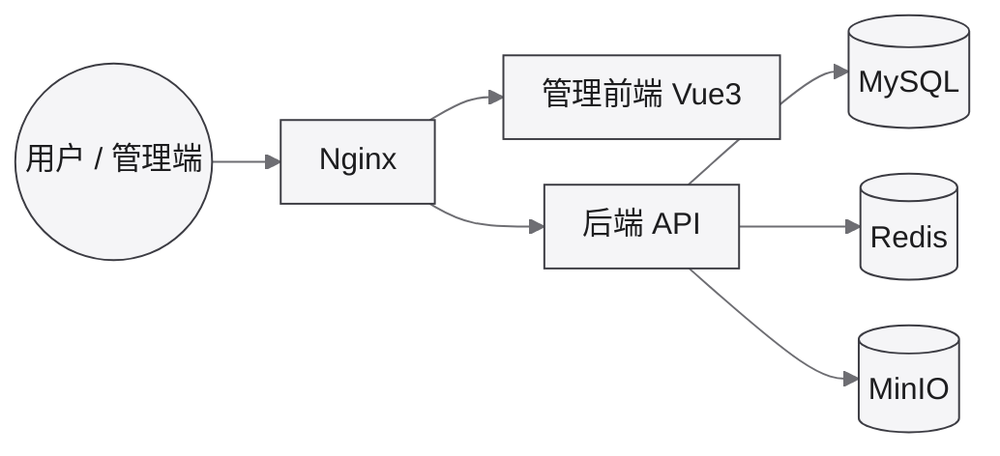

对应开发文档：[芋道 (ruoyi-vue-pro)](/dev/framework/yudao/)

## 部署架构

运行时依赖关系（地址确定后补到下表）。模块拆分见 [芋道介绍](/dev/framework/yudao/)。

## 环境地址

| 环境 | Web | 管理后台 | API / Swagger | 备注 |
|------|-----|----------|---------------|------|
| 开发 | _待补充_ | _待补充_ | _待补充_ | 主机 [dev-yudao](/ops/proxmox/dev-yudao/)（`192.168.31.101`） |
| 测试 | _待补充_ | _待补充_ | _待补充_ | |
| 生产 | _待补充_ | _待补充_ | _待补充_ | |

## 账号与说明

| 项 | 内容 |
|----|------|
| 默认账号 | _待补充_ |
| 部署方式 | 见 [后端部署](/dev/framework/yudao/deploy/)、[前端部署](/dev/framework/yudao/deploy-app/) |
| 基建创建 | [Proxmox VE](/ops/proxmox/)（开发 LXC / 生产 KVM 规划） |
| 其它 | |

顶栏「应用访问 → 芋道」的外链将在地址确定后补上。
