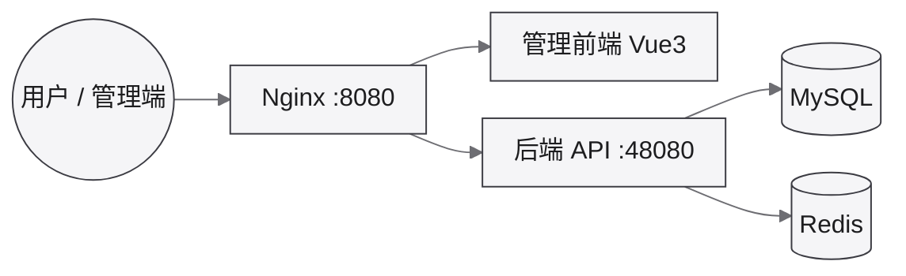

对应开发文档：[芋道 (ruoyi-vue-pro)](/dev/framework/yudao/)

代码仓库：后端官方 `YunaiV/ruoyi-vue-pro`（本地对齐）；前端自有 [bongxin/yudao-ui-admin-vben](https://github.com/bongxin/yudao-ui-admin-vben)。

## 部署架构

运行时依赖（开发 LXC 内 Docker Compose 单体形态）。模块拆分见 [芋道介绍](/dev/framework/yudao/)。

## 环境地址

| 环境 | Web / 管理后台 | API | 主机 |
|------|----------------|-----|------|
| 开发 | `http://192.168.31.103:8080` | `http://192.168.31.103:48080` | [dev-yudao](/ops/proxmox/dev-yudao/)（LXC `103`） |
| 测试 | `http://192.168.31.104:8080` | `http://192.168.31.104:48080` | test-yudao（LXC `104`，待部署） |
| 生产 | _待建_ | _待建_ | 规划为独立 KVM，见 [Proxmox VE](/ops/proxmox/) |

LXC IP 约定：末段 = VMID（模板 `102` / 开发 `103` / 测试 `104`）。

## 账号与说明

| 项 | 内容 |
|----|------|
| 默认账号 | 官方演示账号（部署后务必修改）；口令勿写入公开仓 |
| 部署方式 | 后端 `script/docker` Compose；前端 Vben5 `web-antd` · 见 [后端部署](/dev/framework/yudao/deploy/)、[前端部署](/dev/framework/yudao/deploy-app/) |
| 基建 | [Proxmox VE](/ops/proxmox/) · 模板 `tpl-yudao` 链接克隆 · Nesting + Docker |
| 代码路径（本机） | `/run/media/bongxin/Data/Data/Code/bernsine/` |

顶栏「应用访问 → 芋道」开发入口已指向 `.103`；服务未起来时页面不可达属正常。
