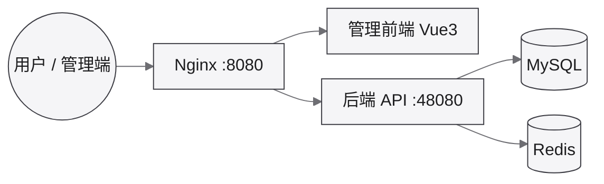

对应开发文档：[芋道 (ruoyi-vue-pro)](/dev/framework/yudao/)。创建过程见 [dev-yudao](/ops/proxmox/dev-yudao/)。

## 开发环境

LXC `dev-yudao`（VMID `103`），PVE 上 Ubuntu 26.04，2 核 / 8 GB / 40 GB，开机自启。

### 服务器（SSH）

- 地址: `192.168.31.103:22`
- 账号: `root`
- 口令创建时自管，不写入本页；也可从 [Proxmox VE](https://192.168.31.2:8006/) 控制台进入

### 数据库（MySQL）

- 地址: `192.168.31.103:3306`
- 库名: `ruoyi-vue-pro`
- 账号密码: `root` / 官方 Compose 演示默认（部署后请修改）

### 缓存（Redis）

- 地址: `192.168.31.103:6379`
- 口令: 无

### 应用访问（HTTP）

- 地址: [http://192.168.31.103:8080](http://192.168.31.103:8080)
- 账号密码: `admin` / 官方演示默认
- 租户编号: `1`

::: tip
其它入口见顶栏「应用访问」。
:::

### 接口地址

- Knife4j: [http://192.168.31.103:48080/doc.html](http://192.168.31.103:48080/doc.html)
- 管理端反代: [http://192.168.31.103:8080/admin-api/doc.html](http://192.168.31.103:8080/admin-api/doc.html)
- API: `http://192.168.31.103:48080`

## 测试 / 生产

| 环境 | 主机 | 状态 |
|------|------|------|
| 测试 | LXC `test-yudao` · `192.168.31.104` | 容器已建，应用未部署 |
| 生产 | 独立 KVM | 待建，见 [Proxmox VE](/ops/proxmox/) |

## 部署架构

