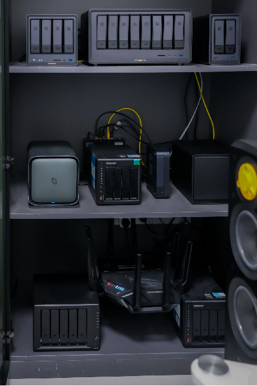

# 什么是NAS

NAS（Network Attached Storage：网络附属存储）按字面简单说就是连接在网络上，具备资料存储功能的装置，因此也称为“网络存储器”。它是一种专用数据存储服务器。它以数据为中心，将存储设备与服务器彻底分离，集中管理数据，从而释放带宽、提高性能、降低总拥有成本、保护投资。其成本远远低于使用服务器存储，而效率却远远高于后者。

专用、定制、易用、低功耗

## 物理设备长什么样？

## NAS（网络附加存储）和服务器的区别_功能

NAS（网络附加存储）：专注于数据存储和文件共享。它提供文件存储服务，并通常具有易于管理的界面，使用户能够简单地存储、访问和共享文件，类似于一个网络硬盘。NAS设备通常用于家庭、小型办公室或中小型企业，用来存储和备份文件、媒体内容等。

服务器：服务器的功能更广泛，它们可以提供多种服务，包括存储、应用程序运行、数据处理、网络服务等。服务器的作用更为多样化，可以根据需要配置成网络服务器、应用服务器、数据库服务器等，提供不同的服务和功能。

## NAS（网络附加存储）和服务器的区别_设计和用途

NAS 设备通常设计为小型、专注于存储、易于设置和管理。它们经常具有低功耗和静音特性，并且专注于提供高效的文件存储和共享功能。服务器 的设计和配置通常更强大和多样化，可以适应更复杂的工作负载。

服务器通常具有更多的处理能力、内存和存储空间，并且可以同时运行多个应用程序或服务。

## NAS的构成

### 物理存储介质

这是NAS的核心组件之一。通常包括一个或多个硬盘驱动器（HDD）或固态硬盘

### 硬件主体

通常包含CPU、内存、电源、机箱在内的硬件设备部分

### 操作系统

几乎所有的商用NAS都运行着专为其硬件定制的操作系统，例如群晖的DSM、威联通的QTS或是开源项目如FreeNAS。
这类操作系统不仅提供了图形化的管理界面，还集成了众多实用的应用和服务，使得NAS不仅仅是一个简单的存储装置，而更像是一个多用途的小型服务器。

## 各品牌NAS产品的对比

| 特性         | 群晖 (Synology) | 威联通 (QNAP) | 绿联   | 铁威马 (Thecus) | 极空间 (ZKSJ) |
|--------------|-----------------|---------------|--------|-----------------|---------------|
| 易用性       | ★★★★☆         | ★★★☆☆       | ★★★☆☆ | ★★☆☆☆          | ★★★★☆       |
| 功能丰富度   | ★★★★★        | ★★★★☆       | ★★★☆☆ | ★★★☆☆         | ★★★☆☆       |
| 性价比       | ★★☆☆☆         | ★★★☆☆       | ★★★★☆ | ★★★★☆         | ★★★★☆       |
| 数据安全性   | ★★★★★        | ★★★★☆       | ★★★☆☆ | ★★★☆☆         | ★★★☆☆       |
| 社区支持     | ★★★★★        | ★★★★☆       | ★★☆☆☆ | ★☆☆☆☆          | ★☆☆☆☆       |
| 多媒体管理   | ★★★★☆         | ★★★★☆       | ★★★☆☆ | ★★★☆☆         | ★★★★☆       |