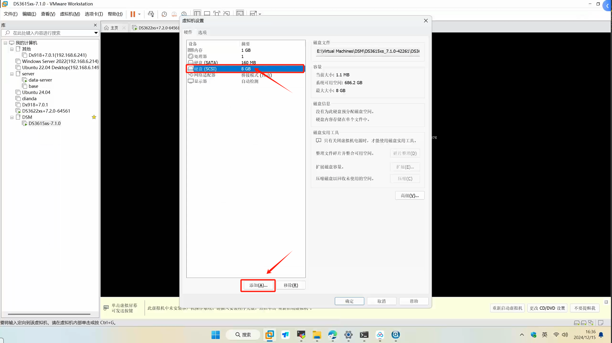
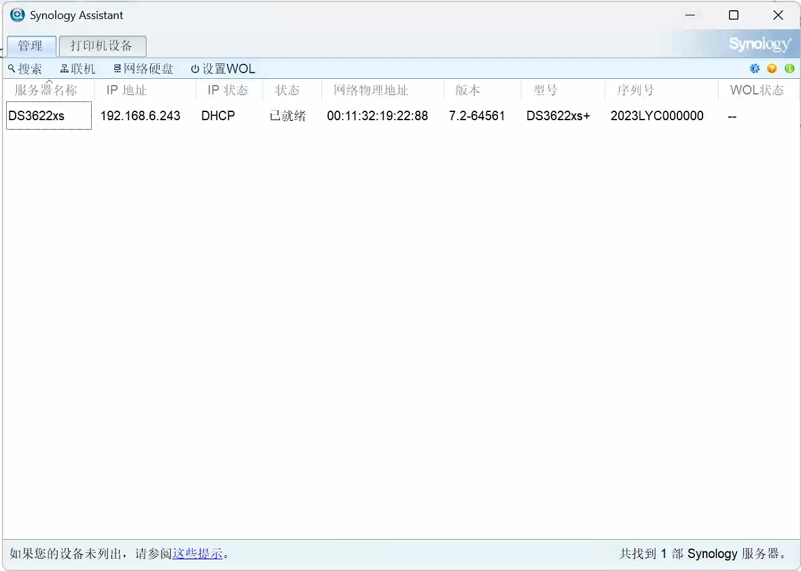
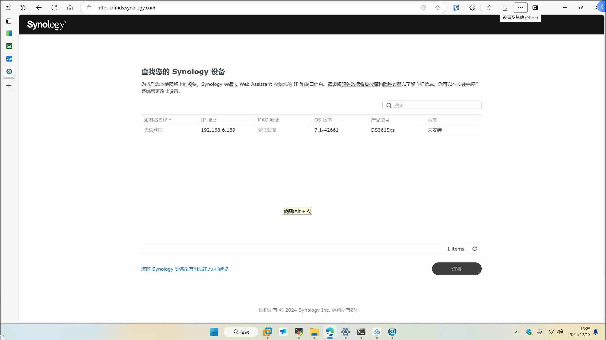
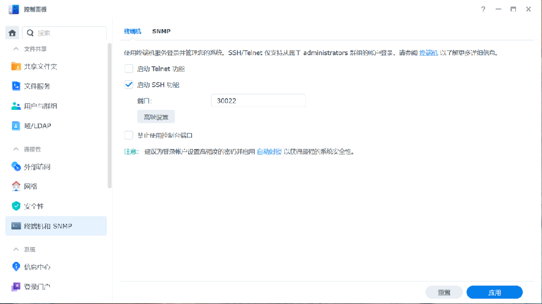

# 群晖NAS系统（DSM）的安装和使用

## NAS系统有哪些核心功能

### 文件共享

NAS设备允许通过网络在多台计算机之间共享文件，很多都内置了文件服务器的功能

### 数据备份

支持本地、异地、NAS间备份，保护数据安全。

### 多媒体管理

作为家庭或办公室的多媒体中心，存储大量照片、视频和音乐文件

## 群晖NAS系统（DSM）的安装

### 准备工作

::: tip 准备工作
1. VMware Workstation Pro 17 (个人使用免费) ——> [下载](https://blogs.vmware.com/china/2024/05/16/workstation-%E5%92%8C-fusion-%E5%AF%B9%E4%B8%AA%E4%BA%BA%E4%BD%BF%E7%94%A8%E5%AE%8C%E5%85%A8%E5%85%8D%E8%B4%B9%EF%BC%8C%E4%BC%81%E4%B8%9A%E8%AE%B8%E5%8F%AF%E8%BD%AC%E5%90%91%E8%AE%A2%E9%98%85/)
2. 【可选】群晖助手下载（Synology Assistant） ——>[下载](https://www.suncan.com.cn/archives/5612)
3. DS3622xs+7.2-64561(懒人包).7z
4. DSM_DS3622xs+_64561.pat (引导文件)
:::

### 运行虚拟机

解压 `DS3622xs+7.2-64561(懒人包).7z` 后，打开 `DS3622xs+7.2.0-64561.vmx`

#### 配置添加硬盘

### 搜索黑群晖

使用 `Synology Assistant` 搜索运行的黑群晖

::: warning 提示
`群晖助手（Synology Assistant）`可能搜索不到，使用浏览器访问 `find.synology.com`
:::

### 安装

## 群晖NAS系统（DSM）的使用

### 核心功能

#### 用户管理

用户与群组

#### 网络配置

登录门户、网络、安全性、终端机、（软路由配置）

#### 文件服务

共享文件夹、文件服务、File Station

#### 套件中心

WebDav、Video、Container、Drive

### 用户管理

#### 管理账号

#### 配置权限

### 网络配置

#### 配置访问端口

#### 配置IP地址

#### 配置SSL证书

#### 配置SSH访问

#### 软路由配置端口转发

### 文件服务

#### File Station（类似Windows资源管理器）

#### 共享文件夹

#### 文件服务

### 套件中心

支持配置套件来源，实现使用第三方套件

## 群晖NAS套件分享和演示

### WebDav Server

#### Raidrive通过WebDAV实现群晖硬盘本地化

#### 小米电视网络连接（WebDav）

### Video Station

#### 利用豆瓣刮削器获取视频信息

### Synology Drive

#### 功能

* 支持分享
* 支持版本历史
* 支持同步
* 支持备份
* 支持回收站
* 支持多种客户端

### Container Manager（DSM低版本上叫Docker）

#### 注册表设置支持配置注册表镜像

#### 功能

* 可视化
* 配置映射端口
* 配置映射路径
* 配置镜像源
* 查看日志

## NAS在企业和家庭中的应用

### 应用

#### 企业

* 电子图书馆（红色图书、技术图书）——WebDav
* 共享文件夹（协同办公）、员工权限控制—— SMB、用户管理
* 数据备份——Synology Drive备份
* 企业培训视频（培训内容、培训人等信息）——Video Station
* 对外资料（实施人员部署材料）——WebDav、Synology Drive共享文件
* 简单Docker应用部署——Container Manager

#### 家庭

* 家庭影院———Video Station
* 个人网盘（手机电脑资料备份）——Synology Drive
* 个人图书馆——WebDav、Koodo Reader
* 移动端套件——DS video、DS file、DS note、Drive、Photos
* 家庭软路由——DDNS、路由器配置（端口转发）

### 个人图书馆——WebDav、Koodo Reader

* 必须挂在共享文件夹
* 必须使用http协议

### 移动端套件

