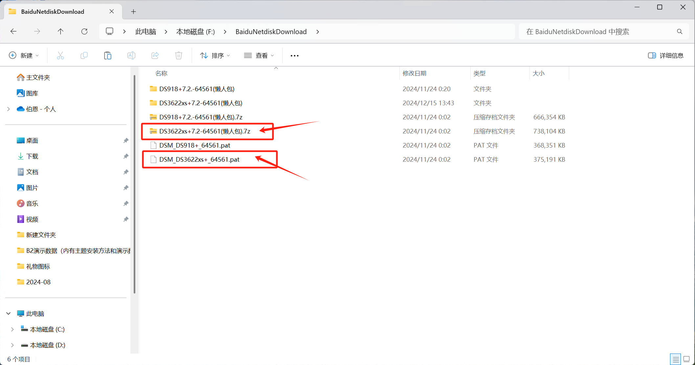
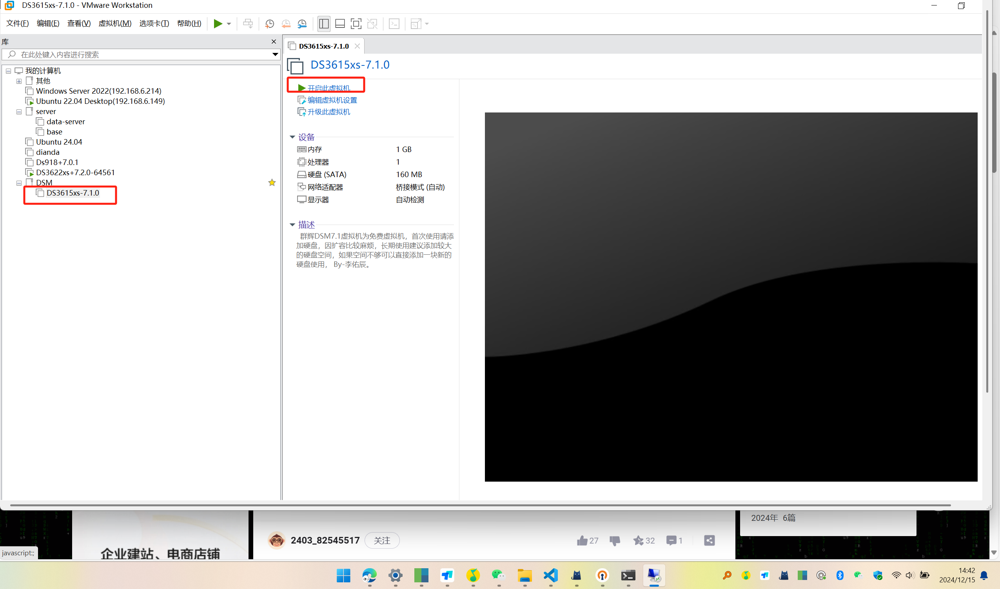
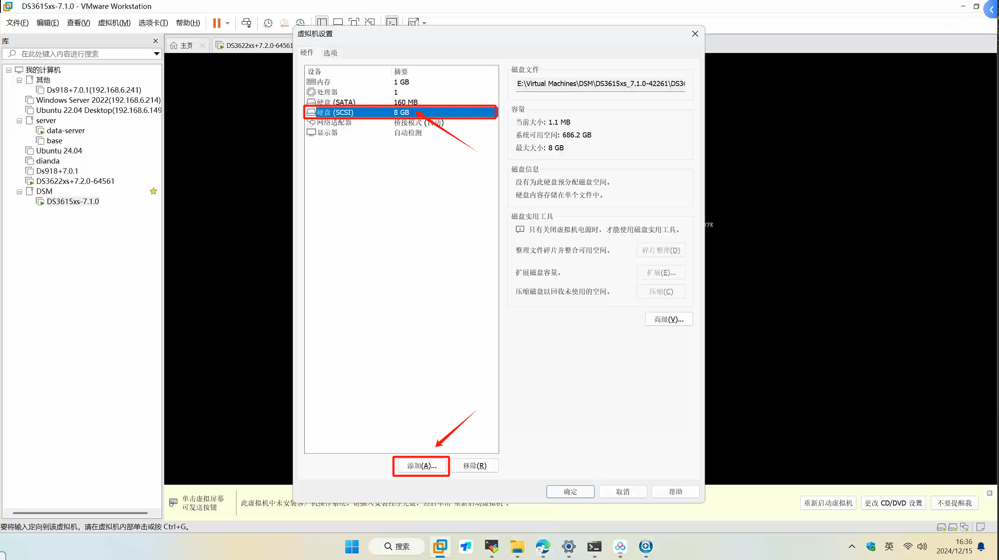
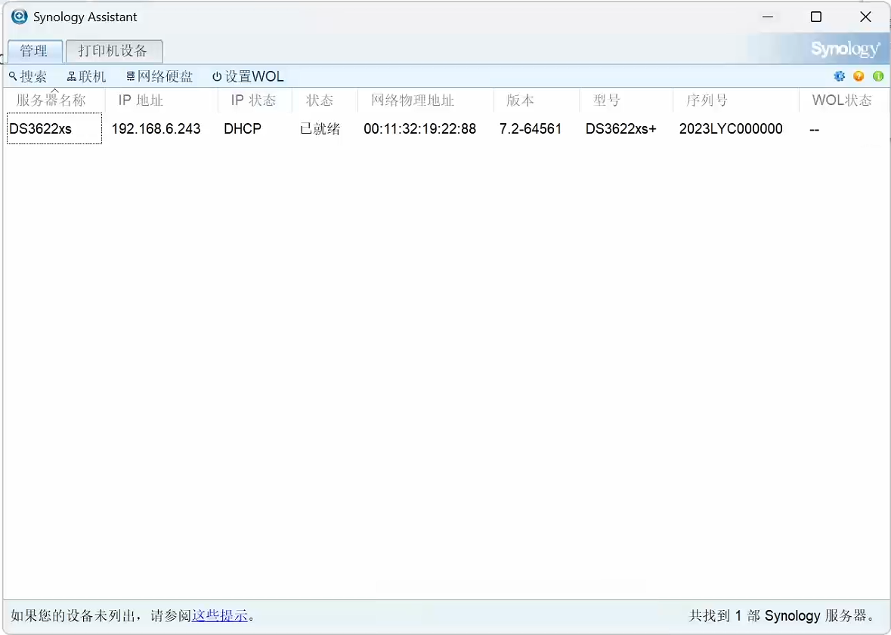
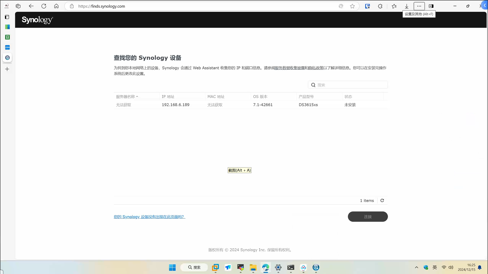

# 认识群晖NAS

## 

## 安装黑群晖

### 准备工作

::: tip 准备工作
1. VMware Workstation Pro 17 (个人使用免费) ——> [下载](https://blogs.vmware.com/china/2024/05/16/workstation-%E5%92%8C-fusion-%E5%AF%B9%E4%B8%AA%E4%BA%BA%E4%BD%BF%E7%94%A8%E5%AE%8C%E5%85%A8%E5%85%8D%E8%B4%B9%EF%BC%8C%E4%BC%81%E4%B8%9A%E8%AE%B8%E5%8F%AF%E8%BD%AC%E5%90%91%E8%AE%A2%E9%98%85/)
2. 【可选】群晖助手下载（Synology Assistant） ——>[下载](https://www.suncan.com.cn/archives/5612)
3. DS3622xs+7.2-64561(懒人包).7z
4. DSM_DS3622xs+_64561.pat (引导文件)
:::

### 运行虚拟机

解压 `DS3622xs+7.2-64561(懒人包).7z` 后，打开 `DS3622xs+7.2.0-64561.vmx`

#### 配置添加硬盘

### 搜索黑群晖

使用 `Synology Assistant` 搜索运行的黑群晖

::: warning 提示
`群晖助手（Synology Assistant）`可能搜索不到，使用浏览器访问 `find.synology.com`
:::

### 安装

