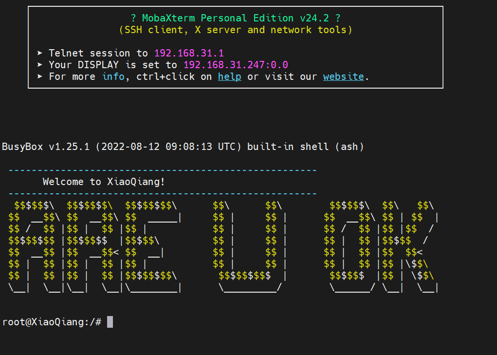
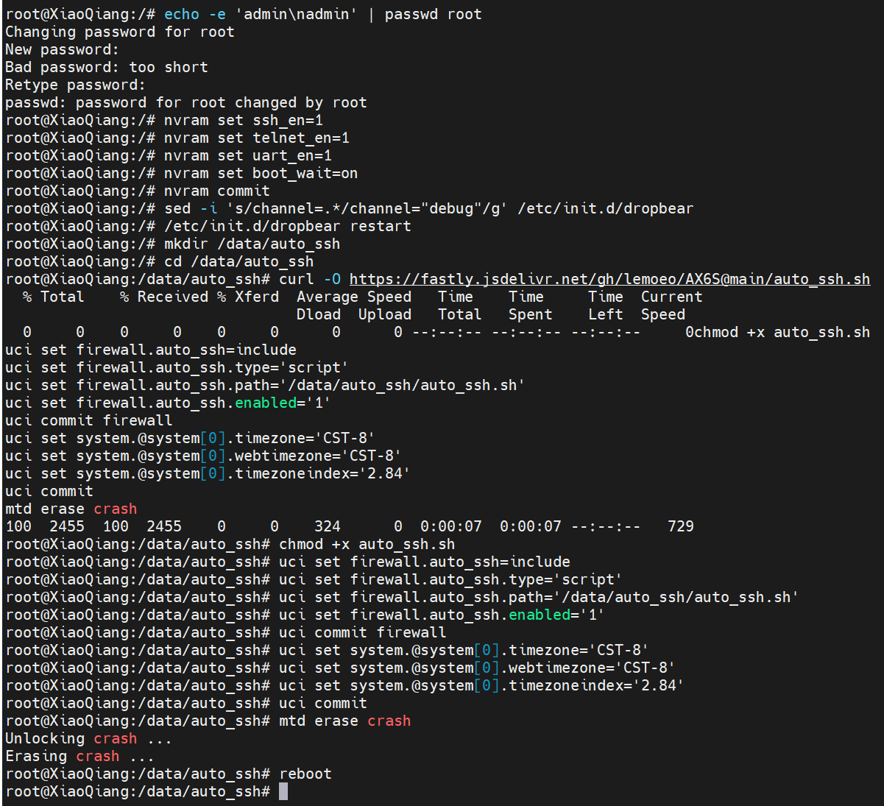
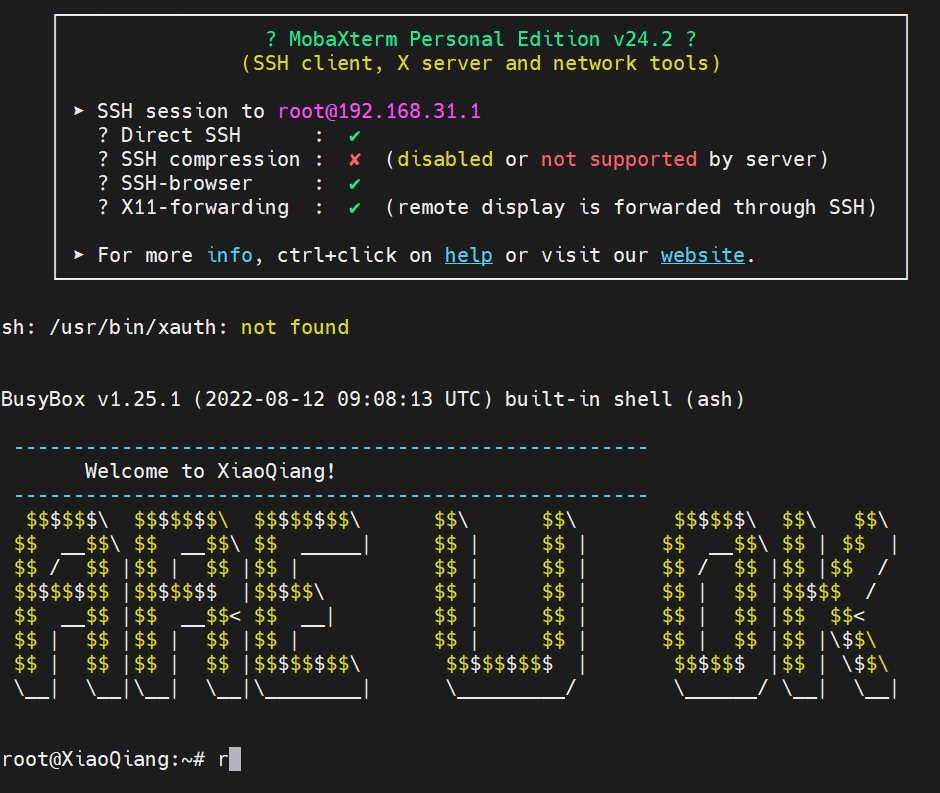
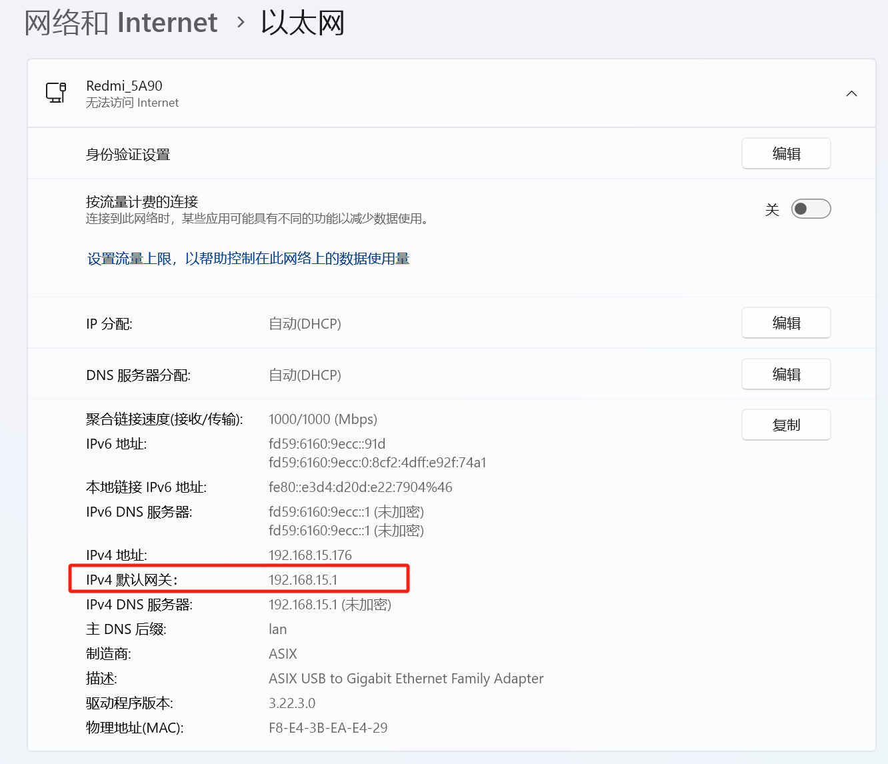
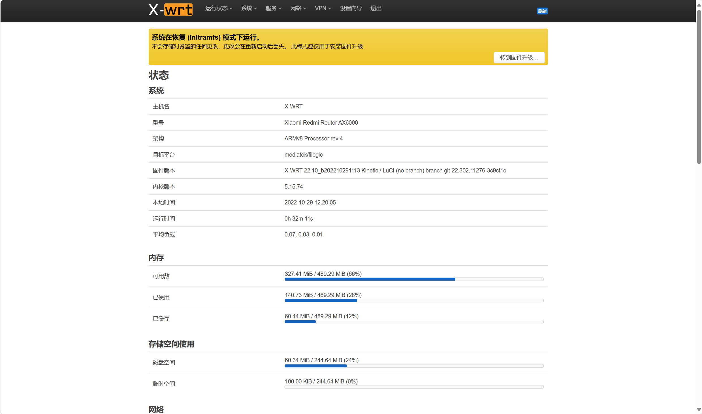
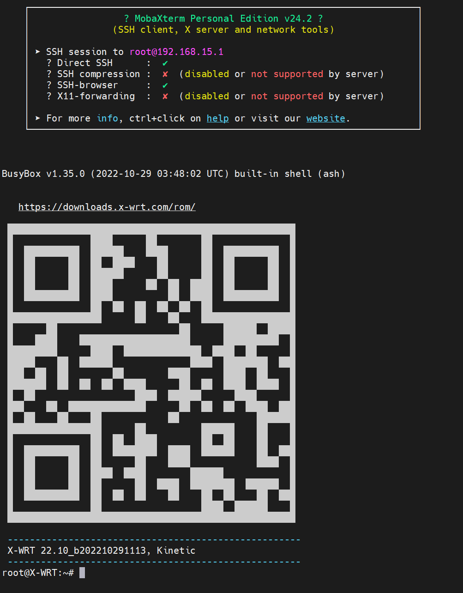
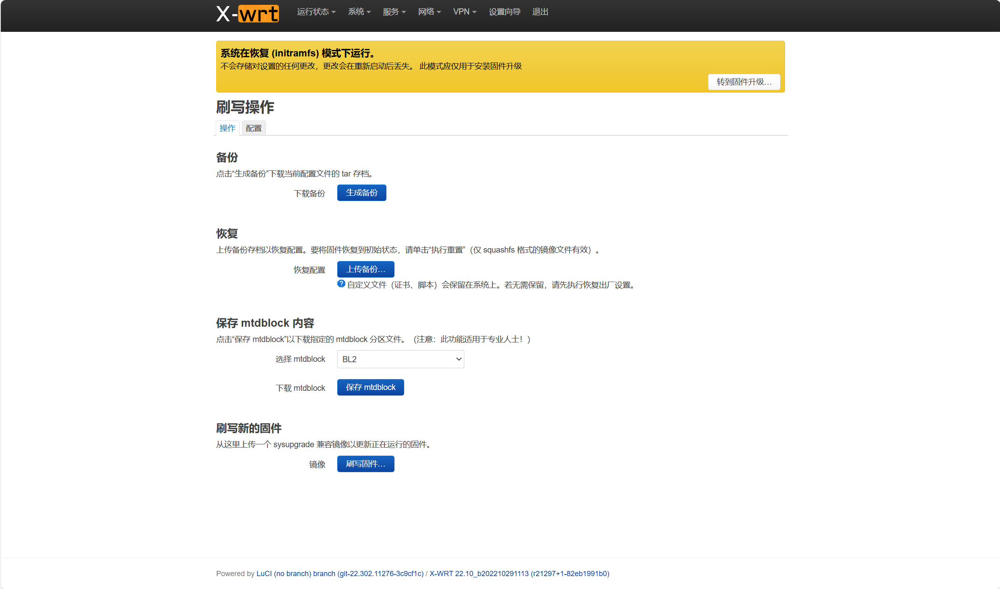

# 红米AX6000刷UBoot和OpenWrt固件

* 开启SSH
* 刷入过渡固件
* 刷入OpenWrt固件

## 降级官方固件

下载固件地址：[https://cdn.cnbj1.fds.api.mi-img.com/xiaoqiang/rom/rb06/miwifi_rb06_firmware_847e9_1.0.48.bin](https://cdn.cnbj1.fds.api.mi-img.com/xiaoqiang/rom/rb06/miwifi_rb06_firmware_847e9_1.0.48.bin)

::: warning 注意
要降级：导航到 Upload firmware （上传固件） 页面并选择适当的软件版本。它会抱怨降级。编辑 url 并将末尾的 <html>0</html> 更改为 <html>1</html>，然后按 Enter。或者，如果已经有 <html>1</html>（在 v1.0.64 上看到），请更改为 <html>2</html>。降级将继续进行。
:::

## 开启SSH

<BilibiliPlayer
  base-src="//player.bilibili.com/player.html?isOutside=true&aid=260611365&bvid=BV1Qe411T7TZ&cid=833815481&p=1"
/>

文档地址：[红米 AX6000 最强 CPU 的硬路由｜解锁 SSH 安装 ShellClash 教程](https://qust.me/post/ax6000-shellclash/)

### 获取stok

``` sh
http://192.168.31.1/cgi-bin/luci/;stok=c9d5f7d3ccfc896e9f04bea8c88d0938/web/prosetting/qos
```

### 开启调试模式

``` sh
http://192.168.31.1/cgi-bin/luci/;stok=c9d5f7d3ccfc896e9f04bea8c88d0938/api/misystem/set_sys_time?timezone=%20%27%20%3B%20zz%3D%24%28dd%20if%3D%2Fdev%2Fzero%20bs%3D1%20count%3D2%202%3E%2Fdev%2Fnull%29%20%3B%20printf%20%27%A5%5A%25c%25c%27%20%24zz%20%24zz%20%7C%20mtd%20write%20-%20crash%20%3B%20
```

### 重启

``` sh
http://192.168.31.1/cgi-bin/luci/;stok=c9d5f7d3ccfc896e9f04bea8c88d0938/api/misystem/set_sys_time?timezone=%20%27%20%3b%20reboot%20%3b%20
```

::: warning
重启后，要重新获取新的 `stok`
:::

### 设置永久开启telnet

``` sh
http://192.168.31.1/cgi-bin/luci/;stok=7ce0ad34047a948b4aa800ac8d1d2989/api/misystem/set_sys_time?timezone=%20%27%20%3B%20bdata%20set%20telnet_en%3D1%20%3B%20bdata%20set%20ssh_en%3D1%20%3B%20bdata%20set%20uart_en%3D1%20%3B%20bdata%20commit%20%3B%20
```

### 重启

``` sh
http://192.168.31.1/cgi-bin/luci/;stok=7ce0ad34047a948b4aa800ac8d1d2989/api/misystem/set_sys_time?timezone=%20%27%20%3b%20reboot%20%3b%20
```

### Telnet连接路由器



### 永久开启并固化ssh

``` sh
echo -e 'admin\nadmin' | passwd root
nvram set ssh_en=1
nvram set telnet_en=1
nvram set uart_en=1
nvram set boot_wait=on
nvram commit
sed -i 's/channel=.*/channel="debug"/g' /etc/init.d/dropbear
/etc/init.d/dropbear restart
mkdir /data/auto_ssh
cd /data/auto_ssh
curl -O https://fastly.jsdelivr.net/gh/lemoeo/AX6S@main/auto_ssh.sh
chmod +x auto_ssh.sh
uci set firewall.auto_ssh=include
uci set firewall.auto_ssh.type='script'
uci set firewall.auto_ssh.path='/data/auto_ssh/auto_ssh.sh'
uci set firewall.auto_ssh.enabled='1'
uci commit firewall
uci set system.@system[0].timezone='CST-8'
uci set system.@system[0].webtimezone='CST-8'
uci set system.@system[0].timezoneindex='2.84'
uci commit
mtd erase crash
reboot
```

这个命令将 root 用户的密码设置为 admin。



### SSH连接路由器


## 刷入OpenWrt固件

<BilibiliPlayer
  base-src="//player.bilibili.com/player.html?isOutside=true&aid=304933810&bvid=BV1oP411F7Y2&cid=886896357&p=1"
/>

文档地址：[红米 ax6000 刷 openwrt 教程，终于有完善好用的 openwrt 了](https://qust.me/post/ax6000-openwrt/)

### 刷入过渡固件

``` sh
cat /proc/cmdline
```

这一步需要路由器是正常联网的，首先 ssh 连接上红米 ax6000 ，执行上面的命令，查看返回的 firmware 等于 0 还是 1。 （我截图这里是 1 ）

如果是 0 执行

``` sh
nvram set boot_wait=on
nvram set uart_en=1
nvram set flag_boot_rootfs=1
nvram set flag_last_success=1
nvram set flag_boot_success=1
nvram set flag_try_sys1_failed=0
nvram set flag_try_sys2_failed=0
nvram commit
cd /tmp
ubiformat /dev/mtd9 -y -f /tmp/initramfs-factory.ubi
reboot -f
```

如果是 1 执行

``` sh
nvram set boot_wait=on
nvram set uart_en=1
nvram set flag_boot_rootfs=0
nvram set flag_last_success=0
nvram set flag_boot_success=1
nvram set flag_try_sys1_failed=0
nvram set flag_try_sys2_failed=0
nvram commit
cd /tmp
ubiformat /dev/mtd8 -y -f /tmp/initramfs-factory.ubi
reboot -f
```

#### 上传过渡固件

* 教程：[https://www.right.com.cn/forum/thread-8255378-1-1.html](https://www.right.com.cn/forum/thread-8255378-1-1.html)
* 过渡固件介绍：[https://www.right.com.cn/forum/thread-212965-1-1.html](https://www.right.com.cn/forum/thread-212965-1-1.html)
* 过渡固件下载地址:[https://downloads.x-wrt.com/rom/](https://downloads.x-wrt.com/rom/)
* 过渡固件名称：`x-wrt-24.04-b202410201421-mediatek-filogic-xiaomi_redmi-router-ax6000-stock-initramfs-factory.ubi`
* sysupgrade文件：`x-wrt-24.04-b202410201421-mediatek-filogic-xiaomi_redmi-router-ax6000-stock-squashfs-sysupgrade.bin`

``` sh
cd /tmp
ubiformat /dev/mtd8 -y -f /tmp/initramfs-factory.ubi
reboot -f
```

::: danger 注意
如果发现以下错误，需留意根据 `firmware` 等于 `0` 还是 `1` 来选择 `mtd8` 还是 `mtd9`。
```
ubiformat: error!: cannot open "/dev/mtd8"
           error 13 (Permission denied)
```
:::

### 访问过渡固件
::: warning 注意
如果没有找到OpenWrt的wifi的话，请使用网线连接路由来访问过渡固件
:::

#### 查看过渡固件ip


#### 浏览器访问过渡固件
```
http://192.168.15.1/
```
* 用户名和密码：admin/admin



#### ssh连接过渡固件


执行命令
``` sh
fw_setenv boot_wait on
fw_setenv uart_en 1
fw_setenv flag_boot_rootfs 0
fw_setenv flag_last_success 1
fw_setenv flag_boot_success 1
fw_setenv flag_try_sys1_failed 8
fw_setenv flag_try_sys2_failed 8
```

#### 升级过渡固件
执行命令
``` sh
sysupgrade -n /tmp/stock-sysupgrade.bin
```

### 连接Wifi

固件无线默认名称：X-WRT_XXXX，密码：88888888
固件管理界面：http://192.168.15.1/
管理界面账户密码：admin/admin
SSH后台登录：root/admin

::: warning 提示
连接WiFi后，需要断开网线，如果连接网线，会默认优先走网线网络，导致192.168.15.1管理后台访问不了
:::

### 刷写固件

::: warning 提示

地址：[https://www.right.com.cn/forum/forum.php?mod=viewthread&tid=8379756&highlight=AX6000](https://www.right.com.cn/forum/forum.php?mod=viewthread&tid=8379756&highlight=AX6000)

固件下载地址(AX6000)：[https://openwrt.mpdn.fun:8443/?dir=lede/mtk/2024-10-31__03-49-41--xiaomi_redmi-ax6000.stable-daily](https://openwrt.mpdn.fun:8443/?dir=lede/mtk/2024-10-31__03-49-41--xiaomi_redmi-ax6000.stable-daily)

在线体验：[https://openwrt.mpdn.fun:8443/?dir=lede/x86_64/](https://openwrt.mpdn.fun:8443/?dir=lede/x86_64/)

immortalWRT下载地址：[https://mirrors.zuoyx.xyz/openwrt/releases/21.02-SNAPSHOT/targets/mediatek/mt7986/](https://mirrors.zuoyx.xyz/openwrt/releases/21.02-SNAPSHOT/targets/mediatek/mt7986/)

:::



打开系统-备份与升级，选择刷写固件。浏览里找到下载好的 openwrt 固件，选择上传。上传好后选择取消勾选保留当前配置然后选择继续。等待刷写完成自动重启，就会进入新的 openwrt 固件。


## 访问OpenWRT

* 后台地址：192.168.6.1
* 用户名：root
* 密码：password