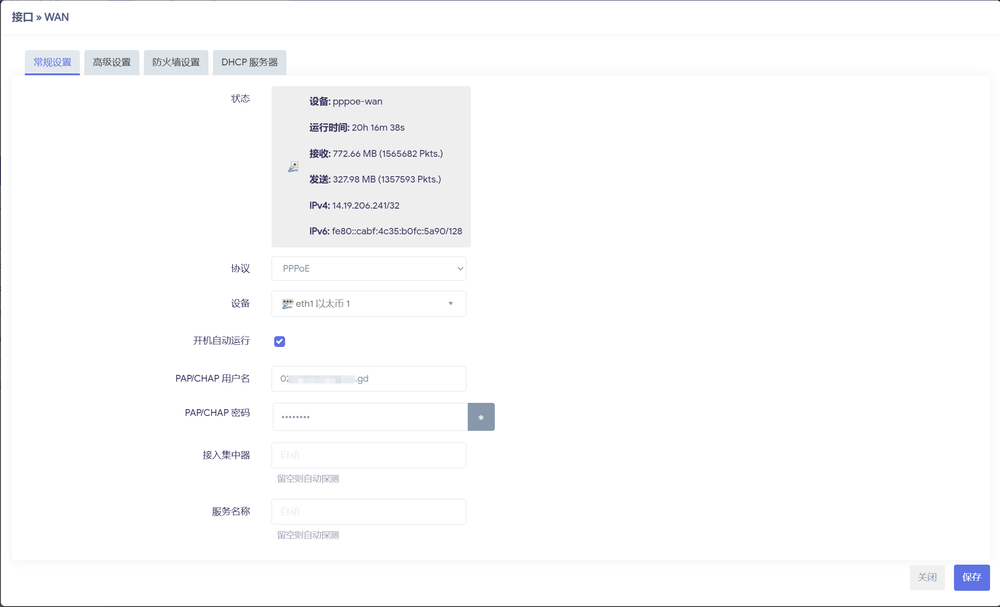
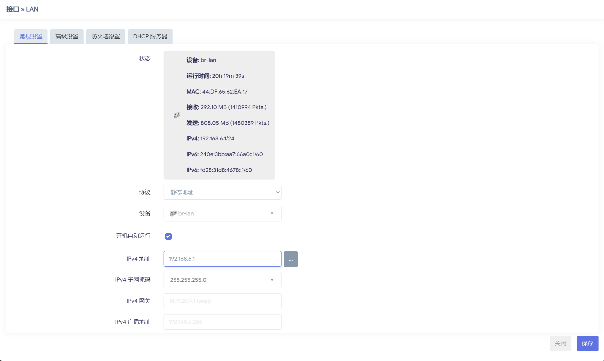

# OpenWRT使用

## 拨号上网

### WAN口配置、

进入 `网络-接口`
协议选择 `PPPoE` ，输入宽带账号密码



### LAN口配置

进入 `网络-接口`
协议选择 `静态地址`



## Wi-Fi无线网络配置

进入 `网络-无线`


## 安装软件

软件包对照：[https://www.right.com.cn/forum/forum.php?mod=viewthread&tid=8387547&highlight=%E8%BD%AF%E4%BB%B6%E5%8C%85](https://www.right.com.cn/forum/forum.php?mod=viewthread&tid=8387547&highlight=%E8%BD%AF%E4%BB%B6%E5%8C%85)

### luci-app-DDNS(动态DNS)

```
luci-app-ddns-go
luci-i18n-ddns-go-zh-cn
```

### luci-app-adblock(广告拦截功能)
```
luci-app-adblock
luci-i18n-adblock-zh-cn
```             


## 修改IP网段

``` sh
vi /etc/config/network
```

``` sh
# /etc/config/network
config interface 'loopback'
        option device 'lo'
        option proto 'static'
        option ipaddr '127.0.0.1'
        option netmask '255.0.0.0'

config globals 'globals'
        option ula_prefix 'fd28:31d8:4678::/48'

config device
        option name 'br-lan'
        option type 'bridge'
        list ports 'eth0'

config device
        option name 'eth0'
        option macaddr '44:df:65:62:ea:17'

config interface 'lan'
        option device 'br-lan'
        option proto 'static'
        option ipaddr '192.168.6.1'
        option netmask '255.255.255.0'
        option ip6assign '60'

config device
        option name 'eth1'
        option macaddr 'c8:bf:4c:fc:5a:90'

config interface 'wan'
        option device 'eth1'
        option proto 'pppoe'
        option username '0207399577@163.gd'
        option password 'gx532231'
        option ipv6 'auto'

config interface 'wan6'
        option device 'eth1'
        option proto 'dhcpv6'

config switch
        option name 'switch0'
        option reset '1'
        option enable_vlan '1'

config switch_vlan
        option device 'switch0'
        option vlan '1'
        option ports '1 2 3 6'

config switch_vlan
        option device 'switch0'
        option vlan '2'
        option ports '4 5'
```

``` sh
reboot
```

## 绑定IP和Mac地址