# Clash 使用教程

## 安卓使用方法

### 1.购买商城会员

[hh5h.cn](https://hh5h.cn/)（如已购买，直接开始下一步）

{ width=240 }

### 2.clash 下载

[https://wwjt.lanzouw.com/iDN6P0rdxywf](https://wwjt.lanzouw.com/iDN6P0rdxywf)

打开 clash 软件，点击【配置】

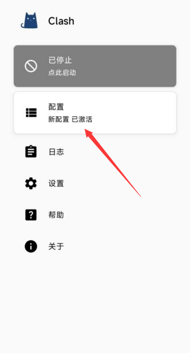{ width=240 }

### 3.点击右上角的【+】号

{ width=240 }

### 4.配置

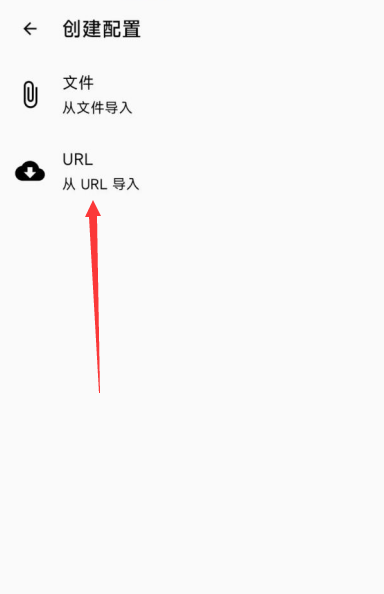{ width=240 }

### 5.url 填写所购买的【url 地址】，自动更新 时间填 60

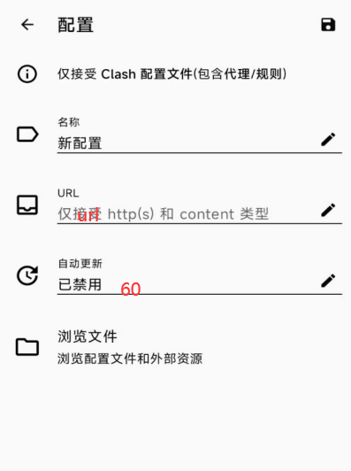{ width=240 }

### 6.点击右上角【保存】

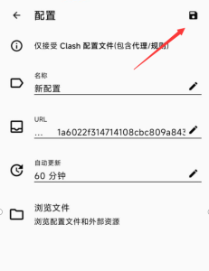{ width=240 }

### 7.点击【代理】

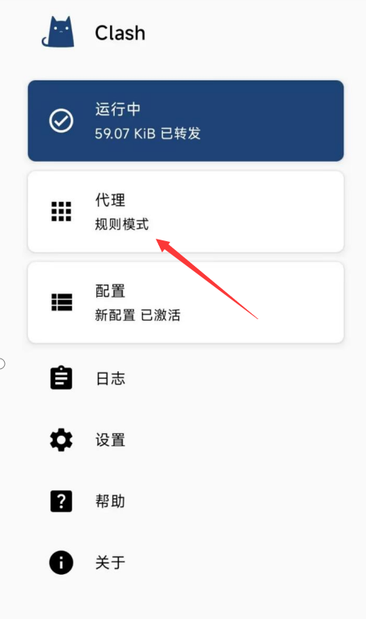{ width=240 }

点右下角蓝色小圆圈，进行测速，有数字显示，说明正常

选择地区后（建议选择美国）

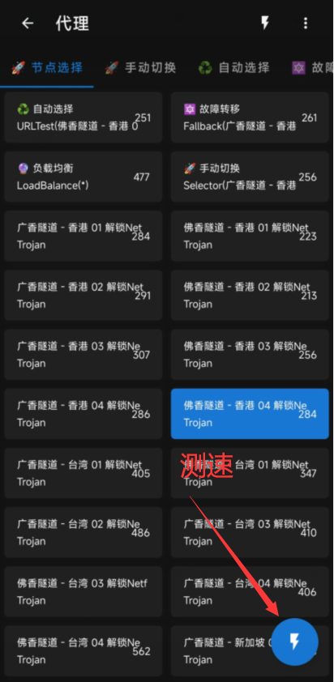{ width=240 }

### 8.开关

不用的时候选择关闭，使用的时候再打开

{ width=240 }

## windous 使用方法

### 1.购买商城会员

[https://www.ssad.shop/#](https://www.ssad.shop/#)（如已购买，直接开始下一步）

PC 端 clash 下载

[https://wwjt.lanzouw.com/iW0Mb0t2062f](https://wwjt.lanzouw.com/iW0Mb0t2062f)

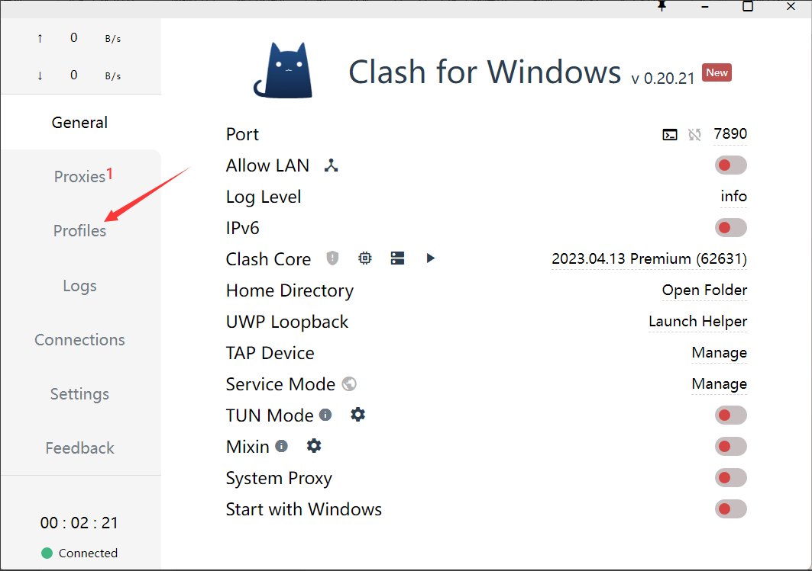{ width=640 }

### 2.点击 proflies

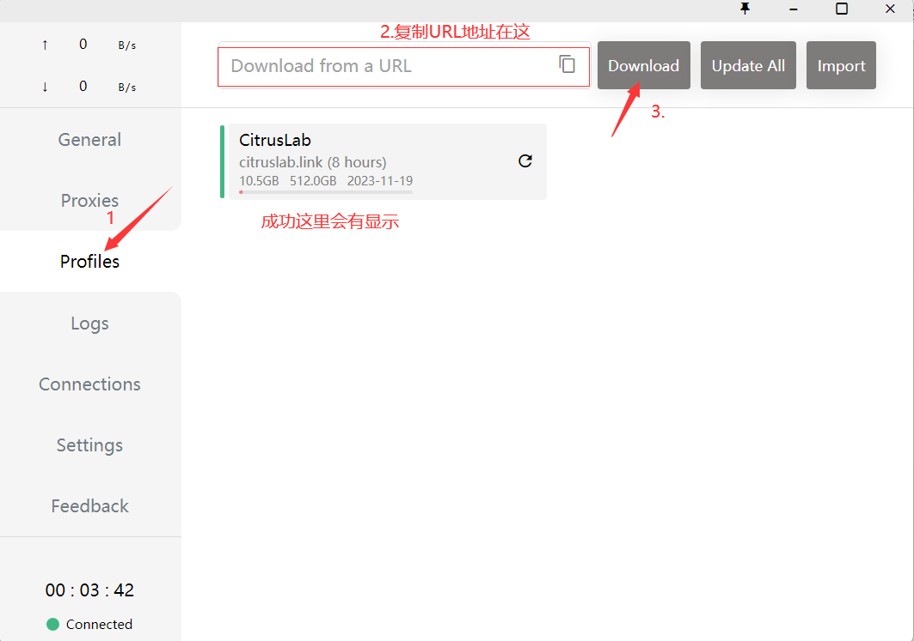{ width=640 }

### 3.点击【proxies】

然后点击【Global】，再测速，有数字显示表示正常，数字越小延迟越低

然后选择地区，建议选择美国地区

{ width=640 }

### 4.开关【system proxy】

绿色代表开 红色代表关

::: warning 提醒
注：不用的时候关掉，开着会影响网速，长时间开着会造成电脑没网
:::

{ width=640 }

## Mac 使用方法

### 1.购买商城会员

https://www.ssad.shop/#（如已购买，直接开始下一步）

### 2.Clashx 下载

https://doc.miyun.app/apps/clashx/ClashX.dmg

### 3.安装

下载后运行 dmg 文件以安装,手动将安装包拖入「应用程序」文件夹中。

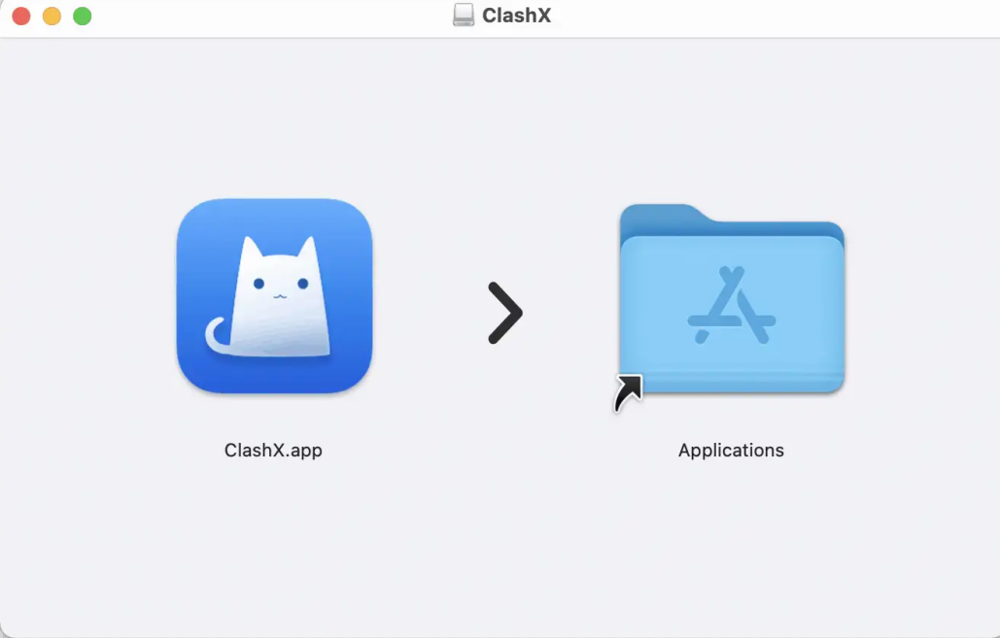{ width=640 }

首次使用 ClashX 时，macOS 会提醒你此应用来自未知开发者，请允许打开此应用。

ClashX 首次运行会提示是否安装帮助程序（Helper）。此帮助程序用于设置系统代理，否则每次你通过 ClashX 变更系统系统状态（打开或关闭）时都需要输入密码，请点击 “Install”，之后 macOS 会提示输入用户密码。

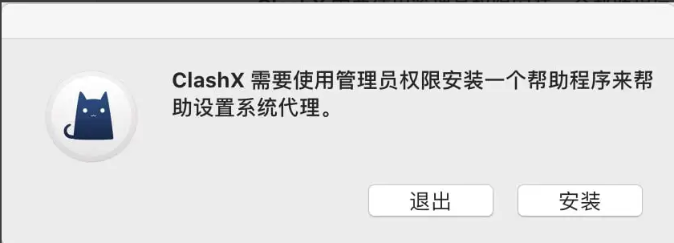{ width=640 }

### 4.配置

一键导入 Clash 订阅

配置订阅 ：点击状态栏 ClashX 图标 → 配置 → 托管配置 → 点击 管理 之后步骤同 自动配置。

复制到 url 地址

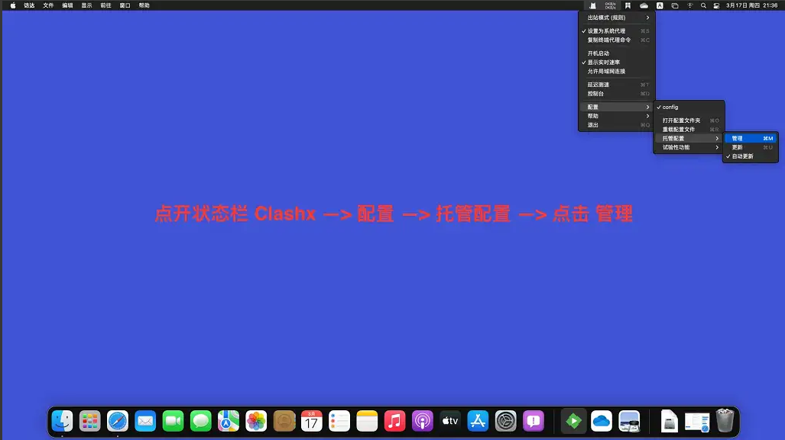{ width=640 }

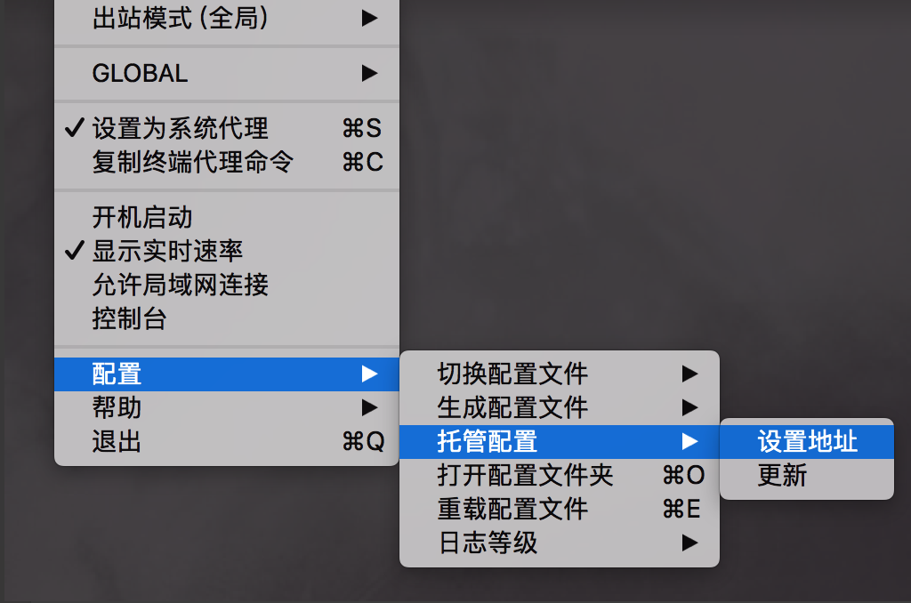{ width=640 }

将地址复制到 URL 输入框，点击 OK 即可。

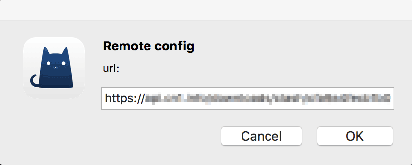{ width=640 }

5、客户端将从 BosLife API 中心验证地址并下载配置文件。

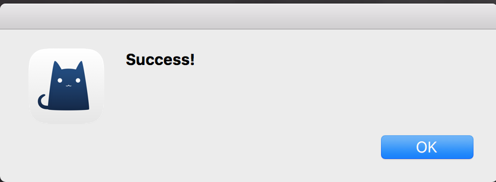{ width=640 }

6.设置软件模式。首先勾选设置为系统代理（软件启动生效），然后根据需求选择出站模式，建议为规则判断即可。

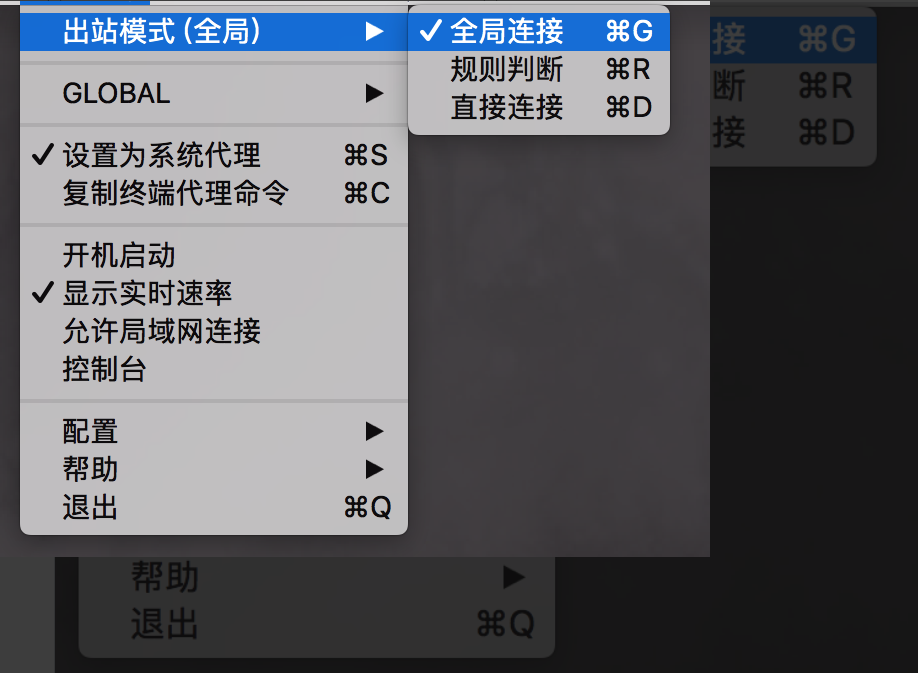{ width=640 }

7.开启代理

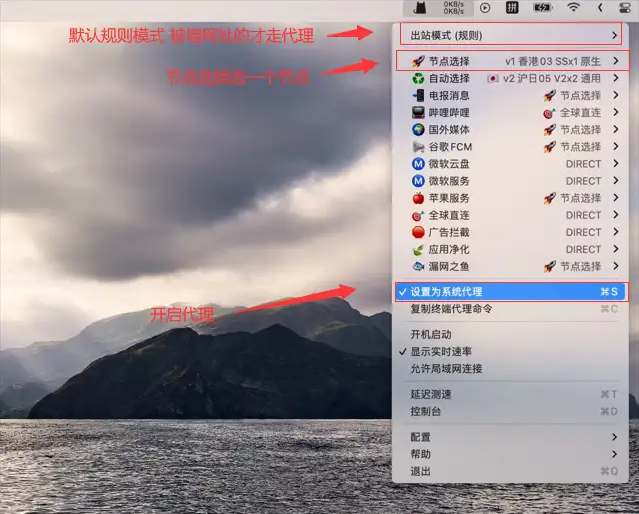{ width=640 }

即可访问 youtube，google 等服务测试网络连通性。如果感觉网速不佳，尝试切换不同节点，或者升级订阅套餐。首次使用建议浏览器开一个隐私模式查看能否正常访问 google，隐私模式可以屏蔽插件的影响，如果您隐私模式可以，正常模式不可以，那么就是插件对代理造成了影响。停用可疑的插件即可。