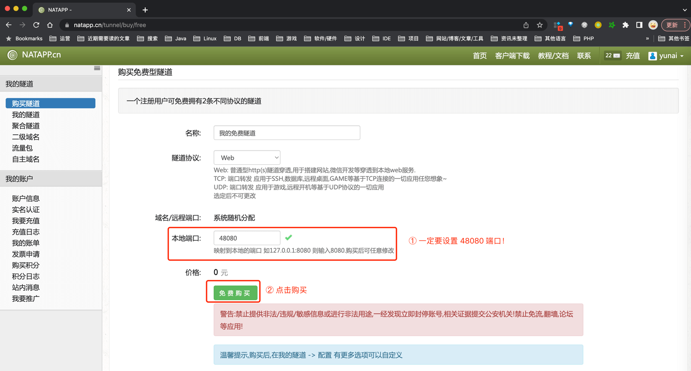
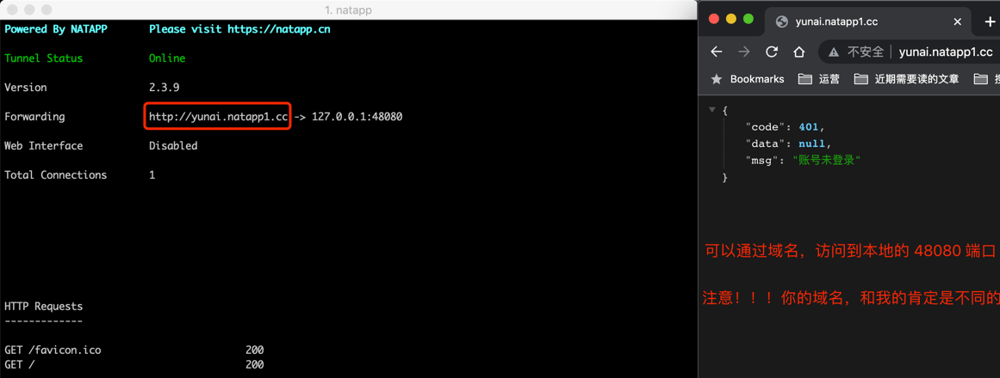

# 内网穿透
在和外部系统对接时，经常需要将本地的服务，暴露到外网中。这时候，就需要使用内网穿透工具了。例如说：支付宝回调、微信支付回调、微信公众号接入、微信小程序接入等等。

常见的内网穿透工具，例如说，[ngrok](https://ngrok.com/)、[frp](https://github.com/fatedier/frp)、[natapp](https://natapp.cn/)等等。

这里，我们使用 natapp 作为内网穿透工具，转发到后端的 48080 端口。

#1. 第一步，购买隧道
访问 [https://natapp.cn/tunnel/buy/free](https://natapp.cn/tunnel/buy/free)地址，免费购买一个隧道。如下图所示：

{ width=640 }

#2. 第二步，启动隧道
购买完成后，参考 [《NATAPP 1 分钟快速新手图文教程》](https://natapp.cn/article/natapp_newbie)文档，将 natapp 进行启动。如下图所示：

{ width=640 }