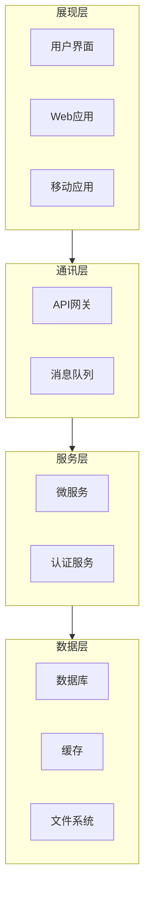

```mermaid
graph TD
    展现层 --> 通讯层;
    通讯层 --> 服务层;
    服务层 --> 数据层;

    subgraph 展现层
        UI[用户界面]
        WebApp[Web应用]
        MobileApp[移动应用]
    end

    subgraph 通讯层
        API[API网关]
        MessageQueue[消息队列]
    end

    subgraph 服务层
        Microservices[微服务]
        AuthService[认证服务]
    end

    subgraph 数据层
        DB[数据库]
        Cache[缓存]
        FileSystem[文件系统]
    end

```