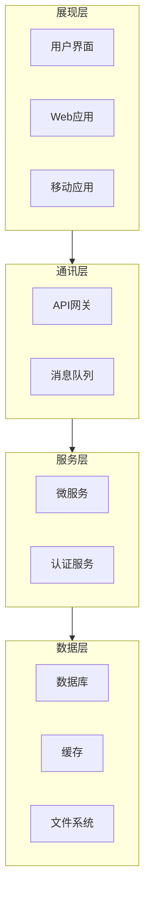

# 认识Mermaid
官网地址：[https://mermaid.js.org/](https://mermaid.js.org/)

Mermaid Live Editor: [https://mermaid.live/](https://mermaid.live/)

## 示例1：mermaid插件方式实现

### 效果


### 代码
::: tip 提示
需要用 \`\`\`mermaid和 \`\`\`包含起来
:::

``` markdown


## 示例2：mermaid图片链接方式实现

### 效果
[](https://mermaid.live/edit#pako:eNpdj7sOwjAMRX8l8oiahTEDC6xMHQmD1Zg2Uh4odSqhqv9OSIRA9XR0fG3ZKwzRECiYGZkuFseEXi5HHUSp2-EupDyJnq1zTVWssjT36hoXG8ZmG-_H_-w54Tw1W_G7FDrwlDxaU85aPwENPJEnDaqgoQdmxxp02EoUM8f-FQZQnDJ1kJ_m90iT2xvafEcK)

### 代码
``` markdown
[](https://mermaid.live/edit#pako:eNpdj7sOwjAMRX8l8oiahTEDC6xMHQmD1Zg2Uh4odSqhqv9OSIRA9XR0fG3ZKwzRECiYGZkuFseEXi5HHUSp2-EupDyJnq1zTVWssjT36hoXG8ZmG-_H_-w54Tw1W_G7FDrwlDxaU85aPwENPJEnDaqgoQdmxxp02EoUM8f-FQZQnDJ1kJ_m90iT2xvafEcK)
```