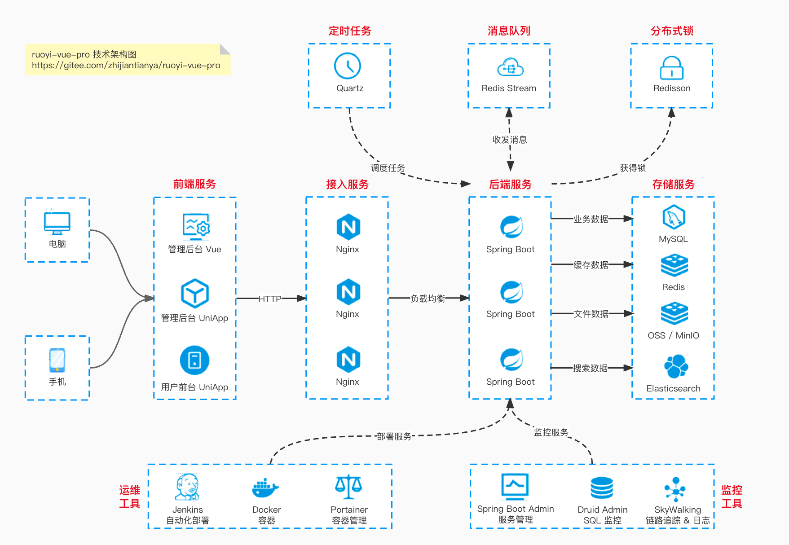

# 简介

## 项目清单

| 项目名称                | 简介                                                         |
|-------------------------|--------------------------------------------------------------|
| [ruoyi-vue-pro](https://gitee.com/zhijiantianya/ruoyi-vue-pro) | 基于 Spring Boot 多模块架构               |
| [yudao-ui-admin-vue3](https://gitee.com/username/yudao-ui-admin-vue3) | 基于 Vue3 + Element Plus 实现的管理后台                       |
| [yudao-mall-uniapp](https://gitee.com/username/yudao-mall-uniapp) | 基于 uni-app 实现的商城小程序                                 |
| [yudao-ui-admin-uniapp](https://gitee.com/username/yudao-ui-admin-uniapp) | 基于 Vue2 + Element UI 实现的管理后台                         |

## 技术架构

## 快速启动

### 后端项目

使用 [IDEA Community](https://www.jetbrains.com/zh-cn/idea/download/?section=windows) 运行后端项目

### 前端项目