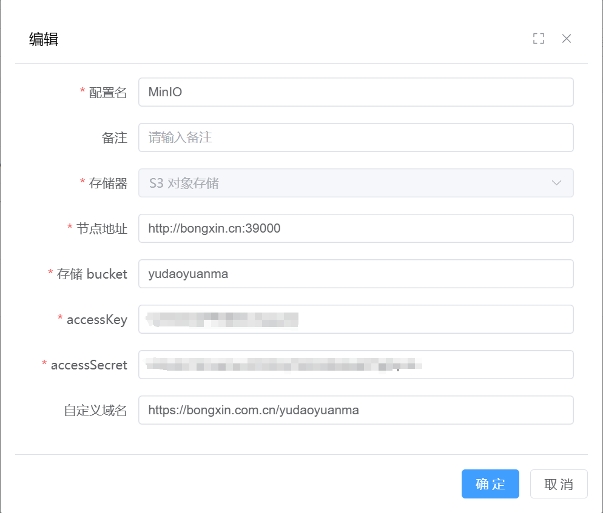

# 拓展模块
``` xml
<module>yudao-module-system</module>
<module>yudao-module-infra</module>
<module>yudao-module-member</module>
<module>yudao-module-bpm</module>
<module>yudao-module-report</module>
<module>yudao-module-mp</module>
<module>yudao-module-pay</module>
<module>yudao-module-mall</module>
<module>yudao-module-crm</module>
<module>yudao-module-erp</module>
<module>yudao-module-ai</module>
<module>yudao-module-iot</module>
```
除了 `system` 和 `infra` 以外，其他均为可选

## 演示模式

修改 `ruoyi-vue-pro` 目录下的 `application-dev.yaml` 

```
demo: false # 开启演示模式
```

## 验证码

修改 `yudao-ui-admin-vue3` 目录下的 `.env.dev` 

```
# 验证码的开关
VITE_APP_CAPTCHA_ENABLE=true
```

## 文件管理

菜单 `[基础设置-文件管理-文件配置]`



::: danger 注意
注意 `自定义域名` 和 `nginx配置文件` 的配合使用
:::

```
# 配置反向代理到 HTTP 服务器
location /yudaoyuanma/ {
    proxy_pass http://bongxin.cn:39000;
    proxy_set_header Host $host;
    proxy_set_header X-Real-IP $remote_addr;
    proxy_set_header X-Forwarded-For $proxy_add_x_forwarded_for;
    proxy_set_header X-Forwarded-Proto $scheme;
}
```

## 数据报表 `report`

<!-- 执行对应 `报表设计器` 的SQL脚本 [go-view.sql](/sql/report/go-view.sql) ，以及对应 `大屏设计器` 的SQL脚本 [jimureport.mysql5.7.create.sql](/sql/report/jimureport.mysql5.7.create.sql)  -->
 
::: warning 提示
`大屏设计器` 还需要运行前端项目 `yudao-ui-go-view`
:::

## 工作流 `bpm`

<!-- 执行对应 `工作流` 的SQL脚本 [bpm-2024-10-07.sql](/sql/bpm/bpm-2024-10-07.sql){target="_blank"} -->

## 会员中心 `menber`

<!-- 执行对应 `会员中心` 的SQL脚本 [member-2024-01-18.sql](/sql/member/member-2024-01-18.sql){target="_blank"} -->

## 微信公众号 `mp`

<!-- 执行对应 `微信公众号` 的SQL脚本 [mp-2024-05-29.sql](/sql/mp/mp-2024-05-29.sql){target="_blank"} -->

## 商城 `mall`

<!-- 执行对应 `微信公众号` 的SQL脚本 [mall-2024-10-05.sql](/sql/mall/mall-2024-10-05.sql){target="_blank"} -->

## 支付 `pay`

<!-- 执行对应 `微信公众号` 的SQL脚本 [pay-2024-08.sql](/sql/pay/pay-2024-08.sql){target="_blank"} -->