# B2 PRO APP
## B2 Pro 移动端全平台使用方法

鉴于朋友们都需要uniapp的源码，索性我也直接把uniapp的源码给到你们，请按照下面的教程，开启您的移动端之旅。

全平台都依赖B2Pro移动端插件，请前往登记域名和下载插件、uniapp源码：[https://7b2.com/check/app](https://7b2.com/check/app)

如果提示没有权限，请先找春哥购买，目前价格是1200/2个域名。正式发布之后价格是1600/1个域名

1、升级您的主题到最新版（大于等于 3.1.8），重新激活主题，重新保存固定连接，然后前往这个网址 登记您的域名：[https://7b2.com/check/app](https://7b2.com/check/app)

2、下载B2PRO全平台配套插件，并前往wp后台上传启用。下载 B2Pro 全平台 uniapp 源码，解压到您电脑上的英文目录中。

3、使用会员号激活插件

4、根据插件提示进行各项设置

5、下载并安装 uniapp 依赖的编辑器 HBuilder X（选择标准版）：[https://www.dcloud.io/hbuilderx.html](https://www.dcloud.io/hbuilderx.html)

6、下载并解压 B2Pro 源码到您的电脑：[https://7b2.com/check/app](https://7b2.com/check/app)

7、**以管理员模式**打开 HBuilder X，如果遇到升级提示，请升级您的 HBuilder X 到最新版，依次点击 文件->打开目录 选择您解压的 B2Pro 全平台 uniapp 源码目录

8、根据下图所示，修改成您自己的信息：

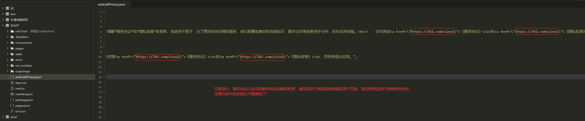

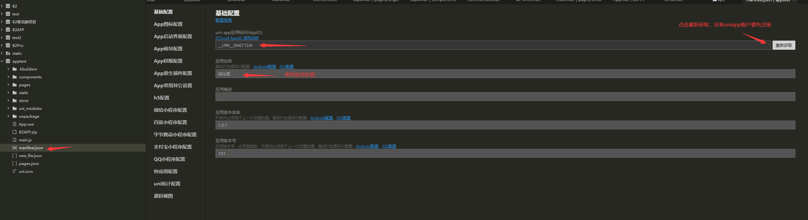

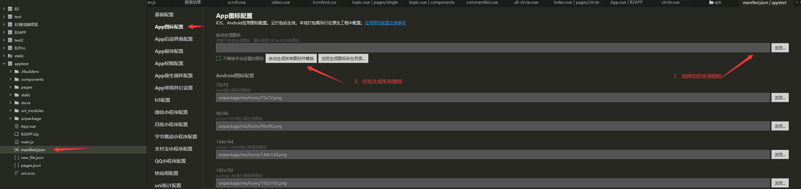

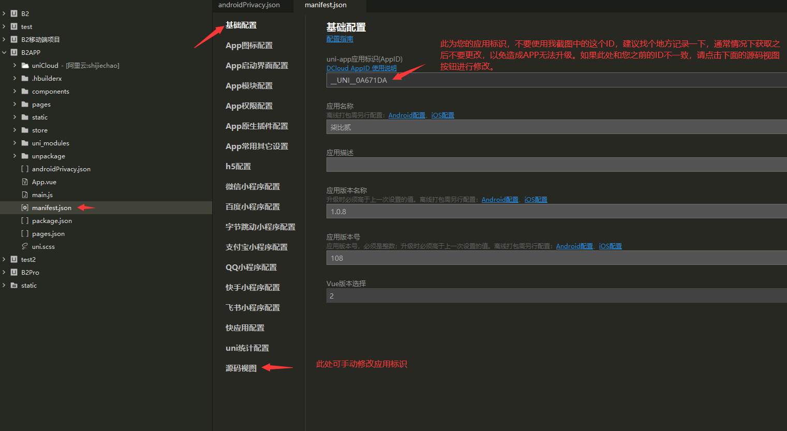

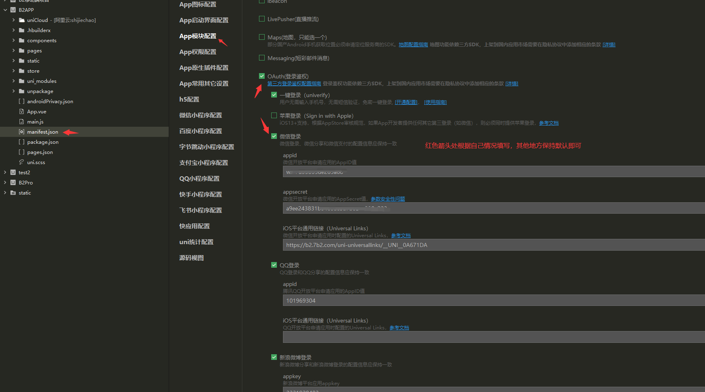

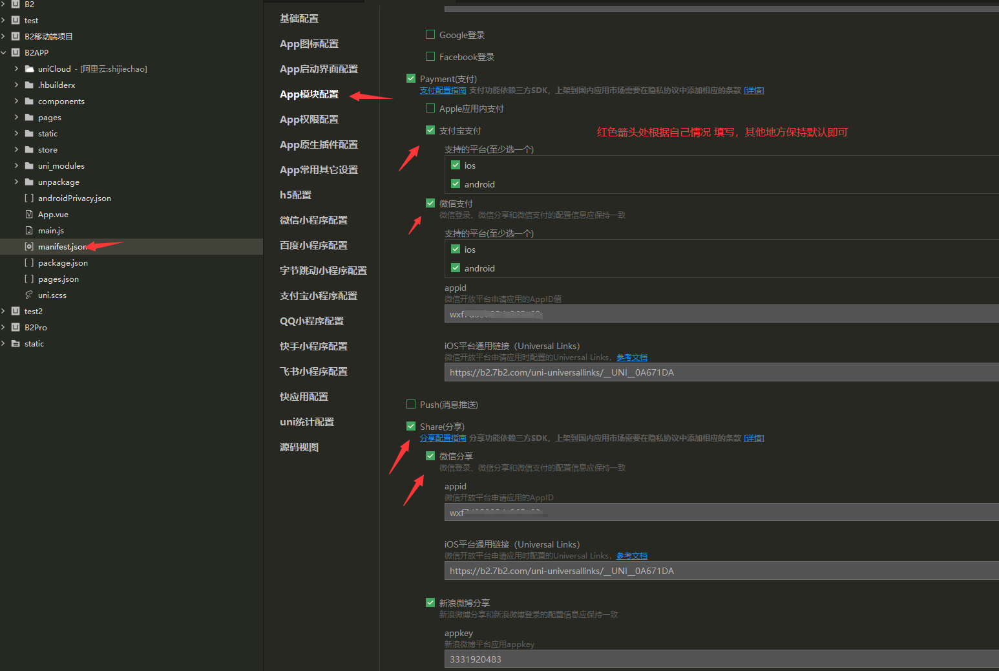

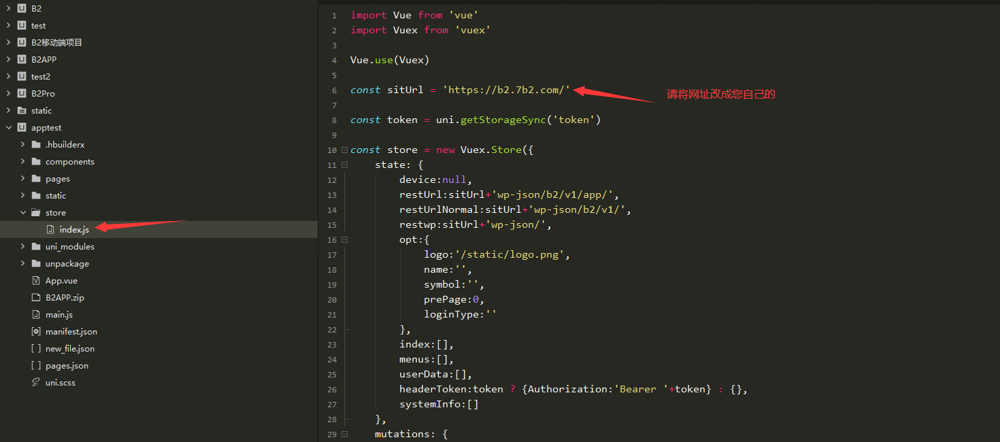

9、打包APP，请根据下图所示操作

自己生成证书：[Android 平台签名证书生成指南](https://7b2.com/document/53711.html)

（不折腾推荐）在线生成证书：[https://www.yunedit.com/createcert](https://www.yunedit.com/createcert)

再根据下图所示操作

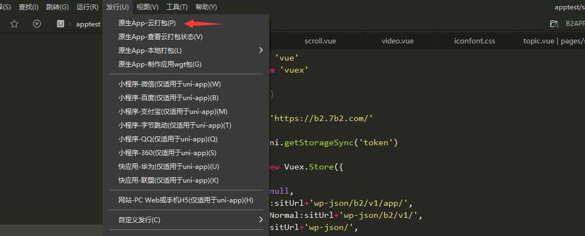

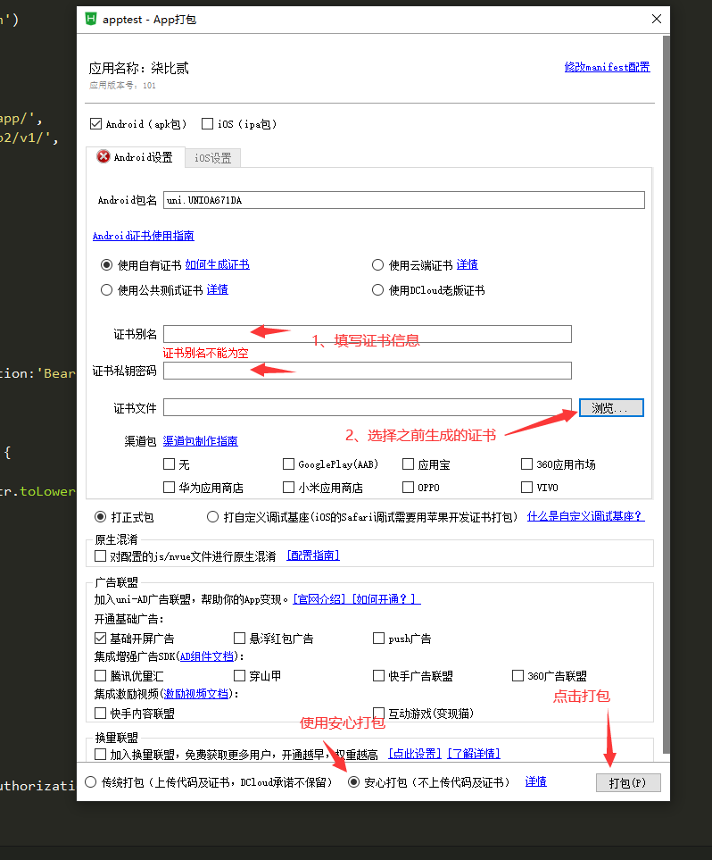

IOS APP打包方法类似，具体操作方法请按照 HBuilder X 官方说明。

10、打包到各平台小程序，和上面APP的打包方法类似，请根据 HBuilder X 的提示一步一步操作。


## B2Pro APP一键登陆设置教程

B2Pro APP 集成了 Dcloud 的一键登陆服务，用户不需要接受和输入二维码，即可自动使用手机号码登陆或注册。

### 开通服务
开通 Dcloud 的一键登陆服务：[开通一键登录服务的详细教程](https://doc.dcloud.net.cn/uniCloud/uni-login/service.html)

开通的时候需要填写应用信息，以下是其各种信息的获取方法：


1、**DCloud AppId** ：前往 开发者中心，点击我创建的应用，将应用的AppId 填写到此处。

2、**应用名称**：你的APP应用名字，比如我的叫 柒比贰

3、**选择平台**：根据您的情况选择。

4、**Android 包名**：Hbuilder X 软件中，点击发行->云打包，Android包名既是它，复制过来。

5、**Android 应用签名MD5、Android 应用签名 SHA256 获取方法**：Android平台签名证书(.keystore)生成指南

### 设置云函数
进入您的网站后台，左侧菜单中有一个B2主题-移动端插件，点击登陆与注册设置，请按照设置说说明操作


进入Hbuilder X 软件，如下图所示进行设置


## Android 和 IOS 平台签名证书生成指南

有安卓开发经验的朋友对这个应该不陌生，生成方法也有很多，我这里只对没有经验的朋友做以下简单指导。

::: tip 注意
如果您不想看以下的一堆文字，请前往：[yunedit.com/createcert](https://www.yunedit.com/createcert) 自动生成，具体生成和使用方法此网站有说明。
:::

如果您想亲自尝试生成证书，请看下面流程。

### keystore的作用
Android平台打包发布apk应用，需要使用数字证书（.keystore文件）进行签名，用于表明开发者身份。

Android证书的生成是自助和免费的，不需要审批或付费。

此教程的目的是生成.keystore文件，或者获取.keystore文件的 MD5 和 SHA256 参数。

### windows平台生成证书的方法：
安装java，并配置环境变量

1、下载JRE软件：[https://pan.baidu.com/s/1Jc7zGroF8QdB7QuxaCqKtw](https://pan.baidu.com/s/1Jc7zGroF8QdB7QuxaCqKtw) 解压码：4tjz

2、安装JRE软件，直接常规软件安装方法，点下一步，直到完成即可。记录下安装目录，比如：C:\Program Files\Java\jre1.8.0_231

3、windows 桌面双击进入我的电脑，然后鼠标右键选择属性。

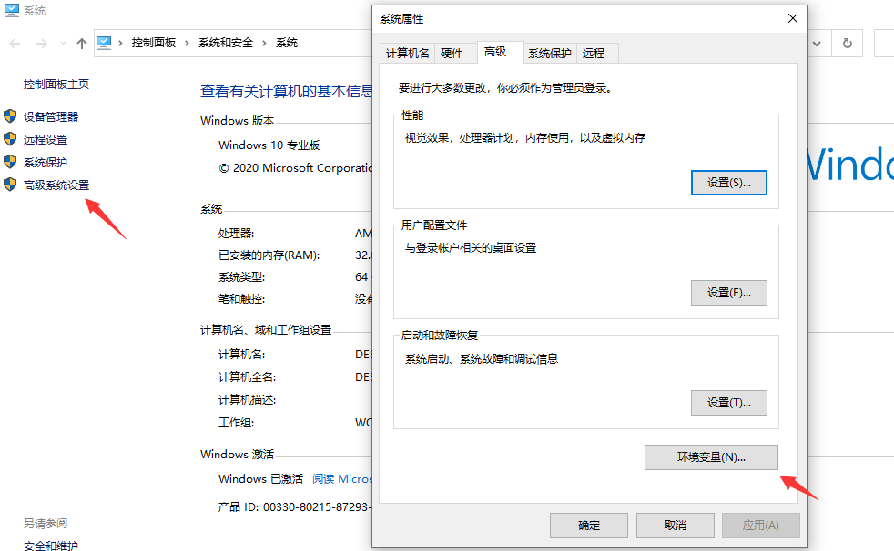

4、设置环境变量

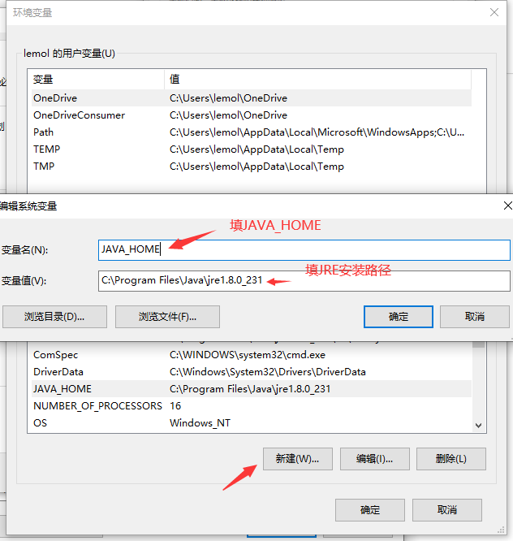

5、再设置一个path环境变量

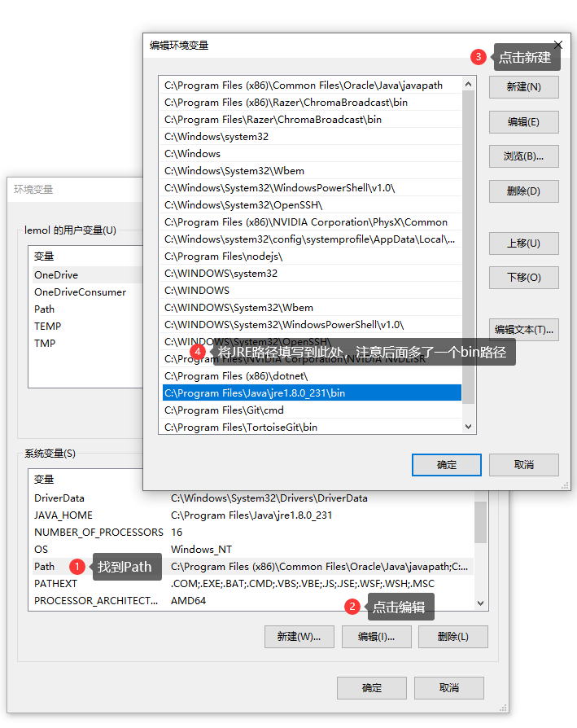


使用 win+q 快捷键打开windows搜索，输入cmd 打开命令提示符，输入 java -version 如果出现下面的提示，表示已经安装成功

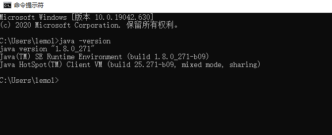

### 生成 keystore 文件，或者获取 keystore 文件的 MD5 和 SHA256

如果以前通过春哥介绍的方法，在线生成过 .keystore 文件，请按照下面 情况一 来操作。如果您是初次打包APP，并未生成过 keystore文件，请按照 情况二 来操作。如果您不记得是否生成过 .keystore 文件，请直接参照 情况二。

#### 情况一：已有 .keystore 文件，获取它的 MD5 和 SHA256 的方法

1、使用 win+q 快捷键打开windows搜索，输入cmd 打开命令提示符

2、使用cd命令，定位到您的 .keystore 文件目录，如果不知道 keystore 文件在哪里，可以在 HBuilderX 软件->发行->云打包中查看证书文件路径。比如我的路径是 d:\qibier.keystore。

3、使用 keytool 命令，查看 MD5 和 SHA256 值，如下图所示：

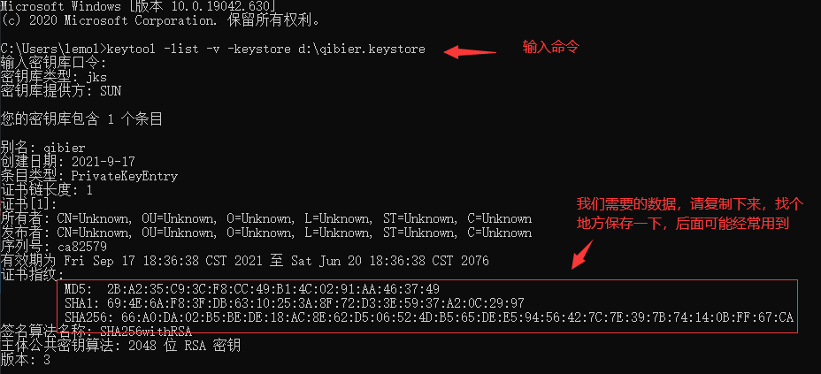

```sh
keytool -list -v -keystore d:\qibier.keystore
```

命令行红色部分为你的 .keystore 文件路径

#### 情况二：生成全新的 .keystore 文件

生成全新 .keystore 文件的命令行：

```sh
keytool -genkey -alias testalias -keyalg RSA -keysize 2048 -validity 36500 -keystore test.keystore
```
`testalias` ：是证书别名，可修改为自己想设置的字符，建议使用英文字母和数字

`test.keystore` ：是证书文件名称，可修改为自己想设置的文件名称


要查看你生成的这个文件的md5,sha256等信息，请使用上面 **情况一** 中的方法。

至此，我们已经可以自己生成.keystore文件，并且获取它的信息了。

## 小程序和APP修改底部菜单教程

请按照下图的方法修改代码：

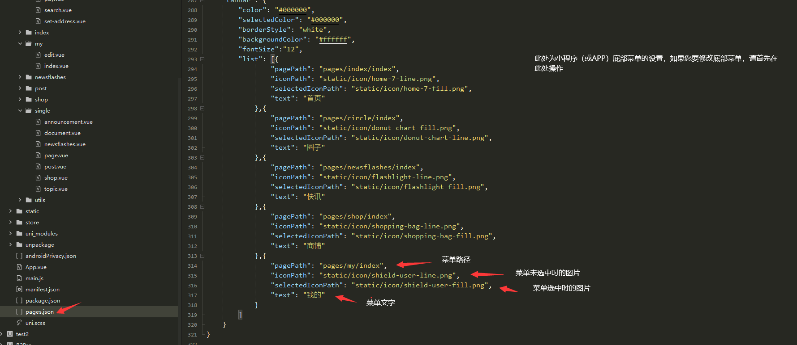

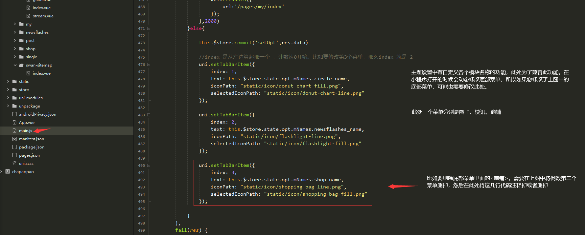

## 百度智能小程序支付开通流程

百度小程序支付聚合了微信、支付宝、百度支付、银联支付等，需要企业，并且有对公账户才能开通。如果不使用。

### 开通步骤
百度小程序后台，管理->支付管理中开通

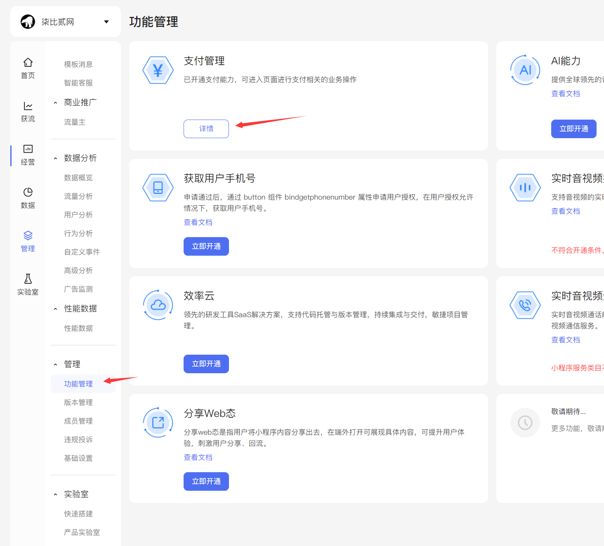


开通的时候根据它的要求填写信息即可。

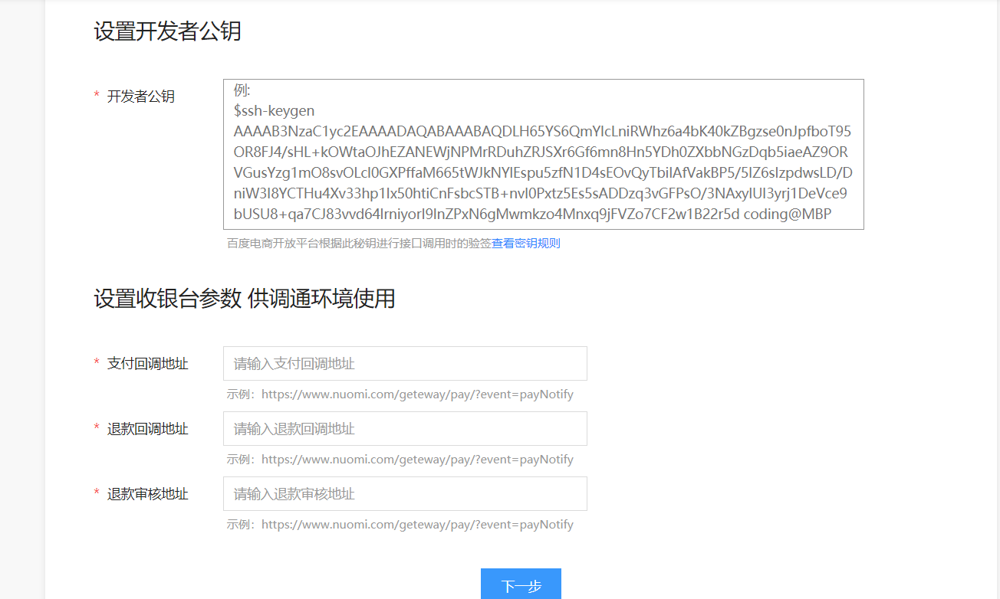

到这一步需要注意：

#### 开发者公钥：

1、请前 [https://www.bejson.com/enc/rsa/](https://www.bejson.com/enc/rsa/) 生成一组公钥和私钥，按照下图所示操作。

百度智能小程序支付开通流程
2、生成的公钥填写到上图中的开发者公钥处，**请务必保证复制的开发者公钥不能有换行和空格，可以先复制到记事本中，将换行和空格都删掉！**。然后找个记事本，把生成的公钥和私钥保存一下，后面会用到。

3、支付回调地址填写 你的域名+/notify ，比如 https://baidu.com/notify

4、退款回调地址填：你的域名+/verifyback

5、退款审核地址填：你的域名+/verifybackcheck

6、下一步根据自己的情况继续填写提交待审核。

#### 审核通过以后：

1、前往B2主题-移动端插件->支付设置中，按照提示将appkey、dealld填写完毕。

2、将上面备份的**私钥**，填写到B2主题-移动端插件->支付设置->**百度小程序支付私钥中**

3、前往百度小程序平台->管理->功能管理->支付设置->支付服务信息中，将**平台公钥**复制到：B2主题-移动端插件->支付设置->**百度小程序支付平台公钥中**。

4、保存设置项

至此百度小程序支付，设置完成。

## 移动端常见错误

1、没使用小程序广告，但是开发者工具提示安装广告插件？
如果您不需要小程序广告，请务必将下面几行代码删除掉。

需要删除的代码位置如下：

```
//文件 components/post.vue 6行-8行
//文件 components/topic.vue 5行-9行
//文件 components/product.vue 52行-54行
//文件 components/download.vue 90行-95行
//文件 pages/index/index.vue 47行-49行
```

需要删除的代码截图示例：


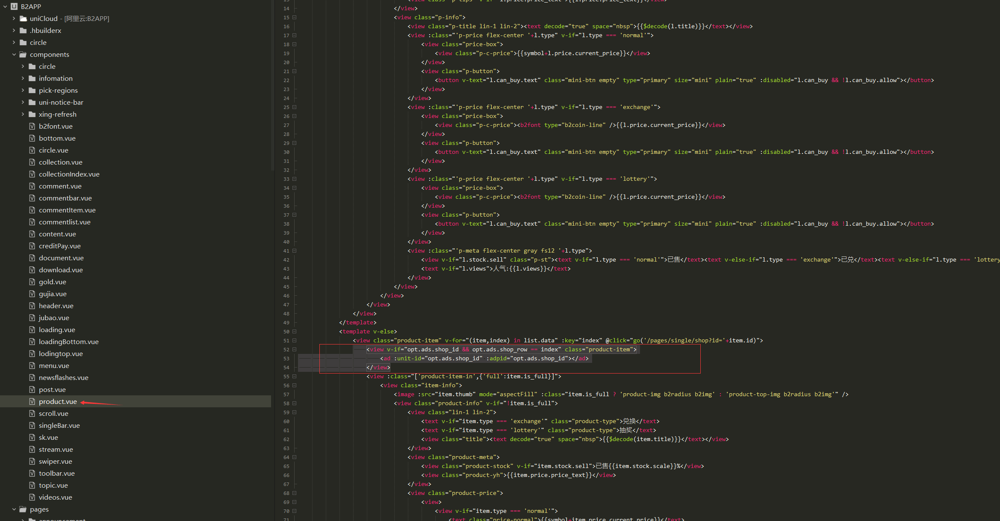

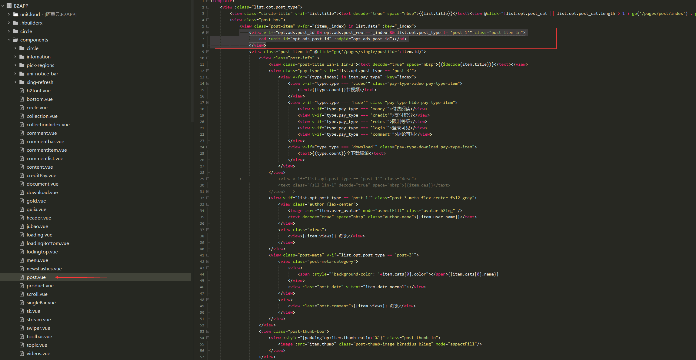

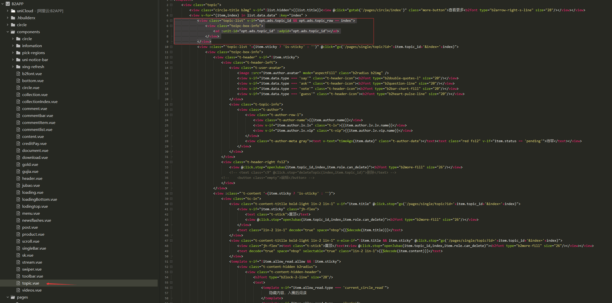

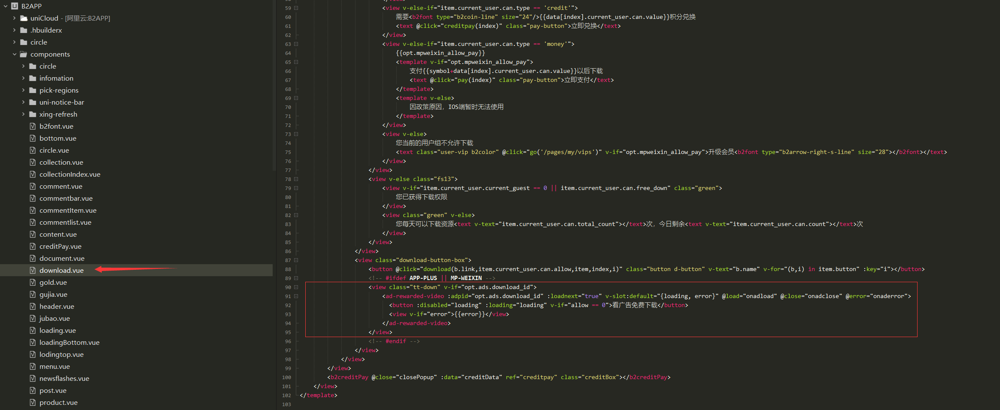

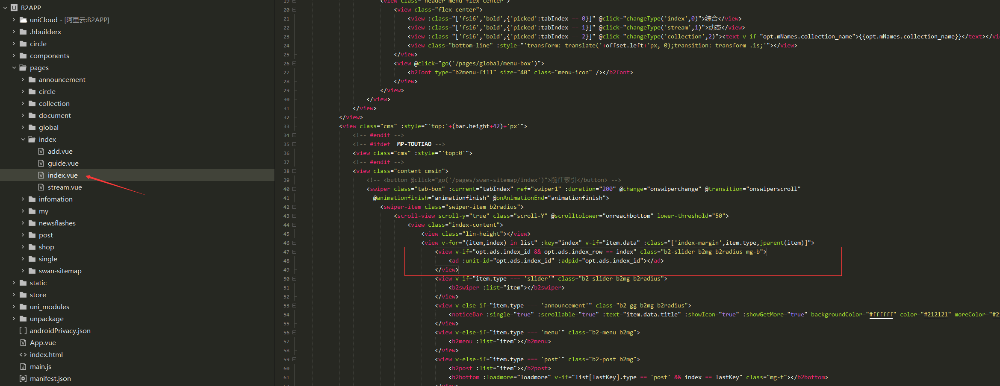


## 微信小程序隐私协议相关内容

微信小程序新增了隐私协议的相关内容，在23年10月17号之前，应当完善此内容，否则小程序的部分功能将无法使用。

B2小程序已经集成了隐私窗口，请按照下面步骤去开通即可，注意每一步都需要操作，否则弹窗不会显示，小程序部分功能无法使用：

1、进入小程序后台完善隐私协议内容：**微信小程序后台->设置->用户隐私保护指引**。填写内容按照下面截图所示：


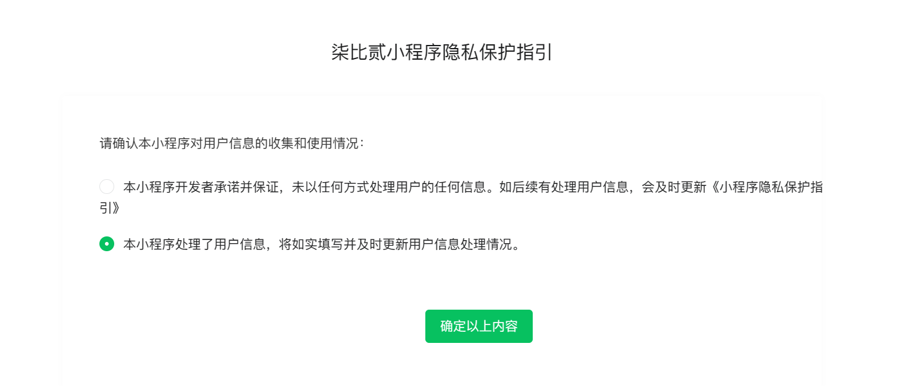

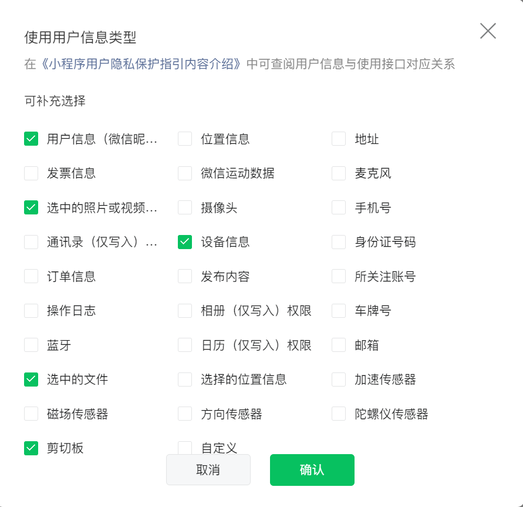

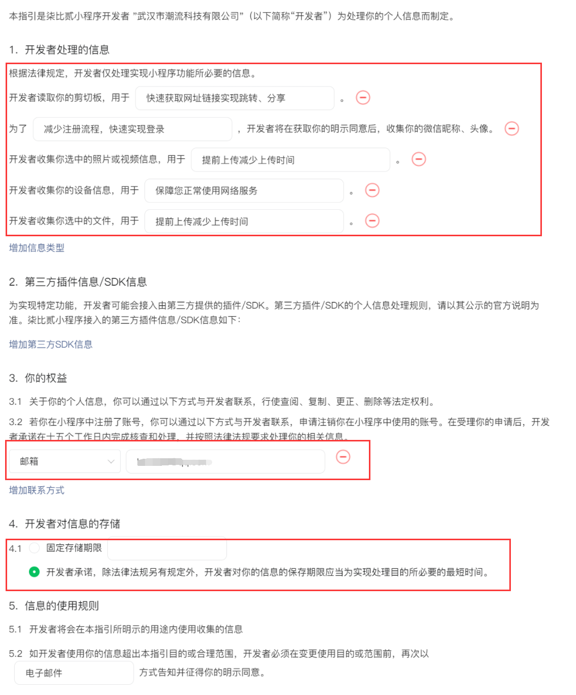

2、如果您使用的是替换升级，也就是下载的是 _replace.zip 这个包覆盖升级，记得 Hbuilderx 的项目中 `manifest.json` 以源码方式编辑，并且在 `mp-weixin` 下面新增 `"usePrivacyCheck" : true`, 选项。如下图：

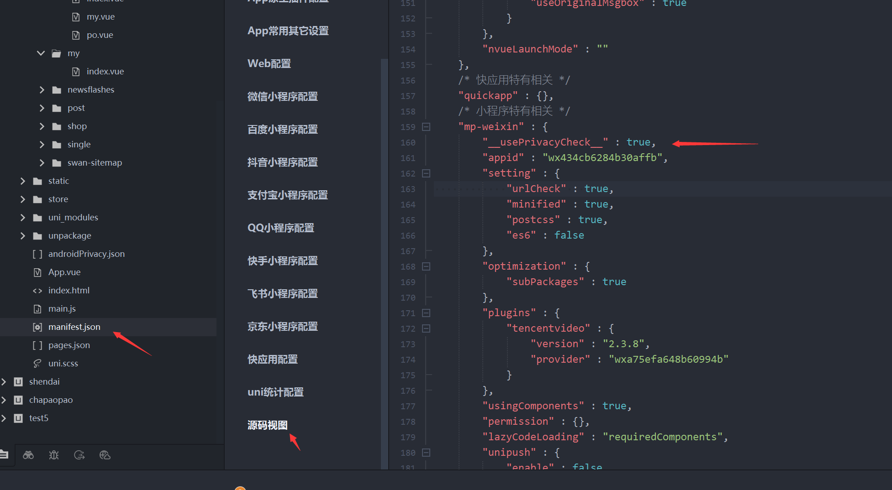

3、务必等待审核通过之后，弹窗才能显示。审核通过之后，微信开发者工具中，清空所有缓存，然后重新编译，弹窗就会显示。

4、用户选择<mark>同意</mark>之后，小程序功能可以完整使用，如果点击不同意，用户将无法使用小程序登录、上传图片等功能。