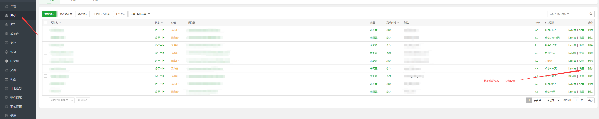
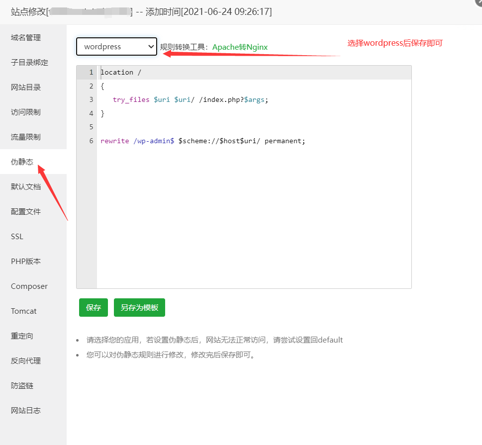
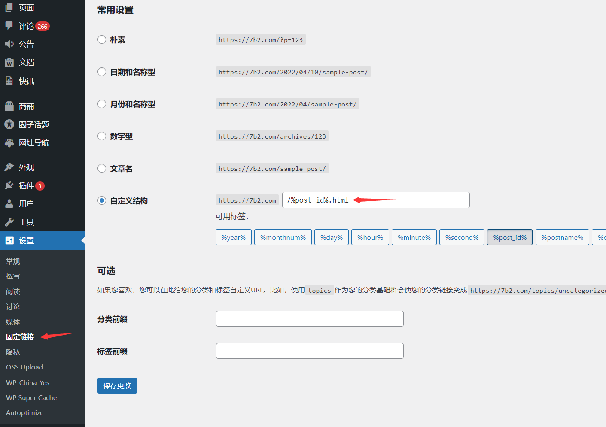
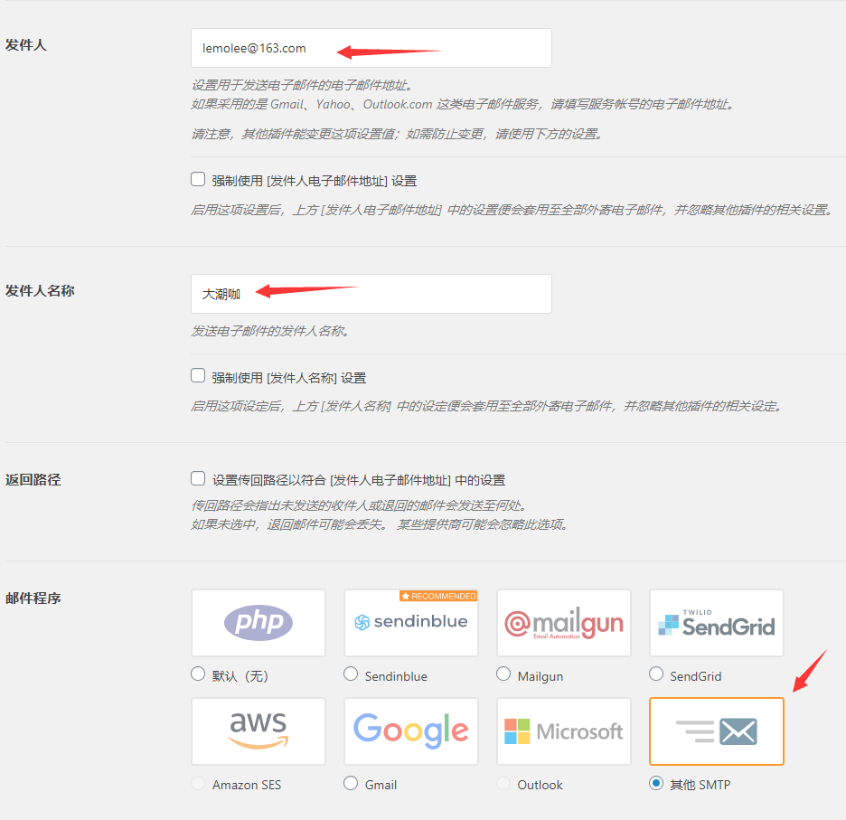
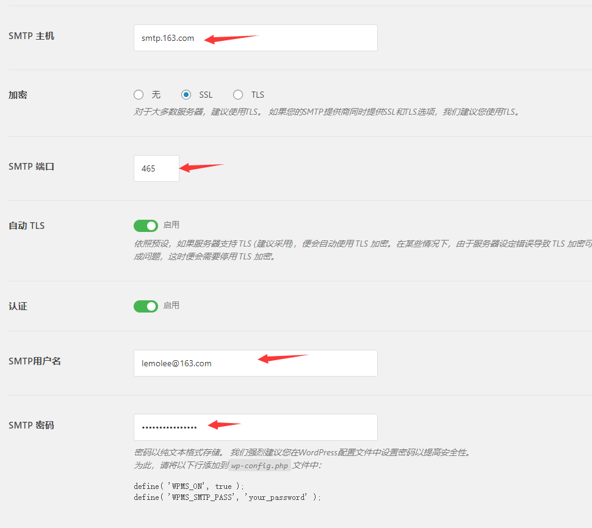
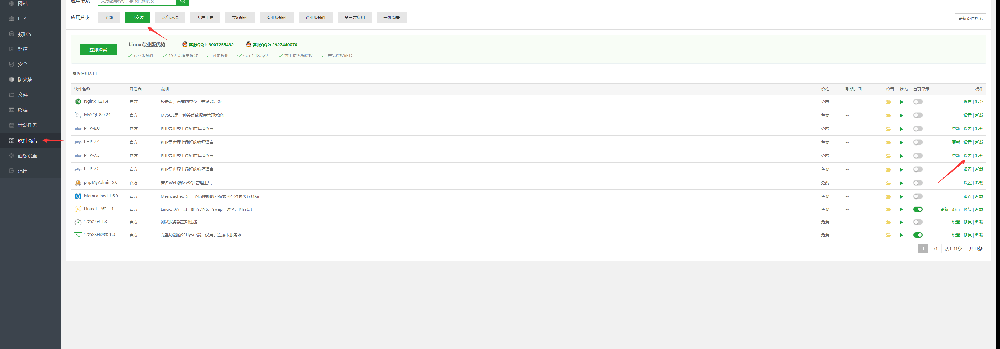
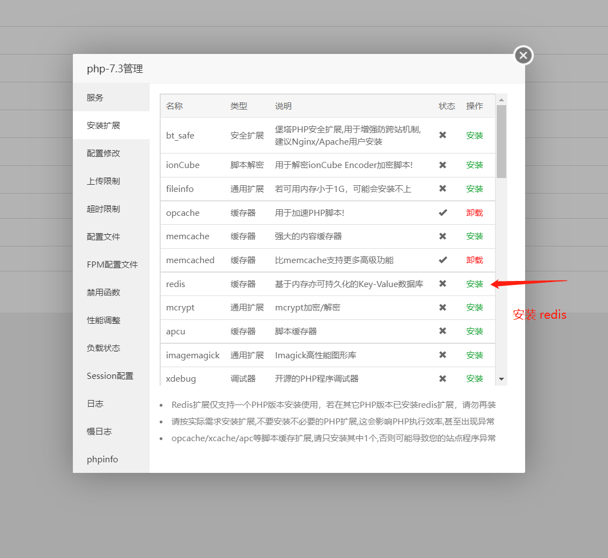
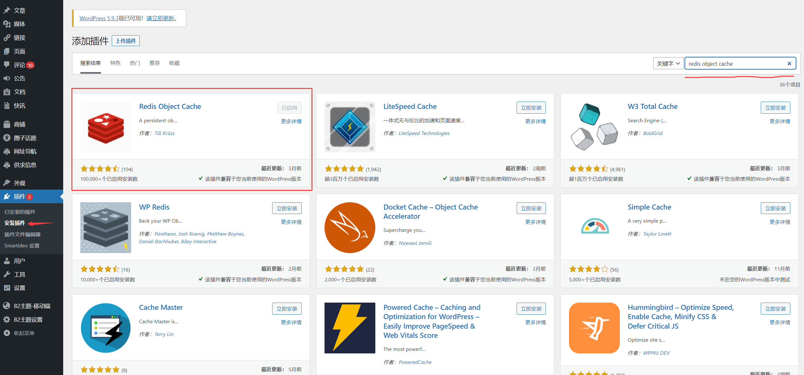
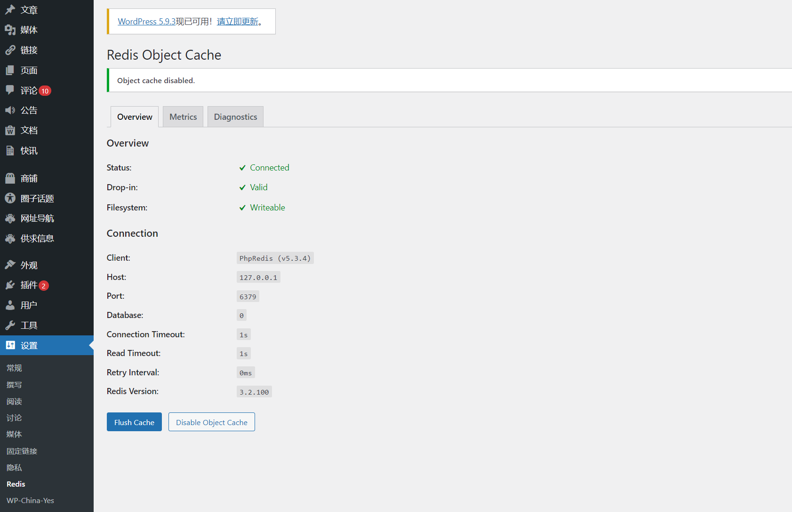

# 快速上手

## B2 主题的适用场景及特点

B2 的是一款面向未来的 Wordpress 主题，这款主题与市面上所有已售主题有着巨大的差别。您看到的可能仅仅是它的外表，它的运行机制和功能可能是您更需要了解的。

4 年多，我们只专注这一个主题的开发，用户购买以后终生享受升级服务，您买完了直接用，剩下的事情交给我们，您只需要专注于运营和内容。

### 适用范围

B2 主题是一款多功能的 Wordpress 主题。可以布置成资讯站，下载站，社交站，购物站等不同形式的站点，也可以启用所有这些功能做成一个综合性的站点。

目前我们的主题已经为 2000 多个站点提供了强大的驱动，许多站点已经有了相当可观的盈利。我们不推荐您仅仅做一个靠广告流量获得收入的站点，B2 主题有直接变现的渠道，您可以出售您的商品、信息、或者资源获得收入。

### B2 主题的特点

#### 1、前后端分离

B2 主题使用了前后端分离的技术，这意味着，您可以将您的站点完全静态化，甚至将页面保存到远程的 CDN 服务器中。打开速度可以是微妙级别，这在以后的运营中让您不必担心流量过大，服务器无法承担的问题。

#### 2、彻底的本土化

国外主题拿到国内使用经常水土不服，排除各种臃肿的设置，还有许多被墙的第三方服务，国内无法使用，打开一个页面一两分钟，这是建站的大忌

#### 3、面向移动端

移动端是大趋势，B2 主题向您呈现的不仅仅是一个主题这么简单，丰富的接口让您的站点在移动平台如鱼得水，配合我们的移动端应用，让您的触角伸向互联网的各个角落。

#### 4、摆脱插件的困扰

WordPress 的插件非常多，经常为了一个功能要装一大堆插件，拖慢速度不说，还会有各种兼容问题。B2 主题几乎所有功能都集成在主题中，保证了速度和兼容性

#### 5、强大的设置项

B2 主题目前版本是 2.2.6，已经拥有了 300 多个设置项，通过这些设置项，您可以组合出几千种不同的样式，让您的站点不再千篇一律。

#### 6、通用 Rest api 接口

B2 主题目前的版本是 2.2.6，已经集成了 130 多个 rest api 接口，这些接口可以在任何平台直接使用，比如 PC 端，小程序端，app 端等等。如果您要开发小程序、app 等应用，可以直接使用这些接口，不必重新开发。

#### 7、强大的支付体系

B2 主题支持支付宝、微信、paypal 的官方支付，支持 payjs、xorpay、迅虎支付、易支付、码支付等高知名度的第三方支付，如果您是企业，可以使用官方支付，如果您是个人可以使用第三方支付，这将为您的变现能力提供巨大的保障。

#### 8、强大的社交体系

B2 主题完美与微信深度集成，用户可以在站点中进行各种互动，是一个以社交为中心，可发散扩展业务的平台。

#### 9、不是一个博客，是一套系统

我们的代码量是市面上其他主题的十几倍到几十倍，所以这不仅仅是个博客主题，是一套系统！能为您带来收益的系统。

## B2 主题的系统要求和环境安装

::: danger 注意
B2 主题不支持虚拟主机，必须使用云主机或者 VPS。
:::

### 基本配置

系统：Linux 64 位和 Windows 64 位

PHP：PHP7.0 64 位 到 PHP7.4 64 位，推荐使用 PHP7.3 64 位

Msql：最低 mysql5.6

WordPress：推荐直接安装官方最新版（[cn.wordpress.org](https://cn.wordpress.org)）

### 推荐配置

我们推荐服务器运行 PHP 7.3，及 MySQL 5.6 或 MariaDB 10.1 或更高版本。
我们也推荐 Nginx 作为运行 WordPress 的最健壮的选项，但这些不是必须的。

### 新手看这里

1、购买服务器，并且安装系统：一般推荐使用国内的阿里云、腾讯云、华为云、百度云等大的厂家，稳定性有保证。购买的时候系统请选择 Centos 7 64 位 或者 Centos8 64 位。

2、解析域名：如果您已经购买了域名，请直接解析到服务器的 IP。（国内服务器需要域名备案，国外服务器不用）

3、服务器安装宝塔面板：宝塔面板是一款环境集成面板，您可以方便地在此面板中管理您的系统。这里有 [宝塔面板的安装方法](https://www.bt.cn/bbs/thread-19376-1-1.html)

4、宝塔安装成功以后从浏览器进入，默认的环境选择 Nginx +PHP7.3+Mysql5.6 ，其他根据情况随意选择

## WordPress 的安装

B2 主题基于 Wordpress ，它是一款极为流行的建站框架，数据表示，世界上流量排名前一千万的网站当中有 33.4%的网站是通过 Wordpress 建立起来的！换句话说，目前 wordpress 已经霸占了整个互联网上前一千万个网站当中的三分之一。您不必考虑它的安全性和适用性，拿来用就行了。

### WordPress 的典型安装步骤

如果您已经搭建好了 PHP 的运行环境和 Mysql，请下载 Wordpress 最新的版本上传到服务器，然后解压到站点目录，通过域名访问根据提示安装。请务必要设置站点的伪静态！伪静态设置方法请百度。

### 新手看这里

如果您是新手，想必已经安装好了宝塔，请按照下面的步骤安装：

进入宝塔面板的【网站】选项里面，点击添加站点，输入两个域名，比如 www.baidu.com 和 baidu.com 每个域名占一行。
数据库选择 Mysql
PHP 选择 7.3 或者 7.2
点击添加按钮
点击站点设置，弹窗中选择伪静态，下拉框里面选择 Wordpress ，然后保存。
下载 Wordpress 最新版，上传到网站根目录，解压，并复制 WordPress 目录里面的文件到网站根目录。
浏览器输入域名打开，根据提示安装 Wordpress

## 安装B2主题所需要的扩展

主题从wp后台安装启用之后，访问后台B2主题设置中，按照提示进行扩展的安装。

::: danger 注意
B2所需扩展和 ionCube 扩展冲突，如果您已经安装了 ionCube 扩展，请先删除！
:::

## 服务器伪静态和WordPress固定连接设置
### 什么是伪静态
比如百度网站上放了一个abc.html文件，你想访问它就直接输入`baidu.com/abc.html`Web服务器看到这样的地址就直接找到这个文件输出给客户端。

动态网页就是，假如你想做一个显示当前时间的页面，那么就可以写个PHP文件，然后访问`baidu.com/abc.php`。Web服务器看到这样的地址，找到`abc.php`这个文件，会交给PHP执行后返回给客户端。而动态网页往往要输入参数，所以地址就变成`baidu.com/abc.php?a=1&b=2`。

搜索引擎比较烦这种带问号的动态网页，因为参数可以随便加，而返回内容却不变，所以会对这种网页降权。

于是有了`mod_rewrite`，它可以重新映射地址。比如当前这个页面的地址`http://baidu.com/abc.html`，Web服务器收到请求后会重新映射为`http://baidu.com/page.php?id=abc`，然后再执行那个PHP程序。这样，在内部不改变的情况下，对外呈现出来的网址变成了没有问号的象静态网页的网址一样。

于是有人给起了个名字叫“伪静态”。其实也没什么伪的，就是没有问号的静态网址，让搜索引擎舒服点而已。

### WordPress的伪静态规则
如果您使用的是类似lnmp、AHM、phpstudy、phpEvn这样的集成环境，一般都会集成有Wordpress的伪静态，请搜索一下这些环境安装Wordpress伪静态的方法。

我们以宝塔环境举例：

如果您是自己编译的环境，请参考：[Wordpress伪静态设置](https://www.jianshu.com/p/40a3028448b4)

Wordpress固定连接设置
B2主题不支持带有问好的连接形式，必须使用自定义的形式。这里注意，如果您使用 `/%postname%` 这种伪静态形式，可能存在部分网址冲突，请尽量用 `/%post_id%.html` 这种连接形式。

## 安装B2主题
### B2主题最基本的安装方法
请前往 [主题下载页面](https://7b2.com/check/register) 下载B2主题，然后进入WP后台->外观 里面上传并启用主题

### 安装主题可能遇到的问题：
1、提示需要填写FTP：请将站点文件夹的root用户组改为www用户组

2、上传到一半无法完成：请修改php最大上传限制，和最大执行时间限制，都改大一些

### 如果仍然无法上传主题
请进入 `wp-content/themes` 目录，将主题包上传到此目录，然后解压，得到B2文件夹，这个文件夹就是主题文件夹 。最后删掉上传的压缩包，然后进入Wordpress 后台启用B2主题

## B2主题的选装插件
B2主题基本所有功能都集成在主题中，但是也有一些没有集成价值的功能我们只做了插件兼容。下面这些插件是B2主题所依赖的（所有插件都是免费，直接WP后台安装即可）。

### WP Mail SMTP

站点注册，找回密码，用户接收订单信息等功能都需要发送邮件，一些服务器可能没有此功能，所以请安装 WP Mail SMTP 插件或者其他 wordpress 邮件发送插件。WP Mail SMTP 配置参考下面截图：

### 选装插件
#### 1、Smartideo （第三方视频播放插件）

Smartideo 是为 WordPress 添加对在线视频支持的一款插件（支持手机、平板等设备HTML5播放）。 目前支持优酷、搜狐视频、土豆、56、腾讯视频、新浪视频、酷6、华数、乐视、YouTube 等网站。

B2主题文章中可以直接引用这些第三方视频，下载及使用方法：[https://www.rifuyiri.net/3639](https://www.rifuyiri.net/3639])

#### 2、WPOSS(阿里云对象存储插件)

如果您要使用阿里云的OSS文件储存服务，请在wp后台->插件中安装 [WPOSS](https://cn.wordpress.org/plugins/wposs/) 插件。插件使用方法请前往：[https://www.laobuluo.com/2250.html](https://www.laobuluo.com/2250.html)

#### 3、WPCOS（腾讯云COS对象储存插件）

如果您要使用腾讯云的的COS文件储存服务，请在wp后台->插件中安装 [WPCOS](https://cn.wordpress.org/plugins/wposs/) 插件，插件使用方法请前往：[https://www.laobuluo.com/4030.html](https://www.laobuluo.com/4030.html)

#### 4、使用又拍云（upyun） （选装插件）

如果您要使用又拍云的文件储存服务，请在wp后台->插件中安装 wpupyun 插件，插件使用方法，请前往：[https://www.laobuluo.com/4183.html](https://www.laobuluo.com/4183.html)

#### 5、使用七牛云 （选装插件）

如果您要使用七牛云的文件储存服务，请在wp后台->插件中安装 WPQiNiu 插件，插件使用方法，请前往：[https://www.laobuluo.com/4164.html](https://www.laobuluo.com/4164.html)

#### 6、使用FTP上传 （选装插件）

安装 Hacklog Remote Attachment 或 WPFTP 插件即可。推荐 [WPFTP](https://cn.wordpress.org/plugins/wpftp/) 使用方法：[https://www.laobuluo.com/2599.html](https://www.laobuluo.com/2599.html)

#### 7、Yet Another Related Posts （选装插件）

B2主题的相关文章依赖 [Yet Another Related Posts](https://cn.wordpress.org/plugins/yet-another-related-posts-plugin/) 插件，请在后台搜索安装启用即可，插件会根据标签、标题、文章内容等信息来匹配相关文章。

需要注意的是，这个插件默认会在文章最下面添加相关文章连接，如果不使用，请在插件设置中将其关闭。

## B2主题的优化

B2主题前后端分离，我们的主题不受域名和浏览器的限制，这意味着您可以使用大部分市面上的可用的优化方案。目前WP的多功能主题，只有我们做到了。

### 安装Opcache扩展
php在执行的时候需要每次都从磁盘读取文件信息，再编译成脚本，这个过程非常消耗时间，我们强烈建议您安装php的 opcache 扩展，用来缓存已经编译好的php代码，从而加速php的执行。

**安装方法**：如果您使用的是宝塔，直接在软件管理，php设置（您当前使用的PHP版本）中安装 opcache 即可。如果您使用的是其他环境，请搜索安装方法。

### 安装 Redis 或者 Memcached 扩展
Mysql 的查询也是比较消耗时间的，我们强烈建议您安装 Redis 或者 Memacached 扩展，以缓存查询结果，减少查询次数。Redis 和 Memcached 选择安装一个即可，不用两个都装。

#### Redis 安装方法：

1、在php扩展中安装Redis（如果是宝塔，在宝塔软件管理，PHP设置里面安装）

2、在WP后台插件管理里面搜索安装 Redis Object Cached 插件，然后启用

#### Memcached安装方法：

1、PHP安装Memcached扩展

2、wordpress 后台搜索安装 memcached is your friend 插件，安装并启用

::: warning 提醒
如果您的站点流量非常大，服务器配置又相对较低，那么很高兴您使用了B2主题，我们的主题支持全站完全静态化，你可以安装  wp super cache 插件 开启全站静态化，具体使用方法请百度，很简单。

如果您的站点流量非常非常大，您还可以CDN缓存您的页面，B2主题同样支持，这是其他主题做不到的。CDN缓存页面需要第三方的支持，如果您不懂请忽略。
:::

#### 缓存注意事项：

如果您要缓存站点的所有页面，请排除以下网址

你的域名+/pay
你的域名+/notify
你的域名+/return
你的域名+/download
你的域名+/redirect
你的域名+/wecatmpnotify
你的域名+/open

比如：

https://7b2.com/pay
https://7b2.com/notify
https://7b2.com/return
https://7b2.com/download
https://7b2.com/redirect
https://7b2.com/wecatmpnotify
https://7b2.com/open

一般的缓存插件或者CDN的设置中都会有排除网址带问号页面的缓存选项。请不要缓存带问号的页面。

### 是否需要压缩css和js文件？
以前，很多人会建议您压缩合并css和js文件。但是以目前的互联网生态来说，压缩可以，合并是不推荐的，因为现代浏览器均支持 HTTP/2 协议，如果您的服务器开启了HTTP/2则不必合并css和js文件。HTTP/2协议支持多个资源同时加载，这意味着您的多个css和js文件都可以同时加载，如果将他们合并成一个文件，加载渲染速度反而会变慢。

### 做了以上优化，还需要注意什么？
1、如果您是开发者，要对主题进行二次开发，请不要使用上面的优化，待开发完毕后再使用。

2、如果您开启了上面的优化，主题的一些设置项设置之后无法生效，请刷新缓存。

3、如果您同一台服务器装了几个Wordpress站点，注意安装WP的时候，每个站点的数据库前缀请设置成不同的，以免在使用 Redis 或者 Memcached 的时候造成缓存的混淆。

## WordPress 安装 Redis 缓存

主题在有很多重复查询或者复杂查询的地方使用了数据缓存，在大部分涉及到安全验证的地方也使用了数据缓存，为了保证速度和安全，强烈建议您开启 Redis 或者 Memcached 缓存功能。Redis 在WP中兼容性、易用性以及使用广度都好于 Memcached ，所以建议使用 Redis。

::: danger 注意
红字提醒：如果您的一个服务器有多个WP站点，并且同时使用 redis 缓存，请务必给每个站点设置不一样的数据库前缀，以免不同站点之间数据冲突。
:::

这里我只以宝塔环境介绍安装方法，其他环境请自行搜索安装方法。

宝塔环境 Redis 安装方法：

1、进入宝塔控制面板，左下菜单 软件商店->已安装中，找到您正在使用的PHP版本  
2、点击设置->安装扩展  
3、找到 redis 并安装  
4、进入wp后台，找到插件菜单，点击安装插件的菜单，然后搜索 redis object cache 插件，安装并启用  
5、wp后台->设置中，点击 Enable Object Cache 启用，显示三个绿色对勾说明安装正确  

