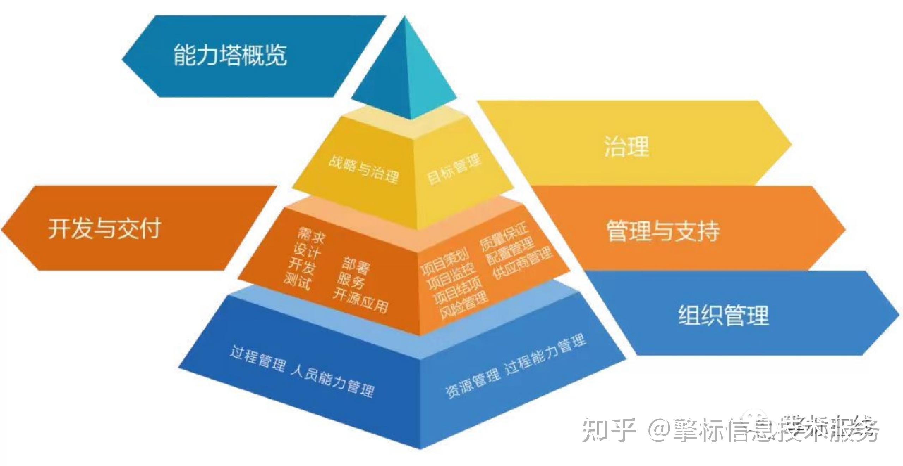
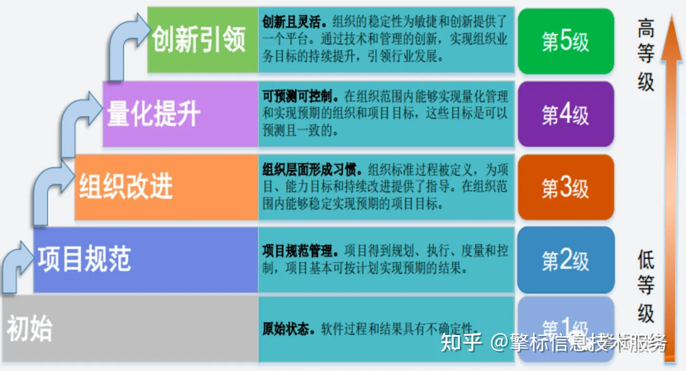
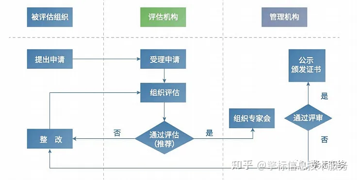

# CSMM软件能力成熟度评估简介
## 一、CSMM是什么

CSMM认证，全称为“软件能力成熟度评估”。CSMM认证，也被称为“中国版CMMI认证”。这是由中国自主制定的团体标准，于2021年6月8日发布。作为国内首套软件开发的主流标准，CSMM认证的推行给国内企事业带来了更优的选择。

## 二、CSMM软件能力成熟度模型框架

软件能力成熟度模型，聚焦软件价值创造能力，围绕治理、开发与交付、管理与支持和组织管理，高度提炼了影响组织战略目标和业务价值的四个能力域。同时提出了20个能力子域、161个能力要求。

- **治理：** 包括战略与治理、目标管理能力子域，确定组织的战略、产品的方向、组织的业务目标，并确保目标的实现。

- **开发与交付：** 包括需求、设计、开发、测试、部署、服务、开源应用能力子域，这些能力子域确保通过软件工程过程交付满足需求的软件，为顾客与利益相关方增加价值。

- **管理与支持：** 包括项目策划、项目监控、质量保证、风险管理、配置管理、供应商管理能力子域，这些能力子域覆盖了软件开发项目的全过程，以确保软件项目能够按照既定的成本、进度和质量交付，能够满足顾客与利益相关方的要求。

- **组织管理：** 包括过程管理、人员能力管理、组织资源管理、过程能力管理能力子域，对软件组织能力进行综合管理。

## 三、CSMM标准等级的划分

CSMM将数据管理能力成熟度划分为五个等级，自低向高依次为初始级（1级）、项目规范级（2级）、组织改进级（3级）、量化提升级（4级）和创新引领级（5级），不同等级代表企业软件能力成熟度水平不同。

## 四、软件能力成熟度CSMM的应用

### （一）本模型可以应用于多个场景：

（1）软件开发组织的自我改进。组织可以根据本组织的瓶颈问题与弱项，参考本模型选择能力子域、选择等级进行改进，也可以参考本模型的所有能力子域进行全面改进；

（2）软件过程能力的自评估。组织可以参考本模型对自己的软件能力进行评估，以识别改进点；

（3）软件过程能力的外部评估；

（4）顾客对供方的评估；

（5）全面评估能力或局部评估能力。可以对照适用的全部能力子域进行评估，也可以仅对部分能力子域评估能力等级。

### （二）本模型适用的组织包含但不限于：

（1）作为供方的开发组织；

（2）存在大量分包的顾客的软件组织；

（3）离岸外包的组织；

（4）软件开发的研究机构；

（5）应用软件开发、嵌入式系统开发、实时系统开发、科学计算软件开发、基础设施软件开发。

## 五、企业实施CSMM认证的好处

（1）易实施应用。允许企业结合资深企业软件开发业务特点，在合理范围内对标准内容进行裁剪。

（2）聚焦核心能力。构建轻量标准，突出软件价值能力，降低中小企业成本。

（3）结构可扩展。涵盖软件开发的全生命周期，支持后续软件平台成熟度、社区成熟度等部分的研制。

（4）共建软件改进生态。推荐更多企业参与相关标准制定验证，吸引行业需方用户关注和采用，共建软件改进生态，推动软件高质量发展。

## 六、申请CSMM评估需要具备的条件

#### 二级

（1）具有独立法人地位；

（2）依据《软件过程能力成熟度模型》标准建立了软件过程能力管理体系，且已有效运行6个月以上；

（3）按照申请等级提供覆盖软件过程能力的治理、开发与交付、管理与支持和组织管理等有效的客观证据。

#### 三级

（1）具有独立法人地位

（2）按照成熟度三级要求，提供覆盖软件过程能力的治理、开发与交付、管理与支持和组织管理等有效的客观证据。

#### 四级

（1）具备三级的基本条件

（2）按照成熟度四级要求提供覆盖软件过程能力的治理、开发与交付、管理与支持、组织管理和量化管理的有效客观证据。

#### 五级

（1）通过成熟度四级评估1年以上

（2）按照成熟度五级要求提供覆盖软件过程能力的治理、开发与交付、管理与支持、组织管理和创新引领的有效客观证据。

## 七、CSMM申请流程

## 八、CSMM与CMMI的关系

（1）CMMI与CSMM都是软件行业的成熟度模型标准，不同的是，CMMI属于国际认证标准，并且已经有30多年的发展。而CSMM认证是在CMMI模型的基础之上，根据国内软件产业发展的行情，提出的符合国内软件产业发展的成熟度等级模型。因此，CSMM也被很多企业称之为“中国版CMMI认证”。

（2）CMMI，即能力成熟度模型集成，是由美国卡耐基梅隆大学软件工程研究所（SEI）组织全世界软件专家历时四年开发，并在全世界推广实施，主要用于指导软件开发过程，改进和衡量其能力并提高性能。完成CMMI认证评估的企业可以通过美国CMMI研究院（CMMI唯一的官方机构）查询公示信息以及评估结果。

（3）CSMM认证，全称“软件能力成熟度评估”，由中国电子技术标准化研究院联合八十余家产学研用相关方结合我国实际，自主制定的团体标准，于2021年6月8号发布，目的是为了帮助国内软件企业对自身的软件能力进行评估和判断，并对于未来的发展路径提供有效建议。