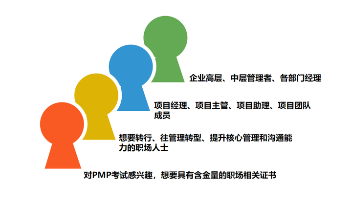
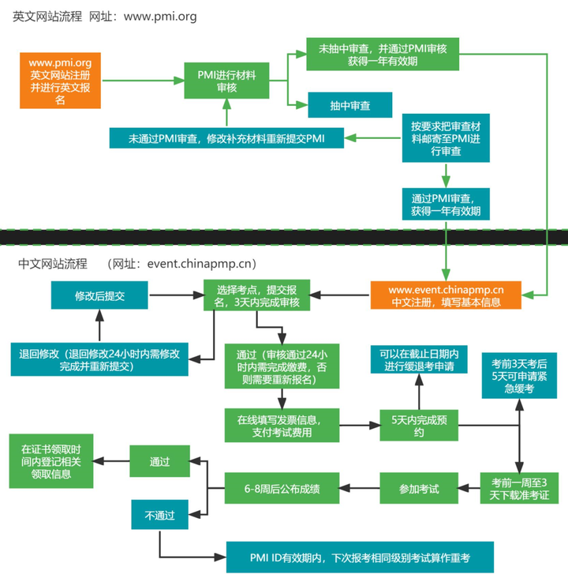
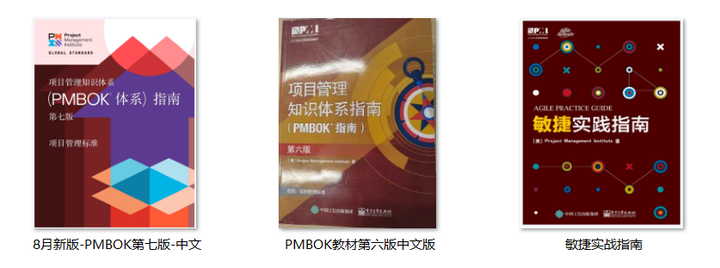
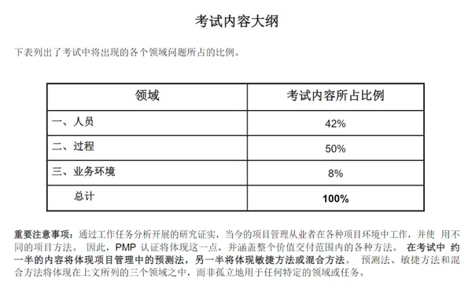
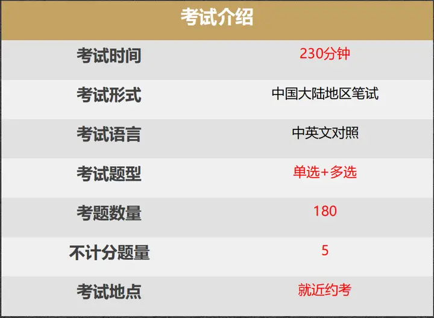
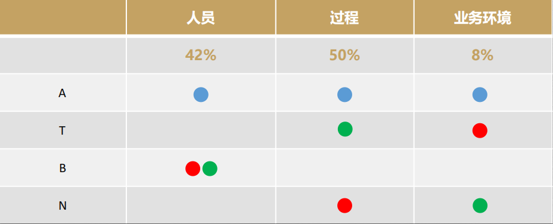
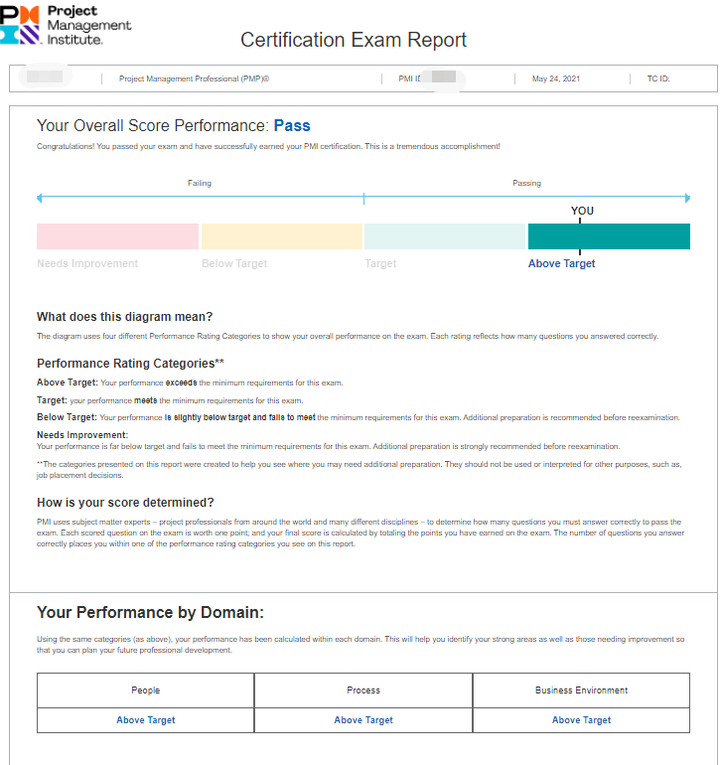
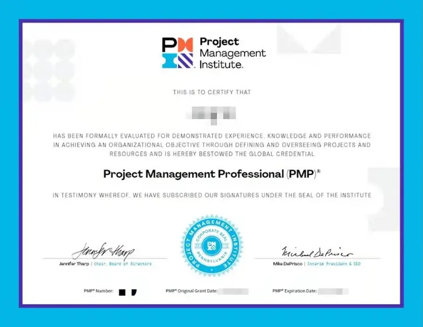
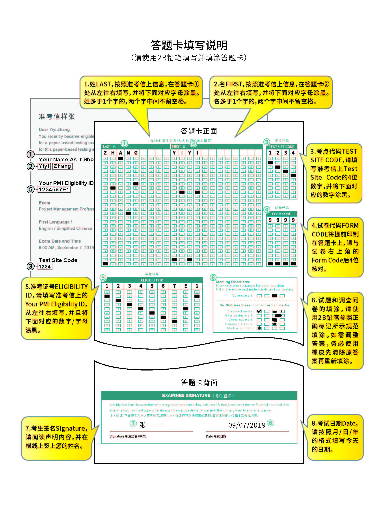
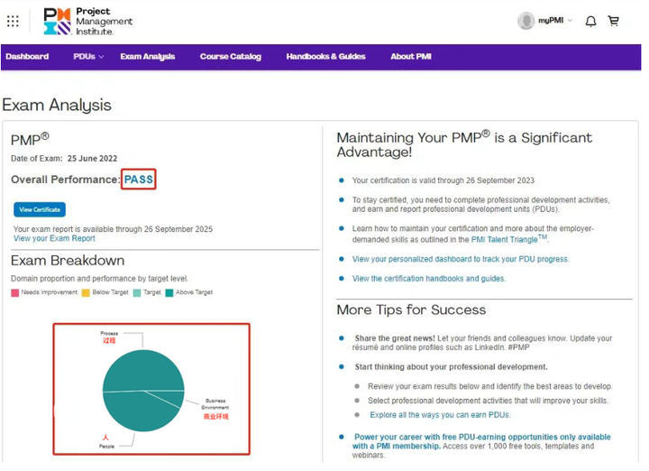

# 认识PMP

## 一、什么是PMP

　PMP全称Project Management Professional，指项目管理专业人士资格认证。它是由全球领先的项目管理专业组织机构——总部位于美国的PMI（项目管理协会）发起，**在全球206个国家和地区得到高度认可，PMP是项目管理领域重要的认证之一，受到业内广泛认可。**

## 二、PMP的价值

### 1.PMP认证的重要性

在全球各个国家几乎都能找到PMP持证人士负责管理的项目。与其他专注于特定地区或特定行业的认证不同，**PMP是真正全球通用的认证，不局限于某种项目管理方法论、某一行业或地区**。预计到2030年，全球经济需要2500万新的项目专业人士。

### 2.PMP认证对薪资的影响

PMP持证人士在薪资和收入潜力方面具有显著优势。根据PMI发布的《薪酬力：项目管理薪酬调查报告》第10版，**受访者中PMP持证人士比非PMP持证人士工资更高（平均高出23%）。**

### 3.PMP认证对组织的影响

当组织中超过三分之一的项目经理为PMP持证人士时，组织会按时、按预算完成更多项目并达成最初目标。（PMI 2015年 Pulse of the Profession® 《职业脉搏调查》）获得PMP认证意味着持证人士将掌握全球通用的项目管理语言，成为全球项目管理专业人士、组织和专家社区中的一份子，成为项目背后的“英雄”。

### 4.针对PMP持证者的福利政策

北京、深圳、杭州和宁波等地，均已发布针对PMP持证者的福利政策！

## 三、PMP适合人群

目前全球有超过140多万PMP持证人员，其中**中国持证人数已有超过46万人。**PMP证书正获得越来越多的职业人士的青睐，被誉为与MBA、MPA齐名的全球三大管理证书。

其实，**PMP没有特别的限制人群，适合各行各业的项目管理方面从事人群。**想要参加PMP考试的人群，只需满足报名条件，即可参加PMP考试。

## 四、PMP考试报名

### 1.报名要求

PMP®报考需提供35课时的培训证明。

### 2.考试时间及地点

国内考试统一由中国国际人才交流基金会组织，考试形式为笔试。

考试时间：**通常一年有4次考试。**以2023年为例，分别安排在3月、5月、8月和11月。

考试地点：全国各大省会城市及个别非省会城市均有考点。

### 3.报名入口

**（1）PMP®英文报名时间及入口**

PMP®英文报名不限时间，可以随时报名，报名资格有1年有效期。也就是说，报名成功后需要在1年内进行中文报名。如果超出1年有效期，需要再次进行英文报名。

PMP®英文报名入口：[pmi.org](https://www.pmi.org/)。

**（2）PMP®中文报名时间及入口**

英文报名成功后，考生可根据自身情况选择考期，并在中文报名通道开启时，进入基金会网站进行中文报名。中文报名成功后，在考前下载打印准考证，考试当天携带相关材料参加考试即可。

中文报名时间：正式考试前一个半月左右。具体报名时间以基金会通知为准。

PMP®中文报名入口：[event.chinapmp.cn](http://event.chinapmp.cn/)。

### 4.报名流程

具体报名流程如下：英文报名→【抽中】审核→中文报名→缴纳报考费用

英文报名信息提交后，PMI会对报名材料进行审核，审核通过后进行中文报名。但PMI会进行资格抽查，如果被抽中审查，需要将电子证明材料上传到PMI网站，审查成功即可继续中文报名。

中文报名审核通过后，考生可进行线上报考费用缴纳，支付方式支持微信、支付宝、银行卡、信用卡。

### 5.考证费用

PMP®的相关费用通常包括报考费用、培训费用、续证费用。

**（1）PMP®报考费用**

PMP®首次考试报名费用为3900元，英文报名资格有效期内重考报名费用为2500元。

**（2）PMP®培训费用**

因**PMP®报考需提供35课时的培训证明，此证明只有PMI授权的R.E.P.培训机构有权开具。**所以如果决定报考，就尽快参加机构培训，尽量一次性通过考试。具体培训费用，可咨询乐凯老师。

**（3）PMP®续证费用**

PMP®证书有效期为3年，3年后若还想拥有PMP®项目管理资格认证，需进行续证。学员需要积攒60PDU，在PMI官网进行缴费（150美金）续证操作。

## 五、PMP学习安排

### 1.学习内容

从2023年8月考试开始，将会新增PMBOK®第7版教材，学习教材包括:

**《PMBOK®指南》第6版**

**《PMBOK®指南》第7版**

**《敏捷实战指南》**

### 2.备考规划

PMP考试的备考时长因人而异。一般考虑1.5-3个月时间备考，由于23年下半年教材改版，建议提前安排学习，合理做好规划！尽量把基础教材都过一遍，紧跟老师课程教学，并且做好功课复习。

## 六、PMP考试安排

### 1.考试内容

### 2.考试形式

### 3.考试结果

PMP的成绩有4个等级：

A：Above Target（高于目标）

T：Target（达到目标）

B：Below Target（低于目标）

N：Needs Improvement（有待提高）

 

### 4.考试成绩单和证书

  

  

## 七、答题卡填写说明

  

## 八、PMP考后注意事项

### 1.成绩查询

在中国大陆地区参加笔试考试的考生，将在考试结束后**6—8周**的时间内收到考试结果，考试结果将通过邮件的形式发给考生。

考生也可在PMI官网（[pmi.org](http://www.pmi.org)）中自行查询，若考试结果显示“**PASS**”就是通过考试啦，若显示“**FAIL**”就是没有通过。

  

### 2.证书领取

**电子版证书**在PMP考试成绩可以查到的时候就能下载了；

**纸质版证书**在报名系统登录，选择邮寄领取(邮费到付)。务必填写正确的快递地址、姓名和手机号码。如有变更，乐凯将会及时通知到各位学员。

### 3.拿证后注意事项

**PMP证书有效期**

PMP证书是存在三年有效期的，所以为了保证证书具备时效性，PMP证书持有者需要每三年进行一次续证，这要求持证者在三年内积攒至少60个PDU，然后在PMI官网进行缴费（150美金）来续证。通过这种续证方式，PMP证书有效期可一直延续下去，不用重新参加PMP考试。

**什么是PDU**

PDU（Professional Development Units）即专业发展单元。PDU是指考生获取证书后，就项目管理专业进行学习、授课，或提供志愿服务的累积时间，以小时为单位，1小时即累积1个PDU。