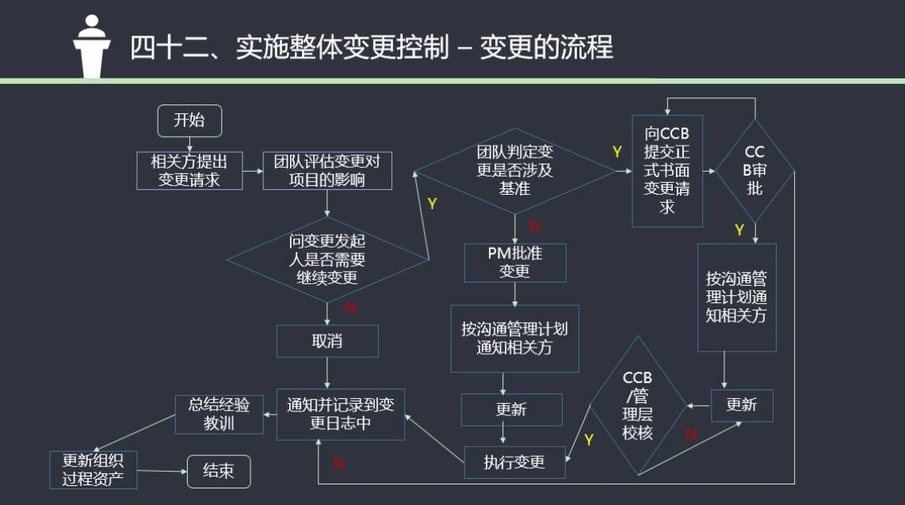
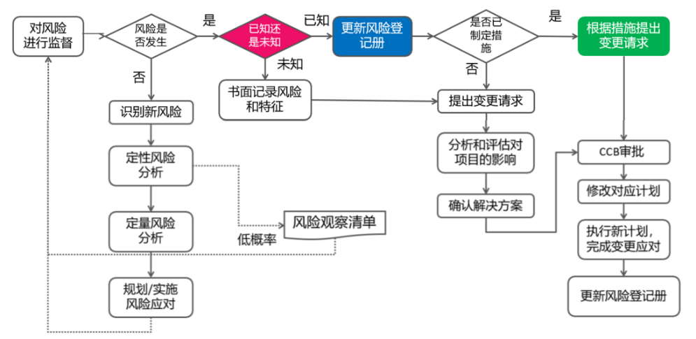

# PMP 考试过关口诀

当然，以下是将你提供的内容转换为 Markdown 格式的列表：

## （一）关键词篇

### 第 1 章 引论
- 看到“驱动变革”——选项中找“将来状态”
- 看到“依赖关系”——选项中找“项目集管理”
- 看到“价值最大化”——选项中找“项目组合管理”
- 看到“可行性研究”——选项中找“商业论证”

### 第 2 章 项目运行环境
- 看到“框架”、“功能”、“过程”——选项中找“项目治理”
- 看到“全部权力”——选项中找“项目型”
- 看到“比较大的权力”——选项中找“强矩阵”
- 看到“很小的权力”——选项中找“弱矩阵”
- 看到“公司有过类似项”——选项中找“组织过程资产”
- 看到“顾问角色”——选项中找“支持型”
- 看到“要求服从”——选项中找“控制型”
- 看到“直接管理和控制”——选项中找“指令型”

### 第 3 章 项目经理的角色
- 看到“允许自主决策”——选项中找“放任型”
- 看到“给予奖励”、“例外管理”——选项中找“交易型”
- 看到“服务承诺”、“关注他人”——选项中找“服务型”
- 看到“促进创新”——选项中找“变革型”
- 看到“激励他人”、“自信”、“说服力强”——选项中找“魅力型”

### 第 4 章 项目整合管理
- 看到“新项目”、“项目经理权力责任”——选项中找“项目章程”
- 看到“是否值得投资”——选项中找“商业论证”
- 看到制约因素(或假设条件)——选项中找 “假设日志”
- 看到“纠正措施、预防措施、缺陷补救、更新”——选项中找“变更请求”
- 看到“计划制定完成”、“章程制定完成”——选项中找“批准”
- 看到“版本问题”——选项中找“配置管理”
- 看到“新任项目经理”——选项中找“项目章程”
- 看到“项目完成”或“终止”——选项中找“经验教训”
- 看到“某某人很有经验”——选项中找“专家判断”
- 看到“考虑所有意见”、“既定决策流程”——选项中找“引导”
- 看到“分享知识”——选项中找“信息管理”

### 第 5 章 项目范围管理
- 看到“暂时无法分解”、“信息不完整”——选项中找“滚动式规划”
- 看到“除外责任”、“范围边界”、“可交付成果的详细描述”——选项中找“项目范围说明书”
- 看到“需求(意见)不一致”——选项中找“引导式研讨会”
- 看到“一对一”、“获取机密信息”——选项中找“访谈”
- 看到“了解期望和态度” ——选项中找“焦点小组”
- 看到“受众多样”、“快速完成”、“地理位置分散

”、“适合开展统计分析”——选项中找“问卷调查”
- 看到“最佳实践”——选项中找“标杆对照”
- 看到“超过 50%” ——选项中找“大多数同意”
- 看到“候选项超过 2 个以上” ——选项中找“相对多数同意”
- 看到“创意分组”——选项中找“亲和图”
- 看到“创意整合”、“反应共性和差异”、“激发新创意”——选项中找“思维导图”
- 看到“投票排列”、“优先排序”——选项中找“名义小组技术”
- 看到“更早发现并更快解决问题”——选项中找“引导”
- 看到业务目标等——选需求跟踪矩阵

### 第 6 章 项目进度管理
- 看到“活动之间的依赖关系”——选项中找“网络图”
- 看到“进度灵活性”——选项中找“关键路径法”
- 看到“最佳实践”——选项中找“选择性依赖关系”
- 看到“成本较低”、“耗时较少”、“准确性较低”——选项中找“类比估算”
- 看到“历史数据之间统计关系”、“数据库”、“模型”——选项中找“参数估算”
- 看到“资源有限”、“过度分配”、“关键路径改变”——选项中找“资源平衡”
- 看到“无法实现资源优化”、“不改变关键路径”——选项中找“资源平滑”
- 看到“不同条件下的可行性”——选项中找“假设情景分析”
- 看到“模型化”、“计算整个项目可能的进度结果”——选项中找“模拟”
- 看到“加班”、“增加额外资源”、“最小的成本增加”——选项中找“赶工”
- 看到“并行开展”——选项中找“快速跟进”
- 看到“向管理层汇报”——选项中找“横道图、甘特图”
- 看到“最悲观、最乐观、最可能”——选项中找“PERT 技术”
- 看到“没有合理可信度”、“提供准确估算”，选“自下而上估算”
- 看到“理解目前的绩效”、“与未来绩效进行对比”——选项中找“趋势分析”

### 第 7 章 项目 成本 管理
- 看到“已知的未知风险”——选项中找“应急储备”
- 看到“未知的未知风险”、“额外”——选项中找“管理储备”
- 看到“外部资金”——选项中找“融资”

### 第 8 章 项目质量管理
- 看到“确保”，“防止”——选项中找“管理质量”
- 看到“根本原因”——选项中找“因果图、石川图、鱼骨图、why-why 分析图”
- 看到“两个因素的关系”——选项中找“散点图”
- 看到“上下限”、“限值”、“过程的稳定性”、“具有可预测的绩效”——选项中找“控制图”
- 看到“主要问题、主要缺陷、给缺陷排序”——选项中找“帕累托”
- 看到“增值活动”、“非增值活动”——选项中找“过程改进”、“管理质量”
- 看到“质量测量方法”——选项中找“质量测量指标”
- 看到“检查可交付成果”——选项中找“质量控制”
- 看到“识别最佳实践”、“识别违规”、“改进过程执行”——选项中找“管理质量”、“审计”
- 看到“培训”、“测试”、“破坏性试验”、“检查”——选项中找“一致性成本”
- 看到“返工”、“报废”、“保修”——选项中找“非一致性成本”
- 看到“价值链”、“过程流”——选项中找“流程图”
- 看到“可视化”、“数据完整性”——选项中找“逻辑数据模型”
- 看到“因素的数量”、“关系强弱”——选项中找“矩阵图”
- 看到“提高产品特性”——选项中找“面向 X 的设计”
- 看到“六西格玛”、“PDCA”——选项中找“质量改进方法”
- 看到“核查表”——选项中找“识别缺陷”
- 看到“发现缺陷”——选项中找“控制质量”、“检查”

### 第 9 章 项目资源管理
- 看到“退出”、“推迟到准备充分”、“推给其他人解决”——选项中找“撤退/回避”
- 看到“强调一致性”——选项中找“缓解/包容”
- 看到“一定程度满意”——选项中找“妥协/调解”
- 看到“公开对话”、“达成共识”——选项中找“合作/解决问题”
- 看到“解决紧急问题”——选项中找“强迫/命令”
- 看到“团队成员能力不足”——选项中找“提供培训”
- 看到“可接受行为”——选项中找“基本规则”
- 看到“团队绩效差”——选项中找“识别根本原因”
- 看到“会议有问题”——选项中找“团队章程”或者“基本规则”
- 看到“内部资源不足”——选项中找“招募”
- 看到“团队成员角色责任”——选项中找“责任分配矩阵”、“RACI”
- 看到“资源详细描述”、“技能、等级、证书”——选项中找“资源分解结构”
- 看到“早期”、“详细信息不足”、“粗略的”——选项中找“类比估算”
- 看到“争吵”、“对立”——选项中找“震荡阶段”
- 看到“开始建立信任”——选项中找“规范阶段”
- 看到“像一个组织有序的单位”——选项中找“成熟阶段”

### 第 10 章 项目沟通管理 
- 看到“虚拟团队”——选项中找“沟通管理计划”或“规划沟通”
- 看到“实时”、“面对面”——选项中找“互动沟通”
- 看到“特定群体”——选项中找“推式沟通”
- 看到“大量信息”、“受众广泛”——选项中找“拉式沟通”

### 第 11 章 项目风险管理
- 看到“使用全新技术或方法”、“高优先级的机会”、“最有能力的资源”——选项中找“开拓”
- 看到“增加资源”——选项中找“提高”
- 看到“建立应急储备”、“预留时间、资金、资源”、“定期审查”——选项中找“接受”
- 看到“消除威胁的原因”、“延长进度计划”、“改变项目策略”、“缩小范围”、“拉回到临界值”——选项中找“规避”
- 看到“外包”、“买保险”、“签订协议”、“成立合资企业”——选项中找“转移”
- 看到“更多测试”、“加入冗余部件”、“备用”——选项中找“减轻”
- 看到“最大潜在影响”——选项中找“敏感性分析”
- 看到“给风险排序”、“识别主要风险”——选项中找“风险定性分析”
- 看到“风险”“不确定性”——选项中找“三点估算”
- 看到“风险管理过程的有效性”、“风险应对措施的有效性”——选项中找“风险审计”
- 看到“如何实施风险管理活动”——选项中找“风险管理计划”
- 看到“优先级排序”——选项中找“概率和影响矩阵”
- 看到“优势”、“劣势”——选项中找“SWOT 分析”
- 看到“协助形成想法”——选项中找“提示清单”
- 看到“两个以上参数分类”——选项中找“层级图”
- 看到“三角分布”、“正态分布”、“贝塔分布”、“离散分布”——选项中找“不确定性表现方式”
- 看到“龙卷风图”——选项中找“敏感性分析”
- 看到“最优路径”——选项中找“决策树分析”

### 第 12 章 项目采购管理
- 看到“范围清楚”、“买方风险最小”——选项中找“固定价合同”
- 看到“一定灵活性”、“绩效偏离”、“财务奖励”、“价格上限”——选项中找“总价加激励费用合同”
- 看到“跨越时间长”、“通货膨胀”——选项中找“总价加经济价格调整合同”
- 看到“人工费率”、“材料费率”、“无法快速定义 SOW”——选项中找“工料合同(T&M)”
- 看到考合同类型的题目中出现“利润”——选项中找“成本补偿合同”
- 看到“激励费用”、“比例分担”——选项中找“成本加激励费用合同”
- 看到“主观判断”、“奖励费用”——选项中找“成本加奖励费用合同”
- 看到“无特别优待”、“一致的理解”——选项中找“投标人会议”
- 看到“怀疑潜在卖方报价”——选项中找“独立成本估算”
- 看到“复杂采购”——选项中找“建议书评价技术”

### 第 13 章 项目相关方管理
- 看到“职权级别”、“关心程度”——选项中找“权力利益方格”

### 0.项目管理概述：
1. 不同项目有不同的制约因素，同一项目在不同阶段有不同的制约因素和目标。(一般和个别原则)
2. 项目型中项目经理权力最大，职能型中权力最小。矩阵中从弱到强，权力加大。
3. 项目一开始风险最大，变更代价最小；项目后期风险变小，变更代价变大。
4. 项目经理可以选择、控制的是组织过程资产，剩下的是事业环境因素。
5. 协调员有一定权力，联络员无
6. 五大过程组和十大知识领域,横向、纵向都要记住，常考的是做事的流程、顺序。

### 1．启动：
1. 看到新项目、项目新阶段、新项目经理等，选项目章程。没有的话，项目经理可以参与编写，但是要发起人来发布。
2. 干系人要全部识别，重点管理，尽早参与。
3. 项目是否值得投资，选商业论证
4. 有任何人质疑项目经理、高层次的、概要性的描述，选项目章程。
5. 章程内容，必须记住：三高二总，发干委，审假因目标

- 三高：高层级需求、高层级项目描述和边界定义、高层级风险
- 二总：总体里程碑进度、总体预算
- 发：发起人及批准章程人员姓名职权
- 干：干系人清单
- 委：委派的PM及权责
- 审：项目审批要求
- 假：假设条件和制约因素
- 因：项目目的和批准原因
- 目标：可测量的项目目标和成功标准

### 2．规划：
1) 项目管理计划的制定是渐进明细的，根据项目的制约因素和特点来决定。
2) 首先明确需求，然后确定范围，最后分解至工作包。看到工作内容和制约因素，想到范围说明书。
3) 关键路径不唯一，是历时最长的。总时差为零的是关键路径，关键路径上的活动浮动时间为0
（选项常考问这个活动浮动时间，80%的答案都是0，首先判断是否在关键路径，很少让你用7宫格去推……）。
4) 看到资源数量有限、或只在特定时间可用、或资源负载太重，用资源平衡。
5) 看到如果……就……选假设情景分析
6) 进度压缩：赶工和快速跟进，看到并行和成本是首要制约因素选快速跟进，其他都是赶工，CPI>1 SPI<1，然后CPI<1,SPI>1了，问发生了什么事：赶工！。
7) 自上而下(专家判断、类比、参数)，领导很忙、让PM快速估算：类比估算。
8) 三点估算的计算公式、标准差和正态分布，默认都是贝塔分布。
9) 储备分析：应急储备和管理储备
10) 质量规划是制定标准，成本效益、质量成本、标杆对照、实验设计是专用。
11) 看到规格，是质量测量指标。
12) 看到有人对沟通不满意、出现争议的显现等，首先审查沟通管理计划，如果没有，制定一个。PMP考题里，如出现”沟通管理计划“80%的时候都是首选答案！
13) 看到有责任不清，选责任分配矩阵。
14) 风险要走流程，就是识别、定性、定量分析和应对。
15) 看到概率和影响相关的，优先排序的，待观察的就是定性分析。
16) 看到决策、建模、敏感性分析，就是定量分析。
17) 看到计算平均结果的统计方法，选预期货币价值分析。
18) 看到采购中甲方希望风险小，选总价合同；看到没有范围选工料合同。
19) 看到完全消除风险选回避；看到风险合同，选转移；看到降低概率，选减轻。
20) 看到不知道变更找谁，选变更管理计划。
21) 干系人管理计划要去除敏感信息。
22) 看到制约因素，找：项目章程、范围说明书、需求文件
23) 积极风险：提高数量、开拓质量
24) 冲突问题：

### 3．执行：
1) 定时或随机使用、查看变更的效果，用质量审计。
2) 看到项目还没有开始就有人了，这是预分配；项目人员要谈判。
3) 团队建设五阶段：“争吵”，选震荡阶段；”开始建立信任“，选规范阶段；”像一个有序的单位“，选成熟阶段。
4) 冲突管理5 方法，看到有人撤选撤退；看到互相进退，选妥协；看到解决，选面对；紧要关头选强制。
5) 干系人对结果不满意，选管理干系人期望(管理干系人参与)，这时问依据什么，选干系人管理策略(干系人管理计划)。
6) 看到卖方不清楚，选投标人大会。
7) 看到过程改进，选质量保证。

### 4．监控：
1) 看到变更一定要走流程，根据当前的状况，选择流程中最合适的步骤。
2) 挣值计算要会，EV，PV，AC。 SV = EV – PV， CV = EV – AC， ETC = BAC-EV 或（BAC-EV）/CPI， EAC = BAC – CV 或 BAC/CPI。
3) 看到验收，选确认范围，看到验证，选质量控制。
4) 看到过程稳定、有无失控、改进效果如何，选控制图
5) 找根本原因选因果图、鱼骨图、石川图。
6) 找两个变量之间的关系，看有无关系，选散点图。
7) 找到最主要的原因，PM怎么做，用帕累托图
8) 新风险用风险再评估，风险是否有效用风险审计，风险应对由风险管理员
9) 采购变更用合同变更控制系统，避免卖方低绩效，用卖方绩效审查(采购绩效审查)。
10) 有干系人的任何变化，首先要更新干系人登记册。

### 5．收尾：
1) 项目要进入收尾，必须有可交付成果的验收。
2) 项目要收尾结束，必须要移交可交付成果。
3) 项目结束要有组织过程资产的更新，经验教训的总结。
4) 看到对采购过程的得失，或为未来采购，选采购审计。
5) 项目完成或终止，选“经验教训”

::: tip
注意，上述规律是一般情况，题目中出现文字会稍有不同，考试中需要结合题目具体描述灵活使用。
:::

## （二）概念区分篇

### 一、组织过程资产和经验教训的区别：

组织过程资产包括：模版、数据库、经验教训。模版和数据库是相对客观的资料，经验教训都是主观总结出来的东西。
### 二、经验教训和问题的区别：

1. 经验教训必须和选择有关，你的选择让你感到得意或后悔的事情，叫经验教训。
2. 问题一般相对客观，与选择无关。
### 三、问题和风险的区别：

1. 问题一般与人的责任、能力、人的主动性有关，不主动、不负责任、缺乏能力。
2. 风险更偏重于天灾，有不可抗性，与人的责任、主动性、能力关系较弱，或无关。
3. 问题和风险又共通性：风险发生即为问题，问题出现会导致风险发生。
### 四、为什么使用关键路径法后，要考虑资源平衡

::: tip 有这样一道 PMP 模拟题：

**一旦项目采用关键路径法分析，必须应用下列哪一项技术来制定进度计划？**   
A. 赶工  
B. 资源平衡  
C. 分解  
D. 快速跟进  
答案选 B.资源平衡。
:::

很多学员对此不理解，为什么采用关键路径法时，必须使用资源平衡呢？因为制订进度表（也称进度计划）时需要考虑各种制约因素和条件，如资源、成本、各类风险、天气与环境制约因素等，这些因素之间也是相互影响的。如果同时考虑所有这些因素，进度表就无法制订出来。因此，关键路径法首先假定没有任何限制条件或因素的情况，其中包括不考虑资源限制，推算出理论中的最短工期，然后再逐步把各种限制条件、因素考虑进去，制订出符合现实情况的可执行的进度表。在现实条件下，资源不可能是无限的，因此要考虑资源限制，使用资源平衡技术。

### 五、资源日历和资源直方图的区别以及考点：

1. 使用的时间，是相对的客观存在。
2. 资源直方图，是项目单位时间所需要的人员数量，是相对的主观需求。
3. 资源日历是资源（多指人，也可包括设备、材料）可供项目
4. 资源日历受资源变化（如生病、调离、辞职）影响，因资源变化而变化。
5. 资源直方图仅受进度计划的影响，当进度不变的时候，资源直方图不发生改变。
6. 总结：资源变化影响资源日历；进度变化影响资源直方图。

### 六、总时差、提前量和滞后量、缓冲三者的区别：

1. 总时差、提前量和滞后量，是网络图中客观存在的情况；缓冲是为应对进度风险而人为添加的。
2. 总时差决定了进度表的灵活余地，根据总时差可以确定关键路径（路线上活动总时差都为零或负的路线叫关键路线）。因此题目中看到进度灵活余地，说的是总时差，看到总时差，一定使用的是关键路径。进度灵活余地→总时差→关键路径。
3. 使用关键路径时，判断进度好坏，仅依据 SPI、SV 是不够的，还需要另外判断关键路径总时差是否是大于等于零。
4. 总时差计算公式=本活动最晚开始-本活动最早开始，或=本活动最晚完成-本活动最早完成。
5. 提前量和滞后量是客观存在，因此调整提前量和滞后量，a、能让进度计划更加切实可行；b、设法使进度落后的活动赶上计划。
6. 看到时间缓冲，或进度缓冲，一定是关键链法。
7. 关键链法不再管理网络路径的总时差，而是重点管理剩余的缓冲持续时间，与剩余的活动链持续时间之间的匹配关系。

### 七、类比估算、参数估算、三点估算的区别是：

1. 类比估算使用历史信息；
2. 参数估算使用数据库，具体的历史信息越多越好；
3. 三点估算使用 3 个信息：最悲观、最乐观、最可能；
### 八、自下而上估算的特点：

1. 自下而上估算不使用历史信息，而是对估算对象分解，化整为零估算，降低了对估算者专业要求，即不专业也可以使用；
2. 自下而上估算提高了估算的准确程度，是最为可靠、最准确的估算方法。当估算准确性要求很高的时候，应使用自下而上估算；
3. 自下而上估算可以用于资源、成本估算，但不能用来估算活动持续时间。

### 九、各种估算方法的关键词：

1. 类比估算的关键词包括：相似的、另一个、早期、详细信息不足
2. 参数估算的关键词包括：数据库、模型、统计方法、乘法、除法
3. 三点估算的关键词包括：风险、不确定性、最悲观、最乐观、最可能
4. 自下而上估算的关键词：没有合理可信度、没有任何经验、准确估算
5. 专家判断的关键词不明显，一般会出现“很有经验的”“请。。。工程师”；另外考专家判断的题目，经常会现在这三个过程：“制定项目章程时”“启动项目”“项目收尾”等。

### 十、管理项目团队成员和管理干系人的相同与不同之处

PMP 考试中，管理团队成员与管理干系人，看似相近，但实际上的方法泾渭分明，稍不留意，就可能掉入陷阱。
A ．管理团队和管理干系人的相同点：
- 核心责任人都是项目经理；
- 都需要使用问题日志；
- 都会发生冲突，需要项目经理解决；
- 二者解决冲突的最好方式都是面对、直接沟通。
B ．管理团队和管理干系人的不同点：
- 管理团队强调对内部的项目团队成员管理；管理干系人通常指的是项目团队之外的干系人；
- 管理干系人中，冲突解决方法比较单一，就是公关、沟通，去影响干系人转变对项目的立场；
- 管理团队中，冲突最初可以由当事人自己解决，其次可以通过项目经理介入解决，解决策略有五种，其中包括强迫/命令。而管理干系人绝对不能使用强迫/命令；
- 管理团队可以事先建立规则，并要求团队成员遵守规则（管理供应商，也可以使用规则）；而规则不适用于管理干系人，团队规则只对内，不对外；
- 预防冲突的方法，对管理干系人而已，就是尽早识别干系人，并让干系人尽早参与；
- 预防冲突的方法，对管理团队而言，包括：采用团队规则、团队规范及成熟的项目管理实践（如沟通规划和角色定义）。

### 十一、进度压缩、赶工与快速跟进的区别与考点

在前面的 PMP 考试技巧中强调过，时间不够选进度压缩（还有另外两个可以选：模拟技术和调整提前量与滞后量，但很少出现）。而进度压缩又具体包括了赶工和快速跟进两种方式，现在就这三项在 PMP 考试中的特点进行简单归纳。
1. 进度压缩的前提是不改变范围，因此消减范围不是应对时间不够的正确选项；
2. 赶工是通过在关键路径的活动上增加资源，缩短关键路径持续时间，来压缩进度；快速跟进是通过将关键路径上本来串行的工作并行，来压缩进度；
3. 赶工的前提，有富裕的成本或资源；快速跟进的前提，关键路径上活动的依赖关系并非都是强制性的，有可选择的；
4. 进度压缩与赶工或快速跟进同时出现在选项中，选大的还是选小的，之前有描述过了；
5. 当赶工和快速跟进都可以选的时候，首选赶工，因为赶工更合理；
6. 题目中强调了进度落后，成本节约，或 SPI<1、CPI>1 时，选赶工；
7. 题目中强调成本不能超，或成本很紧张，而关键路径上有非强制的依赖关系时，选快速跟进；
8. 赶工要考虑两个关键：不但要选择关键路径上的活动赶工；而且要选择赶工成本最低的活动。

### 十二、验收可交付成果和项目（或阶段）收尾的联系及区别

1. 验收可交付成果，属于确认范围过程，属于监控过程组，不是收尾内容。
2. 项目或阶段收尾时，客户或发起人也要验收，但验收的不是可交付成果，是最终产品、服务或成果。
3. 另外，虽然项目或阶段收尾时不验收可交付成果，但是“在收尾期间，项目经理应该审查。。。确认范围过程中所产生的验收文件。。。，以确保在达到全部项目要求之后才正式结束项目”。也就是说，确认范围过程中产生的验收文件，是项目或阶段收尾的输入，而非输出。
4. 结论：  
a、验收可交付成果是监控过程，不是收尾过程的工作；  
b、收尾工作需要使用验收可交付成果的文件，因此验收可交付成果在前，收尾在后

## （三）常见翻译问题
1. 题目中出现的“启动会议”或“启动大会”=开工会议（kick-off meeting)
2. 题目中出现的“回报期”= 回收期（项目选择的经济模型）
3. 题目中出现的“增强”= 提高（风险应对策略）
4. 题目中出现的“缓解”= 减轻（风险应对策略）
5. 题目中出现的“推动式研讨会”=引导式研讨会（收集需求和定义范围的工具）
6. 题目中出现的“基线” = 基准（项目管理计划）
7. 题目中出现的“实现值”= 挣值（EV）
8. 题目中出现的“利害关系者”= 相关方
9. 某些题目中出现的“什么阶段”= 哪一个项目管理过程组（五大过程组）
10. 题目中出现的“赶时间线”= 赶工（进度工具）
11. 题目中出现的“管理干系人期望”= 管理干系人参与
12. 题目中出现的“二级风险”= 次生风险
13. 题目中出现的“团队工作”= 团队协作(团队建设词汇）
14. 题目中出现的“核实范围”= 确认范围（范围管理的一个过程）
15. 题目中出现的“磨合” = 震荡（团队发展阶段）
16. 题目中出现的“提升价值” = 增值（质量保证词汇）
17. 题目中出现的“基准参照”= 标杆对照（范围和质量词汇）
18. 题目中出现的“一线经理”“直线经理”= 职能经理
19. 题目中出现的“资源选择标准”= 供方选择标准（采购术语）
20. 题目中出现的“质量审查” = 大多时间说的是“质量审计”
21. 题目中出现的“核对表” = 核对单（质量、风险）
22. 题目中出现的“团队发展”= 团队建设
23. 题目中出现的“干系人管理策略”= 相关方参与计划
24. 题目中出现的“平衡（leveling)=资源平衡
25. 风险题目中的“可能性”=风险概率
26. 题目中“需求追溯矩阵”=需求跟踪矩阵
27. 题目中“项目群经理”=项目集经理
28. 选项中出现的xxx 计划，有可能说的不是计划，是某个规划过程
29. 挣值题目中出现的“完成了xxx 美元工作”，有可能说的是PV ，而不是EV，要看英文的时态，是虚拟语气，还是完成时。
30. 风险题目正文中出现的“减轻”风险，有可能是“减少”或“应对”的意思，而不是风险应对策略中的“减轻”。这时，可以选减轻策略之外的：回避、转移等策略。

以上是 近 年来出现的一般情况，不排除有特殊情况，要结合英文原文来判断。另外，挣值题目中还存现时态问题，中文不一定能翻译出来，如 PV 的数据，如果无法通过中文判断时，要看一下英文。

## （四） 有效固定答题套路
PMP 考试的情景题目中有一些套路题目，即某些常见的经典情景，答案相对是固定的。总结如下一些经典情景题目及其正确答案，遇到这些经典情景，只需在在选项中找正确答案就行了，不光提高答题速度，也能确保答题的准确率。
### 一、变更顺序 ：

### 二、风险的情景题：
- 先判断风险识别了，还是风险发生了。
- 若是风险识别，按风险管理程序走；
- 若是风险发生，则应采取应急措施或权变措施，注意提交变更请求。
### 三 、 变更和风险流程的整合 ：

### 四 、进度情景题：
- 先判断时间不够，还是资源不够。
- 时间不够，有三个选项可以选，但一般都是进度压缩；
- 资源不够，有两个选项可以选：关键链法和资源平衡。
### 五 、沟通问题：
沟通问题是PMP 考试中很常见的情景题，有3 个正确答案可以选：
1. 沟通管理计划；
2. 沟通规划；
3. 沟通需求分析。
（题目中只会出现一个正确答案的，不存在先后问题）
### 六 、 相关方 问题：
相关方问题也是PMP 考试中很常见的情景题，有4 个正确答案可以选：
1. 相关方参与计划；
2. 管理相关方参与；
3. 让相关方尽早参与；
4. 识别相关方。
（题目中只会出现一个正确答案的，不存在先后问题）

### 七 、与供应商有争议：
1. 谈判；
2. ADR; 
3. 诉讼。

（这个是有顺序的，按谈判、ADR、诉讼顺序来选）
### 八 、选大的，还是选小的？
看题目问题，问的是大的，就选大的；问的是小的，就选小的。举例：
1. 项目进度延误，项目经理应该怎么办？
选项中有进度压缩和赶工，这个选进度压缩。
2. 如果题目这样说：项目进度延误，项目经理增加资源恢复进度，这属于？
答案中有进度压缩和赶工，要选赶工。看明白没有？
### 九 、具体问题，不要麻烦发起人。
1. 项目出现问题，答案中出现“汇报发起人” “联系发起人”，几乎不选。
2. 具体问题（尤其是质量、风险、进度、冲突、资源问题），不要麻烦发起人。
3. 没有解决方案时，不要汇报发起人。
### 十 、冲突问题
1. 冲突发生，题目问如何预防，选规则、团队建设
2. 冲突发生，题目问如何应对，选冲突解决策略
3. 团队个人矛盾选缓和
### 十一 、按题目问题选择答案
1. 注意题目问题问的是工具、过程、还是文件；
2. 问过程的，注意问的是哪一个过程，是启动还是规划、执行、监控，是管理质量还是质量控制，是识别相关方还是规划相关方管理。
3. 所选题目答案，不能与题目问的矛盾。
### 十二 、强调统计方法（或统计分析）的 4 个工具
1. 问卷调查
2. 参数估算
3. 实验设计
4. 敏感性分析
### 十三 、与排序相关的正确答案：
1. 风险定性分析
2. 帕累托
3. 名义组技术
4. 优先矩阵
### 十四 、 相关方 意见不一致或有冲突，正确答案：
1. 引导式研讨会；
2. 与相关相关方开会，统一意见。
### 十五 、 挣值计算
很多人很头疼这种题目，这类题目也是有简便套路的，套路就是：先写出3个变量，再套两个或一个公式