# Clash 使用教程

## 安卓使用方法

#### 1.购买商城会员

[hh5h.cn](hh5h.cn)（如已购买，直接开始下一步）

{ width=240 }

#### 2.clash 下载

[https://wwjt.lanzouw.com/iDN6P0rdxywf](https://wwjt.lanzouw.com/iDN6P0rdxywf)

打开 clash 软件，点击【配置】

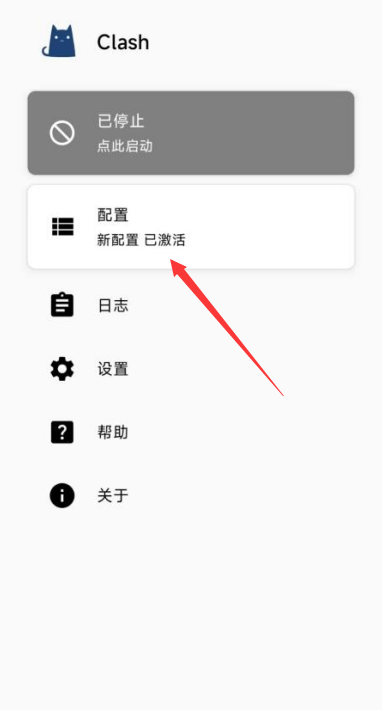{ width=240 }

#### 3.点击右上角的【+】号

{ width=240 }

#### 4.配置

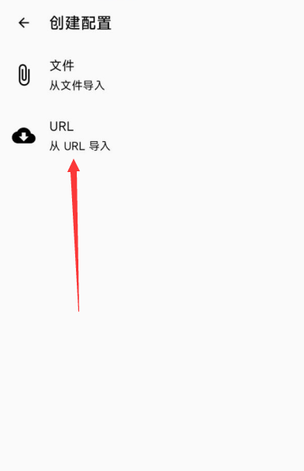{ width=240 }

#### 5.url 填写所购买的【url 地址】，自动更新 时间填 60

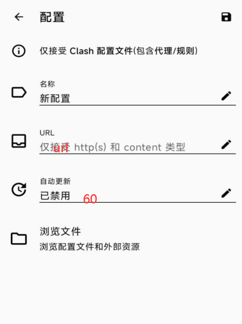{ width=240 }

#### 6.点击右上角【保存】

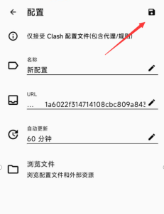{ width=240 }

#### 7.点击【代理】

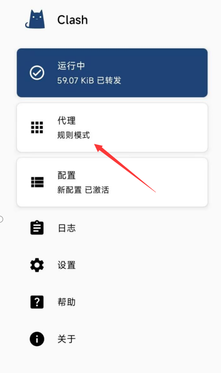{ width=240 }

点右下角蓝色小圆圈，进行测速，有数字显示，说明正常

选择地区后（建议选择美国）

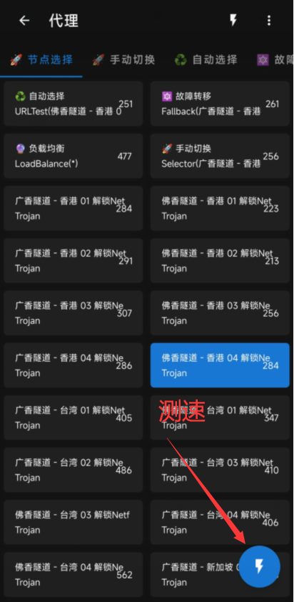{ width=240 }

#### 8.开关

不用的时候选择关闭，使用的时候再打开

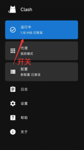{ width=240 }

## windous使用方法

#### 1.购买商城会员

[https://www.ssad.shop/#](https://www.ssad.shop/#)（如已购买，直接开始下一步）

PC端 clash下载

[https://wwjt.lanzouw.com/iW0Mb0t2062f](https://wwjt.lanzouw.com/iW0Mb0t2062f)

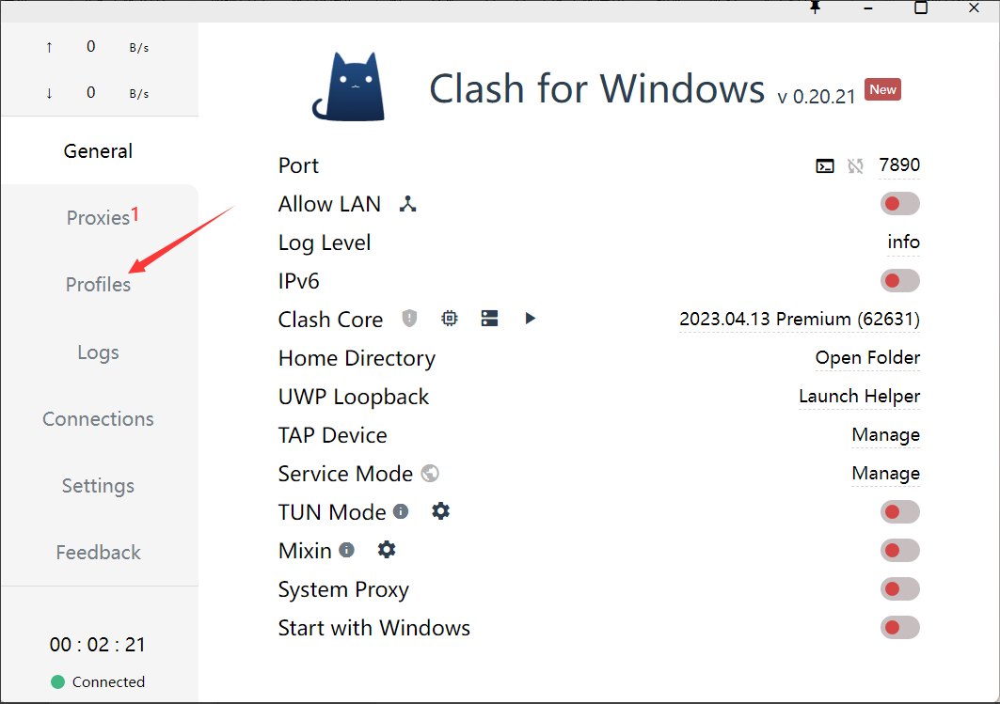{ width=640 }

#### 2.点击proflies

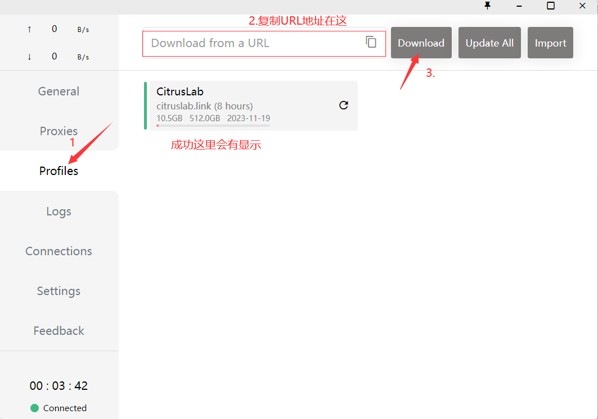{ width=640 }

#### 3.点击【proxies】

然后点击【Global】，再测速，有数字显示表示正常，数字越小延迟越低

然后选择地区，建议选择美国地区

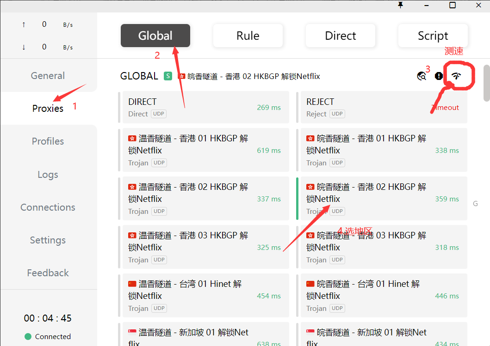{ width=640 }

#### 4.开关【system proxy】

绿色代表开 红色代表关

::: warning 提醒
注：不用的时候关掉，开着会影响网速，长时间开着会造成电脑没网
::: 

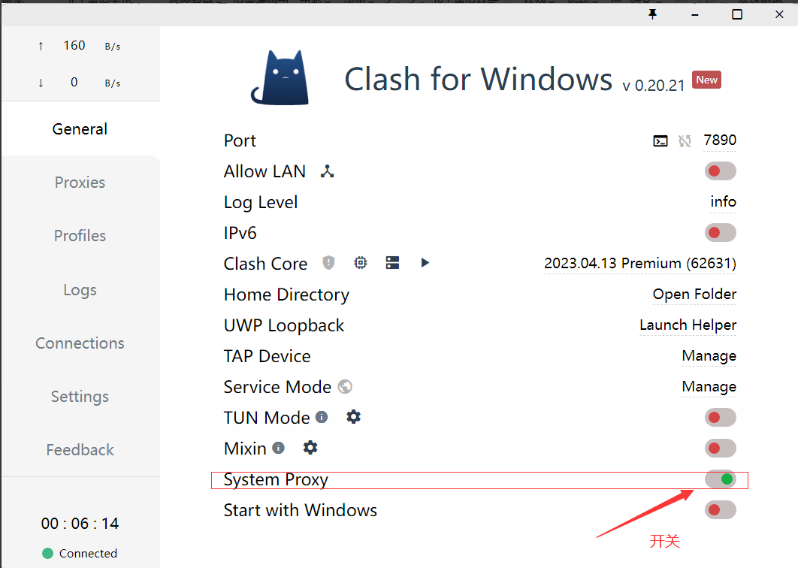{ width=640 }
