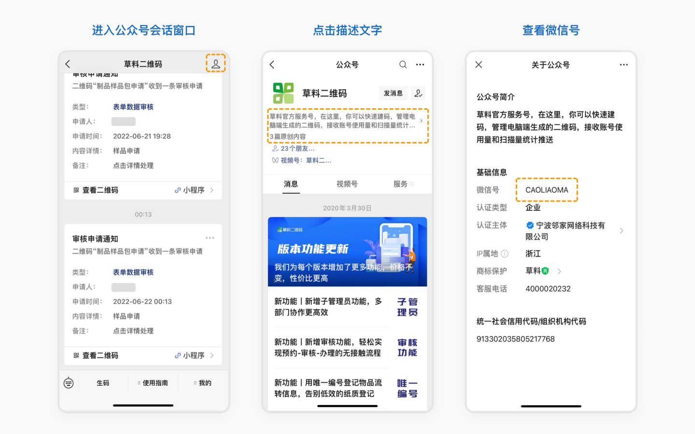
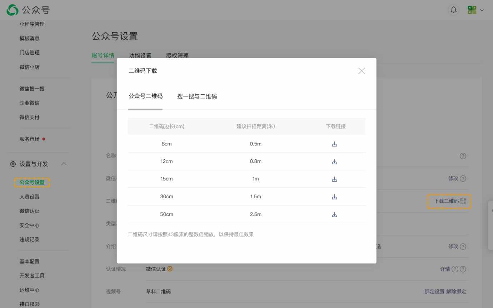
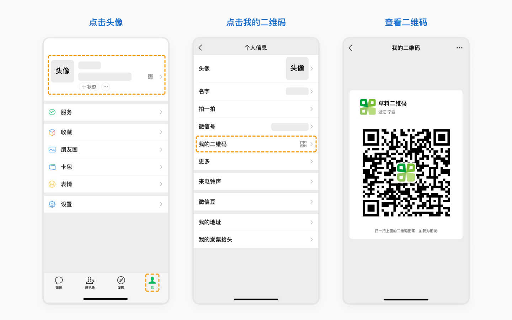
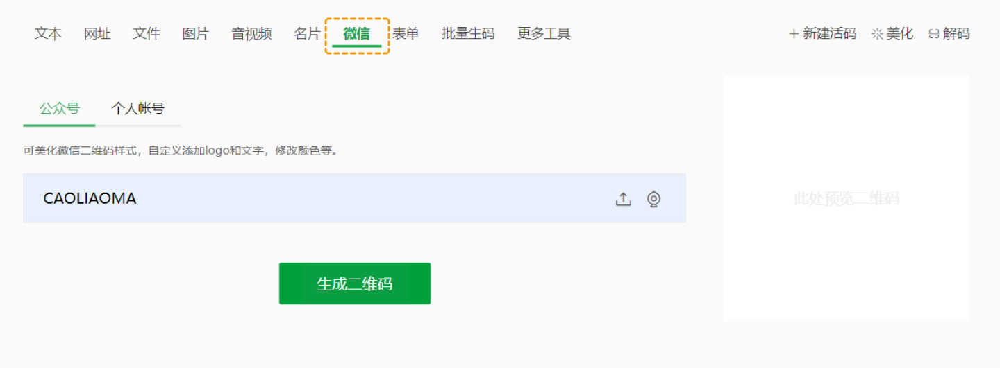

# 功能介绍
## 主要功能
微信公众号、个人微信号、微信群二维码、微信支付二维码等二维码美化，自定义添加logo和文字，修改颜色、码眼等样式；下载透明背景的二维码矢量图。

## 常见问题
### 1. 个人微信二维码或微信群二维码可以做成活码吗？
仅支持上传微信二维码图片生成活码，扫码显示微信二维码图片，需要保存图片到相册，再用微信扫一扫识别。

无法自动切换个人或群二维码图片，如果需要替换图片需要登录草料后台手动更换。

制作方法：草料首页顶部导航栏选择【[图片](https://cli.im/img)】，上传微信二维码图片，可添加更多描述内容，点击【生成二维码】即可。

::: danger 注意
依据[《微信个人账号使用规范》](https://weixin.qq.com/cgi-bin/readtemplate?t=page/agreement/personal_account)，请保证个人微信和微信群是正规用途，审核人员会定期对此类活码的用途进行检查，如果发现涉嫌违规的行为，会限制二维码的访问。[了解详情](https://cli.im/help/48433)
::: 

### 2. 能制作不会失效的微信群二维码吗？能解除只能加100人的限制吗？
不能，微信群二维码由微信平台运营，草料无法解除任何微信平台的规则限制，如微信群二维码7天失效、只能加100人等。

### 3. 可以实现扫描后出现随机微信二维码吗？
草料不支持此功能。

### 4. 能统计微信二维码关注量和来源吗？
草料用户后台仅能统计活码的扫描量，无法统计微信的关注量和来源。

## 操作教程

### 1. 如何获取公众号的微信号？
进入【微信公众号会话窗口】>【右上角头像】>【账号信息】，点击上方描述文字，即可看到公众号的微信号

{ width=640 }

### 2. 如何获取公众号的二维码图片？
登录微信公众平台-[点击登录](https://mp.weixin.qq.com/)，在【公众号设置】页面点击【下载二维码】，即可下载图片

{ width=640 }

### 3. 如何获取个人微信的二维码图片？
手机上打开微信>【我】>【左上角头像】>【我的二维码】，即可保存个人微信二维码图片

{ width=640 }

### 4. 如何对微信二维码进行美化？
进入草料二维码首页，点击【微信】进入微信二维码美化界面，微信公众号可输入微信号或上传二维码图片美化，个人微信或群二维码美化可上传二维码图片美化

{ width=640 }

草料预置了多种微信线上使用相关的二维码样式，帮助你快速制作出符合业务需求的二维码，同时也支持样式美化，修改码点，添加文字及更多自定义操作 [查看详细美化教程](https://cli.im/help/48435)

