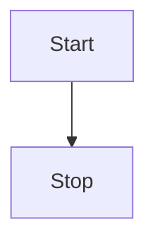

flowchart LR
  Start --> Stop

graph LR;
A[Hard edge] -->|Label| B(Round edge)
B --> C{Decision}
C -->|One| D[Result one]
C -->|Two| E[Result two]

<pre class="mermaid">
    graph LR
    A --- B
    B-->C[fa:fa-ban forbidden]
    B-->D(fa:fa-spinner);
</pre>