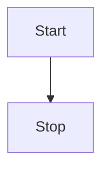
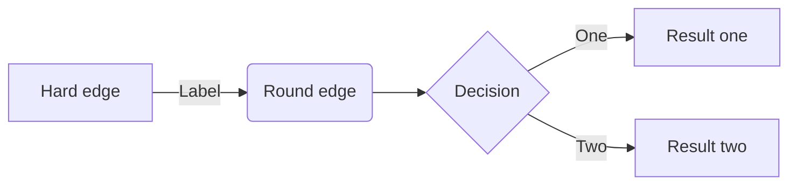

[[toc]]





| Tables        |      Are      |  Cool |
| ------------- | :-----------: | ----: |
| col 3 is      | right-aligned | $1600 |
| col 2 is      |   centered    |   $12 |
| zebra stripes |   are neat    |    $1 |

# 标题1

# 标题2

## 标题22

### 标题223

# 使用自定义锚点 {#my-anchor}

[Home](/) <!-- 将用户导航至根目录下的 index.html -->  
[foo](/foo/) <!-- 将用户导航至目录 foo 下的 index.html -->  
[foo heading](./#heading) <!-- 将用户锚定到 foo 索引文件中的一个标题上 -->  
[bar - three](../bar/three) <!-- 可以省略扩展名 -->  
[bar - three](../bar/three.md) <!-- 可以添加 .md -->  
[bar - four](../bar/four.html) <!-- 或者可以添加 .html -->  

:tada: :100:

::: info
This is an info box.
:::

::: tip
This is a tip.
:::

::: warning
This is a warning.
:::

::: danger
This is a dangerous warning.
:::

::: details
This is a details block.
:::


::: danger STOP
危险区域，请勿继续
:::

::: details 点我查看代码
```js
console.log('Hello, VitePress!')
```
:::

::: raw
Wraps in a <div class="vp-raw"></div>
:::

```js
export default {
  name: 'MyComponent',
  // ...
}
```

```html
<ul>
  <li v-for="todo in todos" :key="todo.id">
    {{ todo.text }}
  </li>
</ul>
```

```js
export default {
  data () {
    return {
      msg: 'Focused!' // [!code focus]
    }
  }
}
```

::: code-group

```js [config.js]
/**
 * @type {import('vitepress').UserConfig}
 */
const config = {
  // ...
}

export default config
```

```ts [config.ts]
import type { UserConfig } from 'vitepress'

const config: UserConfig = {
  // ...
}

export default config
```

:::

When $a \ne 0$, there are two solutions to $(ax^2 + bx + c = 0)$ and they are
$$ x = {-b \pm \sqrt{b^2-4ac} \over 2a} $$

**Maxwell's equations:**

| equation                                                                                                                                                                  | description                                                                            |
| ------------------------------------------------------------------------------------------------------------------------------------------------------------------------- | -------------------------------------------------------------------------------------- |
| $\nabla \cdot \vec{\mathbf{B}}  = 0$                                                                                                                                      | divergence of $\vec{\mathbf{B}}$ is zero                                               |
| $\nabla \times \vec{\mathbf{E}}\, +\, \frac1c\, \frac{\partial\vec{\mathbf{B}}}{\partial t}  = \vec{\mathbf{0}}$                                                          | curl of $\vec{\mathbf{E}}$ is proportional to the rate of change of $\vec{\mathbf{B}}$ |
| $\nabla \times \vec{\mathbf{B}} -\, \frac1c\, \frac{\partial\vec{\mathbf{E}}}{\partial t} = \frac{4\pi}{c}\vec{\mathbf{j}}    \nabla \cdot \vec{\mathbf{E}} = 4 \pi \rho$ | _wha?_                                                                                 |
